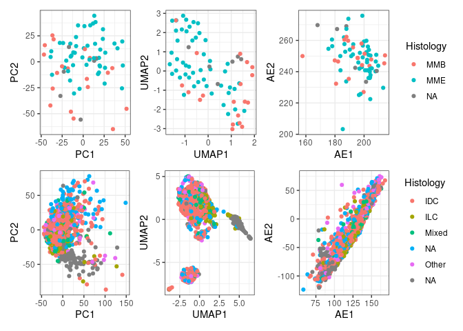

# AIML-WG
Repository with scripts from IARC's Machine Learning / Artificial Intelligence working group

## Data
Folder data contains [scripts to download TCGA transcriptomic data using R package TCGA biolink](https://github.com/IARCbioinfo/AIML-WG/blob/14b2e1bcabdb43e5cb0bea246074e619acffa855/data/Download_TCGAbiolinks.md)

## Unsupervised analysis scripts
Folder unsupervised_analysis contains scripts to perform a benchmarking of linear and non-linear unsupervised learning statistical, machine learning, and deep learning methods from the transcriptomic data in folder data. 

### [PCA and UMAP R scripts](https://github.com/IARCbioinfo/AIML-WG/blob/14b2e1bcabdb43e5cb0bea246074e619acffa855/unsupervised_analysis/PCA_UMAP.md)

