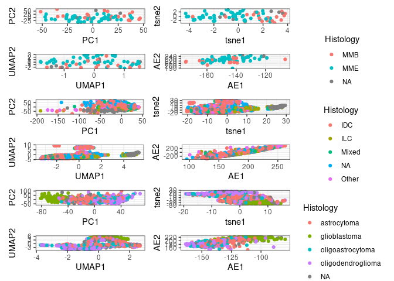
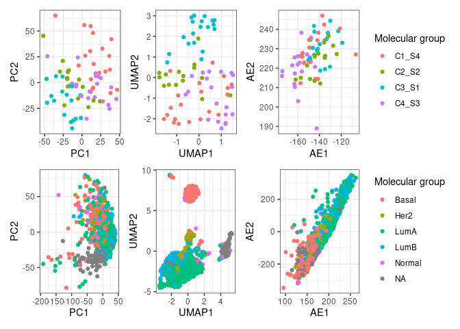
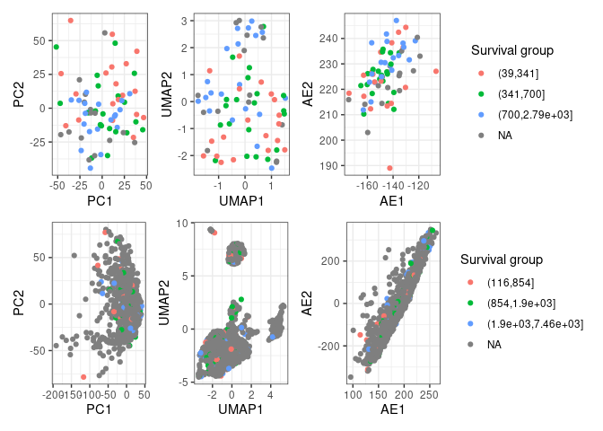
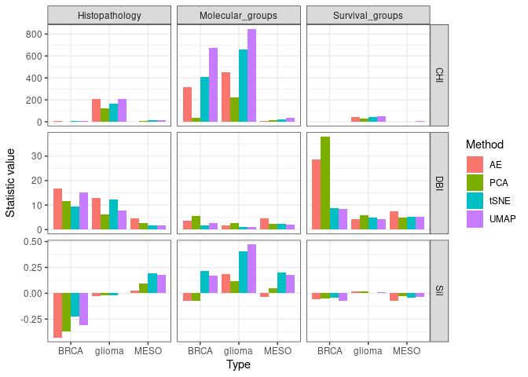

# R Code to compare embeddings on TCGA expression data

## load libraries 

```r
library(tidyverse)
library(SummarizedExperiment)
library(patchwork)
library(umap)
library(ade4)
library(keras)
library(cluster)
library(readxl)
library(fpc)
library(clusterSim)
library(Rtsne)
```

## Load expression data from TCGA

```r
# Glioma with GBM and LGG
load("/data/AIML/work/Shared/TCGA-expression/TCGA-GBMTranscriptome_ProfilingMon_Dec__4_11:47:48_2023.RData")
GBM.Rnaseq.SE = data
load("/data/AIML/work/Shared/TCGA-expression/TCGA-LGGTranscriptome_ProfilingMon_Dec__4_12:09:47_2023.RData")
LGG.Rnaseq.SE = data
# Mesothelioma
load("/data/AIML/work/Shared/TCGA-expression/TCGA-MESOTranscriptome_ProfilingMon_Dec__4_12:26:30_2023.RData")
MESO.Rnaseq.SE = data
# Breast cancer
load("/data/AIML/work/Shared/TCGA-expression/TCGA-BRCATranscriptome_ProfilingMon_Dec__4_11:33:56_2023.RData")
BRCA.Rnaseq.SE = data

rm(data)
gc()
```

```
##             used   (Mb) gc trigger   (Mb)  max used   (Mb)
## Ncells   6645676  355.0   12428622  663.8   7954197  424.8
## Vcells 568095631 4334.3  820649412 6261.1 568127247 4334.5
```

```r
# clean histology
MESO.Rnaseq.SE$primary_diagnosis[MESO.Rnaseq.SE$primary_diagnosis=="Epithelioid mesothelioma, malignant"] = "MME"
MESO.Rnaseq.SE$primary_diagnosis[MESO.Rnaseq.SE$primary_diagnosis=="Mesothelioma, biphasic, malignant"] = "MMB"
MESO.Rnaseq.SE$primary_diagnosis[MESO.Rnaseq.SE$primary_diagnosis%in%c("Mesothelioma, malignant","Fibrous mesothelioma, malignant")] = NA
table(MESO.Rnaseq.SE$primary_diagnosis)
```

```
## 
## MMB MME 
##  22  58
```

```r
# merge GBM and LGG datasets
commoncols = colnames(colData(GBM.Rnaseq.SE) )[colnames(colData(GBM.Rnaseq.SE))%in%colnames(colData(LGG.Rnaseq.SE))]

colData(GBM.Rnaseq.SE) = colData(GBM.Rnaseq.SE)[,commoncols]
colData(LGG.Rnaseq.SE) = colData(LGG.Rnaseq.SE)[,commoncols] 

glioma.Rnaseq.SE = cbind(GBM.Rnaseq.SE,LGG.Rnaseq.SE)
```

### load additional clinical data from TCGA papers

```r
MESO_S1 = read_xlsx("~/AIML/AIML-WG/data/TCGA_TableS1.xlsx",sheet=2)
# match barcodes 
MESO_S1$barcode = MESO.Rnaseq.SE$barcode[sapply(MESO_S1$TCGA_barcode, function(x) grep(x = MESO.Rnaseq.SE$barcode,pattern = x) )]
MESOorder = sapply(MESO.Rnaseq.SE$barcode,function(x){res=which(MESO_S1$barcode==x);if(length(res)==0){res=NA};return(res)})
# remove samples not reported in study
MESO.Rnaseq.SE = MESO.Rnaseq.SE[,!is.na(MESOorder)]
MESO_S1 = MESO_S1[MESOorder[!is.na(MESOorder)],]
```

### make survival groups

```r
## glioma
glioma.Rnaseq.SE$survival_group = cut(glioma.Rnaseq.SE$days_to_death,breaks = quantile(glioma.Rnaseq.SE$days_to_death,c(0,0.33,0.67,1),na.rm=T))
glioma.Rnaseq.SE$survival_group[which(as.numeric(glioma.Rnaseq.SE$survival_group)<3 & glioma.Rnaseq.SE$vital_status=="Alive")] = NA

## MESO
MESO.Rnaseq.SE$survival_group = cut(MESO.Rnaseq.SE$days_to_death,breaks = quantile(MESO.Rnaseq.SE$days_to_death,c(0,0.33,0.67,1),na.rm=T))
MESO.Rnaseq.SE$survival_group[which(as.numeric(MESO.Rnaseq.SE$survival_group)<3 & MESO.Rnaseq.SE$vital_status=="Alive")] = NA

## BRCA
BRCA.Rnaseq.SE$paper_days_to_death = as.numeric(BRCA.Rnaseq.SE$paper_days_to_death)
```

```
## Warning: NAs introduced by coercion
```

```r
BRCA.Rnaseq.SE$survival_group = cut(BRCA.Rnaseq.SE$paper_days_to_death,breaks = quantile(BRCA.Rnaseq.SE$paper_days_to_death,c(0,0.33,0.67,1),na.rm=T))
BRCA.Rnaseq.SE$survival_group[which(as.numeric(BRCA.Rnaseq.SE$survival_group)<3 & BRCA.Rnaseq.SE$paper_vital_status=="Alive")] = NA
```


### Get expression in TPM

```r
MESO.Rnaseq.expr.tpm = assay(MESO.Rnaseq.SE,"tpm_unstrand")
BRCA.Rnaseq.expr.tpm = assay(BRCA.Rnaseq.SE,"tpm_unstrand")
glioma.Rnaseq.expr.tpm = assay(glioma.Rnaseq.SE,"tpm_unstrand")

MESO.Rnaseq.expr.tpm.logmat   = t(log(MESO.Rnaseq.expr.tpm[order(apply(MESO.Rnaseq.expr.tpm,1,var),decreasing = T)[1:5000],]+1))
BRCA.Rnaseq.expr.tpm.logmat   = t(log(BRCA.Rnaseq.expr.tpm[order(apply(BRCA.Rnaseq.expr.tpm,1,var),decreasing = T)[1:5000],]+1))
glioma.Rnaseq.expr.tpm.logmat = t(log(glioma.Rnaseq.expr.tpm[order(apply(glioma.Rnaseq.expr.tpm,1,var),decreasing = T)[1:5000],]+1))
```

## Analysis
Note: use bootstrapping to get CIs.

### PCA of log(tpm+1) expression of 5000 most variable genes

```r
pca.MESO   = dudi.pca(MESO.Rnaseq.expr.tpm.logmat,scannf = F,nf=10)
pca.BRCA   = dudi.pca(BRCA.Rnaseq.expr.tpm.logmat,scannf = F,nf=10)
pca.glioma = dudi.pca(glioma.Rnaseq.expr.tpm.logmat,scannf = F,nf=10)
```

### t-SNE of log(tpm+1) expression of 5000 most variable genes

```r
tsne.MESO   = Rtsne(MESO.Rnaseq.expr.tpm.logmat,perplexity = 24) # had to reduce perplexity from 30 to 24 because too few samples
tsne.BRCA   = Rtsne(BRCA.Rnaseq.expr.tpm.logmat)
tsne.glioma = Rtsne(glioma.Rnaseq.expr.tpm.logmat)
```

### UMAP of log(tpm+1) expression of 5000 most variable genes

```r
umap.MESO   = umap(MESO.Rnaseq.expr.tpm.logmat)
umap.BRCA   = umap(BRCA.Rnaseq.expr.tpm.logmat)
umap.glioma = umap(glioma.Rnaseq.expr.tpm.logmat)
```
Note: play with parameters.

### Autoencoder of of log(tpm+1) expression of 5000 most variable genes

```r
# set models
modelMESO <- keras_model_sequential()
modelBRCA <- keras_model_sequential()
modelglioma <- keras_model_sequential()
modelMESO %>%
  layer_dense(units = 50, activation = "linear", input_shape = 5000) %>%
  layer_dense(units = 2, activation = "linear", name = "bottleneck") %>%
  layer_dense(units = 50, activation = "linear") %>%
  layer_dense(units = 5000)
modelBRCA %>%
  layer_dense(units = 50, activation = "linear", input_shape = 5000) %>%
  layer_dense(units = 2, activation = "linear", name = "bottleneck") %>%
  layer_dense(units = 50, activation = "linear") %>%
  layer_dense(units = 5000)
modelglioma %>%
  layer_dense(units = 50, activation = "linear", input_shape = 5000) %>%
  layer_dense(units = 2, activation = "linear", name = "bottleneck") %>%
  layer_dense(units = 50, activation = "linear") %>%
  layer_dense(units = 5000)
# view model layers
summary(modelMESO)
```

```
## Model: "sequential"
## ________________________________________________________________________________
## Layer (type)                        Output Shape                    Param #     
## ================================================================================
## dense_2 (Dense)                     (None, 50)                      250050      
## ________________________________________________________________________________
## bottleneck (Dense)                  (None, 2)                       102         
## ________________________________________________________________________________
## dense_1 (Dense)                     (None, 50)                      150         
## ________________________________________________________________________________
## dense (Dense)                       (None, 5000)                    255000      
## ================================================================================
## Total params: 505,302
## Trainable params: 505,302
## Non-trainable params: 0
## ________________________________________________________________________________
```

```r
# compile model
modelMESO %>% compile(loss = "mean_squared_error", optimizer = "rmsprop")
modelBRCA %>% compile(loss = "mean_squared_error", optimizer = "rmsprop")
modelglioma %>% compile(loss = "mean_squared_error", optimizer = "rmsprop")

# fit model
modelMESO %>% fit(x = MESO.Rnaseq.expr.tpm.logmat, y = MESO.Rnaseq.expr.tpm.logmat, epochs = 200,verbose = 1)
```

```
## Epoch 1/200
## 
1/3 [=========>....................] - ETA: 1s - loss: 17.2124
3/3 [==============================] - 1s 7ms/step - loss: 254.7981
## Epoch 2/200
## 
1/3 [=========>....................] - ETA: 0s - loss: 16.6764
3/3 [==============================] - 0s 8ms/step - loss: 16.3093
## Epoch 3/200
## 
1/3 [=========>....................] - ETA: 0s - loss: 15.0027
3/3 [==============================] - 0s 6ms/step - loss: 14.6336
## Epoch 4/200
## 
1/3 [=========>....................] - ETA: 0s - loss: 12.4530
3/3 [==============================] - 0s 5ms/step - loss: 11.5072
## Epoch 5/200
## 
1/3 [=========>....................] - ETA: 0s - loss: 8.3413
3/3 [==============================] - 0s 5ms/step - loss: 7.4374
## Epoch 6/200
## 
1/3 [=========>....................] - ETA: 0s - loss: 4.7358
3/3 [==============================] - 0s 5ms/step - loss: 4.1829
## Epoch 7/200
## 
1/3 [=========>....................] - ETA: 0s - loss: 2.7592
3/3 [==============================] - 0s 5ms/step - loss: 2.4499
## Epoch 8/200
## 
1/3 [=========>....................] - ETA: 0s - loss: 1.7267
3/3 [==============================] - 0s 6ms/step - loss: 1.5848
## Epoch 9/200
## 
1/3 [=========>....................] - ETA: 0s - loss: 1.3015
3/3 [==============================] - 0s 6ms/step - loss: 1.5036
## Epoch 10/200
## 
1/3 [=========>....................] - ETA: 0s - loss: 4.1803
3/3 [==============================] - 0s 6ms/step - loss: 4.5018
## Epoch 11/200
## 
1/3 [=========>....................] - ETA: 0s - loss: 2.5062
3/3 [==============================] - 0s 6ms/step - loss: 2.7331
## Epoch 12/200
## 
1/3 [=========>....................] - ETA: 0s - loss: 4.5289
3/3 [==============================] - 0s 6ms/step - loss: 5.3013
## Epoch 13/200
## 
1/3 [=========>....................] - ETA: 0s - loss: 2.5607
3/3 [==============================] - 0s 6ms/step - loss: 2.4131
## Epoch 14/200
## 
1/3 [=========>....................] - ETA: 0s - loss: 2.0828
3/3 [==============================] - 0s 6ms/step - loss: 2.5965
## Epoch 15/200
## 
1/3 [=========>....................] - ETA: 0s - loss: 3.8859
3/3 [==============================] - 0s 6ms/step - loss: 3.5864
## Epoch 16/200
## 
1/3 [=========>....................] - ETA: 0s - loss: 1.7976
3/3 [==============================] - 0s 6ms/step - loss: 2.0236
## Epoch 17/200
## 
1/3 [=========>....................] - ETA: 0s - loss: 4.2625
3/3 [==============================] - 0s 6ms/step - loss: 5.7377
## Epoch 18/200
## 
1/3 [=========>....................] - ETA: 0s - loss: 0.6970
3/3 [==============================] - 0s 22ms/step - loss: 0.9657
## Epoch 19/200
## 
1/3 [=========>....................] - ETA: 0s - loss: 7.5985
3/3 [==============================] - 0s 6ms/step - loss: 10.5310
## Epoch 20/200
## 
1/3 [=========>....................] - ETA: 0s - loss: 3.0296
3/3 [==============================] - 0s 6ms/step - loss: 4.5131
## Epoch 21/200
## 
1/3 [=========>....................] - ETA: 0s - loss: 3.0268
3/3 [==============================] - 0s 6ms/step - loss: 2.9233
## Epoch 22/200
## 
1/3 [=========>....................] - ETA: 0s - loss: 2.1849
3/3 [==============================] - 0s 6ms/step - loss: 3.3561
## Epoch 23/200
## 
1/3 [=========>....................] - ETA: 0s - loss: 4.7552
3/3 [==============================] - 0s 6ms/step - loss: 3.7415
## Epoch 24/200
## 
1/3 [=========>....................] - ETA: 0s - loss: 2.4102
3/3 [==============================] - 0s 6ms/step - loss: 3.7704
## Epoch 25/200
## 
1/3 [=========>....................] - ETA: 0s - loss: 4.3555
3/3 [==============================] - 0s 6ms/step - loss: 3.8815
## Epoch 26/200
## 
1/3 [=========>....................] - ETA: 0s - loss: 1.4442
3/3 [==============================] - 0s 7ms/step - loss: 2.4433
## Epoch 27/200
## 
1/3 [=========>....................] - ETA: 0s - loss: 7.7093
3/3 [==============================] - 0s 7ms/step - loss: 3.9301
## Epoch 28/200
## 
1/3 [=========>....................] - ETA: 0s - loss: 2.1690
3/3 [==============================] - 0s 7ms/step - loss: 3.6535
## Epoch 29/200
## 
1/3 [=========>....................] - ETA: 0s - loss: 6.8253
3/3 [==============================] - 0s 6ms/step - loss: 4.0731
## Epoch 30/200
## 
1/3 [=========>....................] - ETA: 0s - loss: 3.7106
3/3 [==============================] - 0s 6ms/step - loss: 5.0650
## Epoch 31/200
## 
1/3 [=========>....................] - ETA: 0s - loss: 2.9580
3/3 [==============================] - 0s 7ms/step - loss: 5.7011
## Epoch 32/200
## 
1/3 [=========>....................] - ETA: 0s - loss: 2.1184
3/3 [==============================] - 0s 7ms/step - loss: 3.1294
## Epoch 33/200
## 
1/3 [=========>....................] - ETA: 0s - loss: 7.6090
3/3 [==============================] - 0s 7ms/step - loss: 3.7318
## Epoch 34/200
## 
1/3 [=========>....................] - ETA: 0s - loss: 1.0790
3/3 [==============================] - 0s 7ms/step - loss: 1.7248
## Epoch 35/200
## 
1/3 [=========>....................] - ETA: 0s - loss: 6.6017
3/3 [==============================] - 0s 7ms/step - loss: 3.6651
## Epoch 36/200
## 
1/3 [=========>....................] - ETA: 0s - loss: 2.6665
3/3 [==============================] - 0s 6ms/step - loss: 4.0175
## Epoch 37/200
## 
1/3 [=========>....................] - ETA: 0s - loss: 2.8110
3/3 [==============================] - 0s 6ms/step - loss: 3.2812
## Epoch 38/200
## 
1/3 [=========>....................] - ETA: 0s - loss: 1.1525
3/3 [==============================] - 0s 6ms/step - loss: 1.7705
## Epoch 39/200
## 
1/3 [=========>....................] - ETA: 0s - loss: 5.7609
3/3 [==============================] - 0s 6ms/step - loss: 3.6235
## Epoch 40/200
## 
1/3 [=========>....................] - ETA: 0s - loss: 2.7292
3/3 [==============================] - 0s 7ms/step - loss: 4.3276
## Epoch 41/200
## 
1/3 [=========>....................] - ETA: 0s - loss: 3.4857
3/3 [==============================] - 0s 7ms/step - loss: 9.0699
## Epoch 42/200
## 
1/3 [=========>....................] - ETA: 0s - loss: 9.3245
3/3 [==============================] - 0s 6ms/step - loss: 6.3603
## Epoch 43/200
## 
1/3 [=========>....................] - ETA: 0s - loss: 0.6171
3/3 [==============================] - 0s 7ms/step - loss: 0.5658
## Epoch 44/200
## 
1/3 [=========>....................] - ETA: 0s - loss: 0.5640
3/3 [==============================] - 0s 7ms/step - loss: 0.5783
## Epoch 45/200
## 
1/3 [=========>....................] - ETA: 0s - loss: 0.6001
3/3 [==============================] - 0s 7ms/step - loss: 0.5859
## Epoch 46/200
## 
1/3 [=========>....................] - ETA: 0s - loss: 0.6246
3/3 [==============================] - 0s 6ms/step - loss: 0.6781
## Epoch 47/200
## 
1/3 [=========>....................] - ETA: 0s - loss: 1.3468
3/3 [==============================] - 0s 7ms/step - loss: 2.7855
## Epoch 48/200
## 
1/3 [=========>....................] - ETA: 0s - loss: 11.3498
3/3 [==============================] - 0s 6ms/step - loss: 5.8889
## Epoch 49/200
## 
1/3 [=========>....................] - ETA: 0s - loss: 4.8594
3/3 [==============================] - 0s 7ms/step - loss: 3.3145
## Epoch 50/200
## 
1/3 [=========>....................] - ETA: 0s - loss: 2.3132
3/3 [==============================] - 0s 7ms/step - loss: 3.2904
## Epoch 51/200
## 
1/3 [=========>....................] - ETA: 0s - loss: 3.0241
3/3 [==============================] - 0s 6ms/step - loss: 2.8734
## Epoch 52/200
## 
1/3 [=========>....................] - ETA: 0s - loss: 1.6302
3/3 [==============================] - 0s 6ms/step - loss: 2.3900
## Epoch 53/200
## 
1/3 [=========>....................] - ETA: 0s - loss: 4.9885
3/3 [==============================] - 0s 6ms/step - loss: 3.8058
## Epoch 54/200
## 
1/3 [=========>....................] - ETA: 0s - loss: 4.3943
3/3 [==============================] - 0s 6ms/step - loss: 16.8063
## Epoch 55/200
## 
1/3 [=========>....................] - ETA: 0s - loss: 3.3471
3/3 [==============================] - 0s 7ms/step - loss: 4.9016
## Epoch 56/200
## 
1/3 [=========>....................] - ETA: 0s - loss: 1.5053
3/3 [==============================] - 0s 7ms/step - loss: 1.1311
## Epoch 57/200
## 
1/3 [=========>....................] - ETA: 0s - loss: 0.6128
3/3 [==============================] - 0s 7ms/step - loss: 0.5887
## Epoch 58/200
## 
1/3 [=========>....................] - ETA: 0s - loss: 0.5766
3/3 [==============================] - 0s 6ms/step - loss: 0.5891
## Epoch 59/200
## 
1/3 [=========>....................] - ETA: 0s - loss: 0.6401
3/3 [==============================] - 0s 7ms/step - loss: 0.6359
## Epoch 60/200
## 
1/3 [=========>....................] - ETA: 0s - loss: 0.8045
3/3 [==============================] - 0s 8ms/step - loss: 1.1158
## Epoch 61/200
## 
1/3 [=========>....................] - ETA: 0s - loss: 4.4267
3/3 [==============================] - 0s 6ms/step - loss: 3.6256
## Epoch 62/200
## 
1/3 [=========>....................] - ETA: 0s - loss: 1.5006
3/3 [==============================] - 0s 7ms/step - loss: 2.0863
## Epoch 63/200
## 
1/3 [=========>....................] - ETA: 0s - loss: 3.8617
3/3 [==============================] - 0s 7ms/step - loss: 2.8010
## Epoch 64/200
## 
1/3 [=========>....................] - ETA: 0s - loss: 1.8633
3/3 [==============================] - 0s 7ms/step - loss: 2.5556
## Epoch 65/200
## 
1/3 [=========>....................] - ETA: 0s - loss: 3.2078
3/3 [==============================] - 0s 7ms/step - loss: 2.5962
## Epoch 66/200
## 
1/3 [=========>....................] - ETA: 0s - loss: 1.6882
3/3 [==============================] - 0s 7ms/step - loss: 2.2630
## Epoch 67/200
## 
1/3 [=========>....................] - ETA: 0s - loss: 3.4675
3/3 [==============================] - 0s 7ms/step - loss: 2.5927
## Epoch 68/200
## 
1/3 [=========>....................] - ETA: 0s - loss: 1.8793
3/3 [==============================] - 0s 7ms/step - loss: 2.5026
## Epoch 69/200
## 
1/3 [=========>....................] - ETA: 0s - loss: 2.8657
3/3 [==============================] - 0s 6ms/step - loss: 2.4404
## Epoch 70/200
## 
1/3 [=========>....................] - ETA: 0s - loss: 1.7394
3/3 [==============================] - 0s 7ms/step - loss: 5.5596
## Epoch 71/200
## 
1/3 [=========>....................] - ETA: 0s - loss: 30.0730
3/3 [==============================] - 0s 7ms/step - loss: 21.1099
## Epoch 72/200
## 
1/3 [=========>....................] - ETA: 0s - loss: 0.8542
3/3 [==============================] - 0s 7ms/step - loss: 0.6764
## Epoch 73/200
## 
1/3 [=========>....................] - ETA: 0s - loss: 0.5295
3/3 [==============================] - 0s 6ms/step - loss: 0.5537
## Epoch 74/200
## 
1/3 [=========>....................] - ETA: 0s - loss: 0.5663
3/3 [==============================] - 0s 6ms/step - loss: 0.5616
## Epoch 75/200
## 
1/3 [=========>....................] - ETA: 0s - loss: 0.5729
3/3 [==============================] - 0s 6ms/step - loss: 0.5678
## Epoch 76/200
## 
1/3 [=========>....................] - ETA: 0s - loss: 0.5615
3/3 [==============================] - 0s 6ms/step - loss: 0.5815
## Epoch 77/200
## 
1/3 [=========>....................] - ETA: 0s - loss: 0.5574
3/3 [==============================] - 0s 7ms/step - loss: 0.5741
## Epoch 78/200
## 
1/3 [=========>....................] - ETA: 0s - loss: 0.6463
3/3 [==============================] - 0s 7ms/step - loss: 0.6259
## Epoch 79/200
## 
1/3 [=========>....................] - ETA: 0s - loss: 0.7679
3/3 [==============================] - 0s 6ms/step - loss: 1.1791
## Epoch 80/200
## 
1/3 [=========>....................] - ETA: 0s - loss: 4.2252
3/3 [==============================] - 0s 7ms/step - loss: 5.5381
## Epoch 81/200
## 
1/3 [=========>....................] - ETA: 0s - loss: 0.6423
3/3 [==============================] - 0s 6ms/step - loss: 0.7012
## Epoch 82/200
## 
1/3 [=========>....................] - ETA: 0s - loss: 1.4487
3/3 [==============================] - 0s 6ms/step - loss: 2.2259
## Epoch 83/200
## 
1/3 [=========>....................] - ETA: 0s - loss: 1.6835
3/3 [==============================] - 0s 6ms/step - loss: 2.4308
## Epoch 84/200
## 
1/3 [=========>....................] - ETA: 0s - loss: 3.9129
3/3 [==============================] - 0s 6ms/step - loss: 2.7366
## Epoch 85/200
## 
1/3 [=========>....................] - ETA: 0s - loss: 1.8411
3/3 [==============================] - 0s 7ms/step - loss: 2.5565
## Epoch 86/200
## 
1/3 [=========>....................] - ETA: 0s - loss: 6.7274
3/3 [==============================] - 0s 7ms/step - loss: 8.2062
## Epoch 87/200
## 
1/3 [=========>....................] - ETA: 0s - loss: 11.2768
3/3 [==============================] - 0s 7ms/step - loss: 10.0181
## Epoch 88/200
## 
1/3 [=========>....................] - ETA: 0s - loss: 0.6296
3/3 [==============================] - 0s 6ms/step - loss: 0.5831
## Epoch 89/200
## 
1/3 [=========>....................] - ETA: 0s - loss: 0.5166
3/3 [==============================] - 0s 6ms/step - loss: 0.5546
## Epoch 90/200
## 
1/3 [=========>....................] - ETA: 0s - loss: 0.5445
3/3 [==============================] - 0s 6ms/step - loss: 0.5635
## Epoch 91/200
## 
1/3 [=========>....................] - ETA: 0s - loss: 0.5531
3/3 [==============================] - 0s 6ms/step - loss: 0.5668
## Epoch 92/200
## 
1/3 [=========>....................] - ETA: 0s - loss: 0.6232
3/3 [==============================] - 0s 6ms/step - loss: 0.5843
## Epoch 93/200
## 
1/3 [=========>....................] - ETA: 0s - loss: 0.6514
3/3 [==============================] - 0s 7ms/step - loss: 0.6338
## Epoch 94/200
## 
1/3 [=========>....................] - ETA: 0s - loss: 0.6752
3/3 [==============================] - 0s 7ms/step - loss: 0.6601
## Epoch 95/200
## 
1/3 [=========>....................] - ETA: 0s - loss: 1.4797
3/3 [==============================] - 0s 7ms/step - loss: 2.7768
## Epoch 96/200
## 
1/3 [=========>....................] - ETA: 0s - loss: 7.8033
3/3 [==============================] - 0s 6ms/step - loss: 3.7450
## Epoch 97/200
## 
1/3 [=========>....................] - ETA: 0s - loss: 0.6746
3/3 [==============================] - 0s 6ms/step - loss: 0.7284
## Epoch 98/200
## 
1/3 [=========>....................] - ETA: 0s - loss: 1.5959
3/3 [==============================] - 0s 6ms/step - loss: 2.4916
## Epoch 99/200
## 
1/3 [=========>....................] - ETA: 0s - loss: 5.2372
3/3 [==============================] - 0s 7ms/step - loss: 3.1596
## Epoch 100/200
## 
1/3 [=========>....................] - ETA: 0s - loss: 3.8756
3/3 [==============================] - 0s 7ms/step - loss: 7.2218
## Epoch 101/200
## 
1/3 [=========>....................] - ETA: 0s - loss: 1.5220
3/3 [==============================] - 0s 7ms/step - loss: 2.2804
## Epoch 102/200
## 
1/3 [=========>....................] - ETA: 0s - loss: 7.8629
3/3 [==============================] - 0s 7ms/step - loss: 3.7750
## Epoch 103/200
## 
1/3 [=========>....................] - ETA: 0s - loss: 0.6313
3/3 [==============================] - 0s 6ms/step - loss: 0.6230
## Epoch 104/200
## 
1/3 [=========>....................] - ETA: 0s - loss: 0.7686
3/3 [==============================] - 0s 6ms/step - loss: 0.8246
## Epoch 105/200
## 
1/3 [=========>....................] - ETA: 0s - loss: 1.5156
3/3 [==============================] - 0s 7ms/step - loss: 1.9022
## Epoch 106/200
## 
1/3 [=========>....................] - ETA: 0s - loss: 2.7039
3/3 [==============================] - 0s 6ms/step - loss: 2.0581
## Epoch 107/200
## 
1/3 [=========>....................] - ETA: 0s - loss: 1.5088
3/3 [==============================] - 0s 7ms/step - loss: 1.8431
## Epoch 108/200
## 
1/3 [=========>....................] - ETA: 0s - loss: 2.4217
3/3 [==============================] - 0s 7ms/step - loss: 2.0167
## Epoch 109/200
## 
1/3 [=========>....................] - ETA: 0s - loss: 1.4670
3/3 [==============================] - 0s 6ms/step - loss: 1.8735
## Epoch 110/200
## 
1/3 [=========>....................] - ETA: 0s - loss: 2.7047
3/3 [==============================] - 0s 7ms/step - loss: 2.5203
## Epoch 111/200
## 
1/3 [=========>....................] - ETA: 0s - loss: 1.8095
3/3 [==============================] - 0s 6ms/step - loss: 13.9150
## Epoch 112/200
## 
1/3 [=========>....................] - ETA: 0s - loss: 13.6689
3/3 [==============================] - 0s 7ms/step - loss: 6.7620
## Epoch 113/200
## 
1/3 [=========>....................] - ETA: 0s - loss: 0.5319
3/3 [==============================] - 0s 7ms/step - loss: 0.5562
## Epoch 114/200
## 
1/3 [=========>....................] - ETA: 0s - loss: 0.5770
3/3 [==============================] - 0s 7ms/step - loss: 0.5597
## Epoch 115/200
## 
1/3 [=========>....................] - ETA: 0s - loss: 0.5409
3/3 [==============================] - 0s 7ms/step - loss: 0.5564
## Epoch 116/200
## 
1/3 [=========>....................] - ETA: 0s - loss: 0.5360
3/3 [==============================] - 0s 7ms/step - loss: 0.5689
## Epoch 117/200
## 
1/3 [=========>....................] - ETA: 0s - loss: 0.6170
3/3 [==============================] - 0s 6ms/step - loss: 0.5707
## Epoch 118/200
## 
1/3 [=========>....................] - ETA: 0s - loss: 0.5457
3/3 [==============================] - 0s 6ms/step - loss: 0.5810
## Epoch 119/200
## 
1/3 [=========>....................] - ETA: 0s - loss: 0.6111
3/3 [==============================] - 0s 6ms/step - loss: 0.6589
## Epoch 120/200
## 
1/3 [=========>....................] - ETA: 0s - loss: 1.3085
3/3 [==============================] - 0s 6ms/step - loss: 2.1756
## Epoch 121/200
## 
1/3 [=========>....................] - ETA: 0s - loss: 1.5565
3/3 [==============================] - 0s 6ms/step - loss: 2.1501
## Epoch 122/200
## 
1/3 [=========>....................] - ETA: 0s - loss: 3.1183
3/3 [==============================] - 0s 6ms/step - loss: 2.2585
## Epoch 123/200
## 
1/3 [=========>....................] - ETA: 0s - loss: 1.5993
3/3 [==============================] - 0s 6ms/step - loss: 1.9320
## Epoch 124/200
## 
1/3 [=========>....................] - ETA: 0s - loss: 2.4131
3/3 [==============================] - 0s 6ms/step - loss: 1.9603
## Epoch 125/200
## 
1/3 [=========>....................] - ETA: 0s - loss: 1.6542
3/3 [==============================] - 0s 7ms/step - loss: 2.2818
## Epoch 126/200
## 
1/3 [=========>....................] - ETA: 0s - loss: 6.0517
3/3 [==============================] - 0s 7ms/step - loss: 7.8237
## Epoch 127/200
## 
1/3 [=========>....................] - ETA: 0s - loss: 8.8469
3/3 [==============================] - 0s 7ms/step - loss: 7.0819
## Epoch 128/200
## 
1/3 [=========>....................] - ETA: 0s - loss: 0.6291
3/3 [==============================] - 0s 14ms/step - loss: 0.5868
## Epoch 129/200
## 
1/3 [=========>....................] - ETA: 0s - loss: 0.5225
3/3 [==============================] - 0s 7ms/step - loss: 0.5600
## Epoch 130/200
## 
1/3 [=========>....................] - ETA: 0s - loss: 0.5794
3/3 [==============================] - 0s 7ms/step - loss: 0.5755
## Epoch 131/200
## 
1/3 [=========>....................] - ETA: 0s - loss: 0.5826
3/3 [==============================] - 0s 6ms/step - loss: 0.5683
## Epoch 132/200
## 
1/3 [=========>....................] - ETA: 0s - loss: 0.5853
3/3 [==============================] - 0s 7ms/step - loss: 0.5781
## Epoch 133/200
## 
1/3 [=========>....................] - ETA: 0s - loss: 0.5984
3/3 [==============================] - 0s 7ms/step - loss: 0.6767
## Epoch 134/200
## 
1/3 [=========>....................] - ETA: 0s - loss: 1.5427
3/3 [==============================] - 0s 7ms/step - loss: 2.5770
## Epoch 135/200
## 
1/3 [=========>....................] - ETA: 0s - loss: 1.0618
3/3 [==============================] - 0s 7ms/step - loss: 1.2219
## Epoch 136/200
## 
1/3 [=========>....................] - ETA: 0s - loss: 1.7938
3/3 [==============================] - 0s 7ms/step - loss: 1.6229
## Epoch 137/200
## 
1/3 [=========>....................] - ETA: 0s - loss: 1.4604
3/3 [==============================] - 0s 7ms/step - loss: 1.7723
## Epoch 138/200
## 
1/3 [=========>....................] - ETA: 0s - loss: 2.0510
3/3 [==============================] - 0s 7ms/step - loss: 1.7989
## Epoch 139/200
## 
1/3 [=========>....................] - ETA: 0s - loss: 1.4510
3/3 [==============================] - 0s 6ms/step - loss: 1.8044
## Epoch 140/200
## 
1/3 [=========>....................] - ETA: 0s - loss: 2.1851
3/3 [==============================] - 0s 6ms/step - loss: 1.8652
## Epoch 141/200
## 
1/3 [=========>....................] - ETA: 0s - loss: 1.5679
3/3 [==============================] - 0s 7ms/step - loss: 1.9467
## Epoch 142/200
## 
1/3 [=========>....................] - ETA: 0s - loss: 2.3413
3/3 [==============================] - 0s 6ms/step - loss: 2.2382
## Epoch 143/200
## 
1/3 [=========>....................] - ETA: 0s - loss: 1.5337
3/3 [==============================] - 0s 6ms/step - loss: 10.8455
## Epoch 144/200
## 
1/3 [=========>....................] - ETA: 0s - loss: 14.2469
3/3 [==============================] - 0s 7ms/step - loss: 7.5891
## Epoch 145/200
## 
1/3 [=========>....................] - ETA: 0s - loss: 0.5408
3/3 [==============================] - 0s 7ms/step - loss: 0.5514
## Epoch 146/200
## 
1/3 [=========>....................] - ETA: 0s - loss: 0.5846
3/3 [==============================] - 0s 7ms/step - loss: 0.5539
## Epoch 147/200
## 
1/3 [=========>....................] - ETA: 0s - loss: 0.5244
3/3 [==============================] - 0s 7ms/step - loss: 0.5532
## Epoch 148/200
## 
1/3 [=========>....................] - ETA: 0s - loss: 0.5388
3/3 [==============================] - 0s 6ms/step - loss: 0.5570
## Epoch 149/200
## 
1/3 [=========>....................] - ETA: 0s - loss: 0.6168
3/3 [==============================] - 0s 6ms/step - loss: 0.5684
## Epoch 150/200
## 
1/3 [=========>....................] - ETA: 0s - loss: 0.6091
3/3 [==============================] - 0s 7ms/step - loss: 0.5868
## Epoch 151/200
## 
1/3 [=========>....................] - ETA: 0s - loss: 0.6000
3/3 [==============================] - 0s 6ms/step - loss: 0.5890
## Epoch 152/200
## 
1/3 [=========>....................] - ETA: 0s - loss: 0.7431
3/3 [==============================] - 0s 6ms/step - loss: 1.1366
## Epoch 153/200
## 
1/3 [=========>....................] - ETA: 0s - loss: 5.3977
3/3 [==============================] - 0s 7ms/step - loss: 3.2515
## Epoch 154/200
## 
1/3 [=========>....................] - ETA: 0s - loss: 1.6680
3/3 [==============================] - 0s 7ms/step - loss: 2.1576
## Epoch 155/200
## 
1/3 [=========>....................] - ETA: 0s - loss: 2.3529
3/3 [==============================] - 0s 7ms/step - loss: 1.9028
## Epoch 156/200
## 
1/3 [=========>....................] - ETA: 0s - loss: 1.5105
3/3 [==============================] - 0s 6ms/step - loss: 1.8411
## Epoch 157/200
## 
1/3 [=========>....................] - ETA: 0s - loss: 2.7085
3/3 [==============================] - 0s 7ms/step - loss: 2.7154
## Epoch 158/200
## 
1/3 [=========>....................] - ETA: 0s - loss: 2.6394
3/3 [==============================] - 0s 6ms/step - loss: 13.0223
## Epoch 159/200
## 
1/3 [=========>....................] - ETA: 0s - loss: 6.9334
3/3 [==============================] - 0s 6ms/step - loss: 3.8564
## Epoch 160/200
## 
1/3 [=========>....................] - ETA: 0s - loss: 0.5673
3/3 [==============================] - 0s 6ms/step - loss: 0.5550
## Epoch 161/200
## 
1/3 [=========>....................] - ETA: 0s - loss: 0.5362
3/3 [==============================] - 0s 7ms/step - loss: 0.5605
## Epoch 162/200
## 
1/3 [=========>....................] - ETA: 0s - loss: 0.6123
3/3 [==============================] - 0s 7ms/step - loss: 0.5703
## Epoch 163/200
## 
1/3 [=========>....................] - ETA: 0s - loss: 0.5535
3/3 [==============================] - 0s 7ms/step - loss: 0.5627
## Epoch 164/200
## 
1/3 [=========>....................] - ETA: 0s - loss: 0.5865
3/3 [==============================] - 0s 7ms/step - loss: 0.5734
## Epoch 165/200
## 
1/3 [=========>....................] - ETA: 0s - loss: 0.6456
3/3 [==============================] - 0s 7ms/step - loss: 0.6009
## Epoch 166/200
## 
1/3 [=========>....................] - ETA: 0s - loss: 0.8575
3/3 [==============================] - 0s 7ms/step - loss: 1.3092
## Epoch 167/200
## 
1/3 [=========>....................] - ETA: 0s - loss: 5.3113
3/3 [==============================] - 0s 6ms/step - loss: 2.8586
## Epoch 168/200
## 
1/3 [=========>....................] - ETA: 0s - loss: 1.4927
3/3 [==============================] - 0s 7ms/step - loss: 1.8182
## Epoch 169/200
## 
1/3 [=========>....................] - ETA: 0s - loss: 2.0551
3/3 [==============================] - 0s 7ms/step - loss: 1.7449
## Epoch 170/200
## 
1/3 [=========>....................] - ETA: 0s - loss: 1.2436
3/3 [==============================] - 0s 7ms/step - loss: 1.4827
## Epoch 171/200
## 
1/3 [=========>....................] - ETA: 0s - loss: 1.9597
3/3 [==============================] - 0s 7ms/step - loss: 1.7364
## Epoch 172/200
## 
1/3 [=========>....................] - ETA: 0s - loss: 1.4879
3/3 [==============================] - 0s 7ms/step - loss: 1.7692
## Epoch 173/200
## 
1/3 [=========>....................] - ETA: 0s - loss: 1.9847
3/3 [==============================] - 0s 7ms/step - loss: 1.8082
## Epoch 174/200
## 
1/3 [=========>....................] - ETA: 0s - loss: 1.7603
3/3 [==============================] - 0s 6ms/step - loss: 4.6495
## Epoch 175/200
## 
1/3 [=========>....................] - ETA: 0s - loss: 29.2171
3/3 [==============================] - 0s 6ms/step - loss: 16.1806
## Epoch 176/200
## 
1/3 [=========>....................] - ETA: 0s - loss: 0.7296
3/3 [==============================] - 0s 7ms/step - loss: 0.6318
## Epoch 177/200
## 
1/3 [=========>....................] - ETA: 0s - loss: 0.5195
3/3 [==============================] - 0s 6ms/step - loss: 0.5557
## Epoch 178/200
## 
1/3 [=========>....................] - ETA: 0s - loss: 0.5562
3/3 [==============================] - 0s 6ms/step - loss: 0.5585
## Epoch 179/200
## 
1/3 [=========>....................] - ETA: 0s - loss: 0.5500
3/3 [==============================] - 0s 6ms/step - loss: 0.5780
## Epoch 180/200
## 
1/3 [=========>....................] - ETA: 0s - loss: 0.6022
3/3 [==============================] - 0s 6ms/step - loss: 0.5906
## Epoch 181/200
## 
1/3 [=========>....................] - ETA: 0s - loss: 0.6726
3/3 [==============================] - 0s 6ms/step - loss: 0.6833
## Epoch 182/200
## 
1/3 [=========>....................] - ETA: 0s - loss: 1.7178
3/3 [==============================] - 0s 7ms/step - loss: 2.6804
## Epoch 183/200
## 
1/3 [=========>....................] - ETA: 0s - loss: 2.9277
3/3 [==============================] - 0s 6ms/step - loss: 1.7856
## Epoch 184/200
## 
1/3 [=========>....................] - ETA: 0s - loss: 0.8247
3/3 [==============================] - 0s 7ms/step - loss: 0.8297
## Epoch 185/200
## 
1/3 [=========>....................] - ETA: 0s - loss: 0.9921
3/3 [==============================] - 0s 7ms/step - loss: 1.0479
## Epoch 186/200
## 
1/3 [=========>....................] - ETA: 0s - loss: 1.4081
3/3 [==============================] - 0s 7ms/step - loss: 1.8043
## Epoch 187/200
## 
1/3 [=========>....................] - ETA: 0s - loss: 2.7217
3/3 [==============================] - 0s 7ms/step - loss: 2.0455
## Epoch 188/200
## 
1/3 [=========>....................] - ETA: 0s - loss: 1.3552
3/3 [==============================] - 0s 7ms/step - loss: 1.6028
## Epoch 189/200
## 
1/3 [=========>....................] - ETA: 0s - loss: 1.7953
3/3 [==============================] - 0s 7ms/step - loss: 1.6450
## Epoch 190/200
## 
1/3 [=========>....................] - ETA: 0s - loss: 1.2262
3/3 [==============================] - 0s 7ms/step - loss: 1.7207
## Epoch 191/200
## 
1/3 [=========>....................] - ETA: 0s - loss: 5.0923
3/3 [==============================] - 0s 7ms/step - loss: 5.2367
## Epoch 192/200
## 
1/3 [=========>....................] - ETA: 0s - loss: 11.6616
3/3 [==============================] - 0s 7ms/step - loss: 9.7643
## Epoch 193/200
## 
1/3 [=========>....................] - ETA: 0s - loss: 0.5888
3/3 [==============================] - 0s 7ms/step - loss: 0.5523
## Epoch 194/200
## 
1/3 [=========>....................] - ETA: 0s - loss: 0.5402
3/3 [==============================] - 0s 7ms/step - loss: 0.5481
## Epoch 195/200
## 
1/3 [=========>....................] - ETA: 0s - loss: 0.5462
3/3 [==============================] - 0s 7ms/step - loss: 0.5547
## Epoch 196/200
## 
1/3 [=========>....................] - ETA: 0s - loss: 0.5248
3/3 [==============================] - 0s 6ms/step - loss: 0.5481
## Epoch 197/200
## 
1/3 [=========>....................] - ETA: 0s - loss: 0.6052
3/3 [==============================] - 0s 7ms/step - loss: 0.5571
## Epoch 198/200
## 
1/3 [=========>....................] - ETA: 0s - loss: 0.5797
3/3 [==============================] - 0s 6ms/step - loss: 0.5627
## Epoch 199/200
## 
1/3 [=========>....................] - ETA: 0s - loss: 0.5820
3/3 [==============================] - 0s 7ms/step - loss: 0.5878
## Epoch 200/200
## 
1/3 [=========>....................] - ETA: 0s - loss: 0.6801
3/3 [==============================] - 0s 7ms/step - loss: 0.8741
```

```r
modelBRCA %>% fit(x = BRCA.Rnaseq.expr.tpm.logmat, y = BRCA.Rnaseq.expr.tpm.logmat, epochs = 200,verbose = 1)
```

```
## Epoch 1/200
## 
 1/39 [..............................] - ETA: 20s - loss: 16.4472
12/39 [========>.....................] - ETA: 0s - loss: 26.9359 
23/39 [================>.............] - ETA: 0s - loss: 14.4528
33/39 [========================>.....] - ETA: 0s - loss: 11.0507
39/39 [==============================] - 1s 5ms/step - loss: 10.1047
## Epoch 2/200
## 
 1/39 [..............................] - ETA: 0s - loss: 10.9330
10/39 [======>.......................] - ETA: 0s - loss: 5.1404 
19/39 [=============>................] - ETA: 0s - loss: 4.7143
28/39 [====================>.........] - ETA: 0s - loss: 4.2268
37/39 [===========================>..] - ETA: 0s - loss: 4.5801
39/39 [==============================] - 0s 6ms/step - loss: 4.4841
## Epoch 3/200
## 
 1/39 [..............................] - ETA: 0s - loss: 6.5930
11/39 [=======>......................] - ETA: 0s - loss: 5.3162
21/39 [===============>..............] - ETA: 0s - loss: 4.4706
30/39 [======================>.......] - ETA: 0s - loss: 4.9569
39/39 [==============================] - ETA: 0s - loss: 4.4266
39/39 [==============================] - 0s 6ms/step - loss: 4.4266
## Epoch 4/200
## 
 1/39 [..............................] - ETA: 0s - loss: 1.4046
10/39 [======>.......................] - ETA: 0s - loss: 3.8680
19/39 [=============>................] - ETA: 0s - loss: 4.5706
28/39 [====================>.........] - ETA: 0s - loss: 3.9735
37/39 [===========================>..] - ETA: 0s - loss: 3.7711
39/39 [==============================] - 0s 6ms/step - loss: 3.9441
## Epoch 5/200
## 
 1/39 [..............................] - ETA: 0s - loss: 2.5842
10/39 [======>.......................] - ETA: 0s - loss: 3.0899
19/39 [=============>................] - ETA: 0s - loss: 3.7844
28/39 [====================>.........] - ETA: 0s - loss: 3.9851
37/39 [===========================>..] - ETA: 0s - loss: 3.6845
39/39 [==============================] - 0s 6ms/step - loss: 3.6556
## Epoch 6/200
## 
 1/39 [..............................] - ETA: 0s - loss: 1.9465
10/39 [======>.......................] - ETA: 0s - loss: 3.4245
19/39 [=============>................] - ETA: 0s - loss: 4.3118
28/39 [====================>.........] - ETA: 0s - loss: 3.5657
37/39 [===========================>..] - ETA: 0s - loss: 3.4203
39/39 [==============================] - 0s 6ms/step - loss: 3.3931
## Epoch 7/200
## 
 1/39 [..............................] - ETA: 0s - loss: 2.1143
10/39 [======>.......................] - ETA: 0s - loss: 3.1747
19/39 [=============>................] - ETA: 0s - loss: 4.2415
28/39 [====================>.........] - ETA: 0s - loss: 3.4424
36/39 [==========================>...] - ETA: 0s - loss: 3.2699
39/39 [==============================] - 0s 6ms/step - loss: 3.2478
## Epoch 8/200
## 
 1/39 [..............................] - ETA: 0s - loss: 2.0824
 9/39 [=====>........................] - ETA: 0s - loss: 2.5866
18/39 [============>.................] - ETA: 0s - loss: 4.1085
27/39 [===================>..........] - ETA: 0s - loss: 3.0156
35/39 [=========================>....] - ETA: 0s - loss: 2.9645
39/39 [==============================] - 0s 6ms/step - loss: 2.9650
## Epoch 9/200
## 
 1/39 [..............................] - ETA: 0s - loss: 3.4055
10/39 [======>.......................] - ETA: 0s - loss: 2.5956
19/39 [=============>................] - ETA: 0s - loss: 3.8340
28/39 [====================>.........] - ETA: 0s - loss: 2.8658
37/39 [===========================>..] - ETA: 0s - loss: 2.8855
39/39 [==============================] - 0s 6ms/step - loss: 2.8373
## Epoch 10/200
## 
 1/39 [..............................] - ETA: 0s - loss: 3.1904
10/39 [======>.......................] - ETA: 0s - loss: 2.5364
19/39 [=============>................] - ETA: 0s - loss: 3.9910
28/39 [====================>.........] - ETA: 0s - loss: 2.9723
37/39 [===========================>..] - ETA: 0s - loss: 2.7406
39/39 [==============================] - 0s 6ms/step - loss: 2.7274
## Epoch 11/200
## 
 1/39 [..............................] - ETA: 0s - loss: 3.1752
10/39 [======>.......................] - ETA: 0s - loss: 2.2545
19/39 [=============>................] - ETA: 0s - loss: 2.7674
28/39 [====================>.........] - ETA: 0s - loss: 2.4996
37/39 [===========================>..] - ETA: 0s - loss: 2.3601
39/39 [==============================] - 0s 6ms/step - loss: 2.3609
## Epoch 12/200
## 
 1/39 [..............................] - ETA: 0s - loss: 1.7286
10/39 [======>.......................] - ETA: 0s - loss: 4.4809
19/39 [=============>................] - ETA: 0s - loss: 2.6837
27/39 [===================>..........] - ETA: 0s - loss: 2.5154
36/39 [==========================>...] - ETA: 0s - loss: 2.3535
39/39 [==============================] - 0s 6ms/step - loss: 2.3346
## Epoch 13/200
## 
 1/39 [..............................] - ETA: 0s - loss: 2.8419
 8/39 [=====>........................] - ETA: 0s - loss: 3.2336
17/39 [============>.................] - ETA: 0s - loss: 2.3959
26/39 [===================>..........] - ETA: 0s - loss: 2.2457
35/39 [=========================>....] - ETA: 0s - loss: 2.3607
39/39 [==============================] - 0s 6ms/step - loss: 2.3834
## Epoch 14/200
## 
 1/39 [..............................] - ETA: 0s - loss: 0.8361
10/39 [======>.......................] - ETA: 0s - loss: 1.5727
19/39 [=============>................] - ETA: 0s - loss: 2.0248
27/39 [===================>..........] - ETA: 0s - loss: 2.2498
36/39 [==========================>...] - ETA: 0s - loss: 1.8625
39/39 [==============================] - 0s 6ms/step - loss: 1.8783
## Epoch 15/200
## 
 1/39 [..............................] - ETA: 0s - loss: 5.7518
10/39 [======>.......................] - ETA: 0s - loss: 2.0874
19/39 [=============>................] - ETA: 0s - loss: 2.2226
28/39 [====================>.........] - ETA: 0s - loss: 2.1253
37/39 [===========================>..] - ETA: 0s - loss: 2.0133
39/39 [==============================] - 0s 6ms/step - loss: 2.0130
## Epoch 16/200
## 
 1/39 [..............................] - ETA: 0s - loss: 2.7232
10/39 [======>.......................] - ETA: 0s - loss: 2.0883
19/39 [=============>................] - ETA: 0s - loss: 1.8571
28/39 [====================>.........] - ETA: 0s - loss: 2.1433
37/39 [===========================>..] - ETA: 0s - loss: 1.9501
39/39 [==============================] - 0s 6ms/step - loss: 1.9244
## Epoch 17/200
## 
 1/39 [..............................] - ETA: 0s - loss: 1.1071
 9/39 [=====>........................] - ETA: 0s - loss: 1.4773
17/39 [============>.................] - ETA: 0s - loss: 2.0410
25/39 [==================>...........] - ETA: 0s - loss: 1.8913
33/39 [========================>.....] - ETA: 0s - loss: 1.7520
39/39 [==============================] - 0s 6ms/step - loss: 1.7206
## Epoch 18/200
## 
 1/39 [..............................] - ETA: 0s - loss: 1.7662
 9/39 [=====>........................] - ETA: 0s - loss: 2.5669
17/39 [============>.................] - ETA: 0s - loss: 1.9998
26/39 [===================>..........] - ETA: 0s - loss: 1.7432
35/39 [=========================>....] - ETA: 0s - loss: 1.6835
39/39 [==============================] - 0s 6ms/step - loss: 1.9399
## Epoch 19/200
## 
 1/39 [..............................] - ETA: 0s - loss: 3.7697
10/39 [======>.......................] - ETA: 0s - loss: 1.1920
19/39 [=============>................] - ETA: 0s - loss: 1.0337
27/39 [===================>..........] - ETA: 0s - loss: 1.2007
36/39 [==========================>...] - ETA: 0s - loss: 1.2476
39/39 [==============================] - 0s 6ms/step - loss: 1.2904
## Epoch 20/200
## 
 1/39 [..............................] - ETA: 0s - loss: 4.4205
 9/39 [=====>........................] - ETA: 0s - loss: 1.9822
17/39 [============>.................] - ETA: 0s - loss: 1.3766
25/39 [==================>...........] - ETA: 0s - loss: 1.7544
34/39 [=========================>....] - ETA: 0s - loss: 1.5244
39/39 [==============================] - 0s 6ms/step - loss: 1.4765
## Epoch 21/200
## 
 1/39 [..............................] - ETA: 0s - loss: 1.3062
 9/39 [=====>........................] - ETA: 0s - loss: 2.0414
18/39 [============>.................] - ETA: 0s - loss: 1.7013
27/39 [===================>..........] - ETA: 0s - loss: 1.3975
36/39 [==========================>...] - ETA: 0s - loss: 1.6559
39/39 [==============================] - 0s 6ms/step - loss: 1.6234
## Epoch 22/200
## 
 1/39 [..............................] - ETA: 0s - loss: 0.9171
 9/39 [=====>........................] - ETA: 0s - loss: 0.9937
18/39 [============>.................] - ETA: 0s - loss: 1.2331
26/39 [===================>..........] - ETA: 0s - loss: 1.3719
35/39 [=========================>....] - ETA: 0s - loss: 1.2426
39/39 [==============================] - 0s 6ms/step - loss: 1.2904
## Epoch 23/200
## 
 1/39 [..............................] - ETA: 0s - loss: 1.9417
 9/39 [=====>........................] - ETA: 0s - loss: 1.5468
18/39 [============>.................] - ETA: 0s - loss: 1.3286
27/39 [===================>..........] - ETA: 0s - loss: 1.7149
35/39 [=========================>....] - ETA: 0s - loss: 1.4709
39/39 [==============================] - 0s 6ms/step - loss: 1.3967
## Epoch 24/200
## 
 1/39 [..............................] - ETA: 0s - loss: 0.7152
10/39 [======>.......................] - ETA: 0s - loss: 1.3213
19/39 [=============>................] - ETA: 0s - loss: 1.2273
27/39 [===================>..........] - ETA: 0s - loss: 1.5974
36/39 [==========================>...] - ETA: 0s - loss: 1.3535
39/39 [==============================] - 0s 6ms/step - loss: 1.3048
## Epoch 25/200
## 
 1/39 [..............................] - ETA: 0s - loss: 0.6358
 9/39 [=====>........................] - ETA: 0s - loss: 1.2007
18/39 [============>.................] - ETA: 0s - loss: 1.5105
26/39 [===================>..........] - ETA: 0s - loss: 1.2403
34/39 [=========================>....] - ETA: 0s - loss: 1.2653
39/39 [==============================] - 0s 7ms/step - loss: 1.4191
## Epoch 26/200
## 
 1/39 [..............................] - ETA: 0s - loss: 0.7408
 5/39 [==>...........................] - ETA: 0s - loss: 0.6417
14/39 [=========>....................] - ETA: 0s - loss: 0.6284
23/39 [================>.............] - ETA: 0s - loss: 1.0898
31/39 [======================>.......] - ETA: 0s - loss: 0.9947
39/39 [==============================] - 0s 7ms/step - loss: 1.0638
## Epoch 27/200
## 
 1/39 [..............................] - ETA: 0s - loss: 2.1474
 9/39 [=====>........................] - ETA: 0s - loss: 1.2855
18/39 [============>.................] - ETA: 0s - loss: 1.1548
27/39 [===================>..........] - ETA: 0s - loss: 1.2027
36/39 [==========================>...] - ETA: 0s - loss: 1.1290
39/39 [==============================] - 0s 6ms/step - loss: 1.1635
## Epoch 28/200
## 
 1/39 [..............................] - ETA: 0s - loss: 2.4990
 8/39 [=====>........................] - ETA: 0s - loss: 1.4308
14/39 [=========>....................] - ETA: 0s - loss: 1.0787
21/39 [===============>..............] - ETA: 0s - loss: 1.0923
25/39 [==================>...........] - ETA: 0s - loss: 1.2170
30/39 [======================>.......] - ETA: 0s - loss: 1.2302
38/39 [============================>.] - ETA: 0s - loss: 1.1011
39/39 [==============================] - 0s 9ms/step - loss: 1.0946
## Epoch 29/200
## 
 1/39 [..............................] - ETA: 0s - loss: 0.7831
 8/39 [=====>........................] - ETA: 0s - loss: 1.2269
15/39 [==========>...................] - ETA: 0s - loss: 1.3725
21/39 [===============>..............] - ETA: 0s - loss: 1.2384
28/39 [====================>.........] - ETA: 0s - loss: 1.0926
36/39 [==========================>...] - ETA: 0s - loss: 1.1253
39/39 [==============================] - 0s 8ms/step - loss: 1.2325
## Epoch 30/200
## 
 1/39 [..............................] - ETA: 0s - loss: 1.2327
 9/39 [=====>........................] - ETA: 0s - loss: 0.7101
13/39 [=========>....................] - ETA: 0s - loss: 0.6728
21/39 [===============>..............] - ETA: 0s - loss: 0.8653
29/39 [=====================>........] - ETA: 0s - loss: 0.9296
37/39 [===========================>..] - ETA: 0s - loss: 0.9269
39/39 [==============================] - 0s 8ms/step - loss: 0.9405
## Epoch 31/200
## 
 1/39 [..............................] - ETA: 0s - loss: 1.4572
 9/39 [=====>........................] - ETA: 0s - loss: 1.2369
16/39 [===========>..................] - ETA: 0s - loss: 0.9722
24/39 [=================>............] - ETA: 0s - loss: 1.1020
32/39 [=======================>......] - ETA: 0s - loss: 1.1432
39/39 [==============================] - 0s 7ms/step - loss: 1.0529
## Epoch 32/200
## 
 1/39 [..............................] - ETA: 0s - loss: 0.5786
 9/39 [=====>........................] - ETA: 0s - loss: 0.9711
17/39 [============>.................] - ETA: 0s - loss: 1.2098
26/39 [===================>..........] - ETA: 0s - loss: 1.0653
34/39 [=========================>....] - ETA: 0s - loss: 1.0303
39/39 [==============================] - 0s 6ms/step - loss: 1.0119
## Epoch 33/200
## 
 1/39 [..............................] - ETA: 0s - loss: 1.2199
10/39 [======>.......................] - ETA: 0s - loss: 1.6865
19/39 [=============>................] - ETA: 0s - loss: 1.1730
27/39 [===================>..........] - ETA: 0s - loss: 0.9947
36/39 [==========================>...] - ETA: 0s - loss: 1.0441
39/39 [==============================] - 0s 6ms/step - loss: 1.0378
## Epoch 34/200
## 
 1/39 [..............................] - ETA: 0s - loss: 0.7095
10/39 [======>.......................] - ETA: 0s - loss: 1.0324
18/39 [============>.................] - ETA: 0s - loss: 1.0802
27/39 [===================>..........] - ETA: 0s - loss: 0.9230
36/39 [==========================>...] - ETA: 0s - loss: 1.0588
39/39 [==============================] - 0s 6ms/step - loss: 1.0506
## Epoch 35/200
## 
 1/39 [..............................] - ETA: 0s - loss: 0.7511
 9/39 [=====>........................] - ETA: 0s - loss: 0.6534
17/39 [============>.................] - ETA: 0s - loss: 0.8037
25/39 [==================>...........] - ETA: 0s - loss: 0.9228
34/39 [=========================>....] - ETA: 0s - loss: 0.8494
39/39 [==============================] - 0s 6ms/step - loss: 0.8716
## Epoch 36/200
## 
 1/39 [..............................] - ETA: 0s - loss: 1.1179
 5/39 [==>...........................] - ETA: 0s - loss: 1.5505
14/39 [=========>....................] - ETA: 0s - loss: 0.9815
23/39 [================>.............] - ETA: 0s - loss: 0.9388
29/39 [=====================>........] - ETA: 0s - loss: 0.9765
37/39 [===========================>..] - ETA: 0s - loss: 0.9639
39/39 [==============================] - 0s 7ms/step - loss: 0.9483
## Epoch 37/200
## 
 1/39 [..............................] - ETA: 0s - loss: 0.6227
10/39 [======>.......................] - ETA: 0s - loss: 1.0415
19/39 [=============>................] - ETA: 0s - loss: 0.9611
28/39 [====================>.........] - ETA: 0s - loss: 0.9472
37/39 [===========================>..] - ETA: 0s - loss: 0.9262
39/39 [==============================] - 0s 6ms/step - loss: 0.9206
## Epoch 38/200
## 
 1/39 [..............................] - ETA: 0s - loss: 0.7757
 9/39 [=====>........................] - ETA: 0s - loss: 0.8867
18/39 [============>.................] - ETA: 0s - loss: 1.0111
25/39 [==================>...........] - ETA: 0s - loss: 0.8918
33/39 [========================>.....] - ETA: 0s - loss: 0.8984
39/39 [==============================] - 0s 7ms/step - loss: 0.9652
## Epoch 39/200
## 
 1/39 [..............................] - ETA: 0s - loss: 0.6384
10/39 [======>.......................] - ETA: 0s - loss: 0.6048
17/39 [============>.................] - ETA: 0s - loss: 0.7632
26/39 [===================>..........] - ETA: 0s - loss: 0.8533
33/39 [========================>.....] - ETA: 0s - loss: 0.8033
39/39 [==============================] - 0s 8ms/step - loss: 0.7802
## Epoch 40/200
## 
 1/39 [..............................] - ETA: 0s - loss: 0.8463
10/39 [======>.......................] - ETA: 0s - loss: 1.2811
18/39 [============>.................] - ETA: 0s - loss: 0.9891
26/39 [===================>..........] - ETA: 0s - loss: 0.9837
35/39 [=========================>....] - ETA: 0s - loss: 0.9265
39/39 [==============================] - 0s 6ms/step - loss: 0.9190
## Epoch 41/200
## 
 1/39 [..............................] - ETA: 0s - loss: 0.7938
 9/39 [=====>........................] - ETA: 0s - loss: 0.7730
18/39 [============>.................] - ETA: 0s - loss: 1.0548
26/39 [===================>..........] - ETA: 0s - loss: 0.9110
35/39 [=========================>....] - ETA: 0s - loss: 0.8345
39/39 [==============================] - 0s 7ms/step - loss: 0.8978
## Epoch 42/200
## 
 1/39 [..............................] - ETA: 0s - loss: 1.3819
10/39 [======>.......................] - ETA: 0s - loss: 0.7885
19/39 [=============>................] - ETA: 0s - loss: 0.7464
27/39 [===================>..........] - ETA: 0s - loss: 0.8681
35/39 [=========================>....] - ETA: 0s - loss: 0.8088
39/39 [==============================] - 0s 6ms/step - loss: 0.8003
## Epoch 43/200
## 
 1/39 [..............................] - ETA: 0s - loss: 1.1592
 9/39 [=====>........................] - ETA: 0s - loss: 1.0508
18/39 [============>.................] - ETA: 0s - loss: 0.8792
27/39 [===================>..........] - ETA: 0s - loss: 0.8967
35/39 [=========================>....] - ETA: 0s - loss: 0.8708
39/39 [==============================] - 0s 6ms/step - loss: 0.8503
## Epoch 44/200
## 
 1/39 [..............................] - ETA: 0s - loss: 0.6808
10/39 [======>.......................] - ETA: 0s - loss: 1.0380
19/39 [=============>................] - ETA: 0s - loss: 0.8317
28/39 [====================>.........] - ETA: 0s - loss: 0.8677
36/39 [==========================>...] - ETA: 0s - loss: 0.8498
39/39 [==============================] - 0s 6ms/step - loss: 0.8369
## Epoch 45/200
## 
 1/39 [..............................] - ETA: 0s - loss: 0.6612
10/39 [======>.......................] - ETA: 0s - loss: 0.8869
19/39 [=============>................] - ETA: 0s - loss: 0.8095
28/39 [====================>.........] - ETA: 0s - loss: 0.8572
37/39 [===========================>..] - ETA: 0s - loss: 0.8251
39/39 [==============================] - 0s 6ms/step - loss: 0.8157
## Epoch 46/200
## 
 1/39 [..............................] - ETA: 0s - loss: 0.6049
 9/39 [=====>........................] - ETA: 0s - loss: 0.8678
18/39 [============>.................] - ETA: 0s - loss: 0.8043
27/39 [===================>..........] - ETA: 0s - loss: 0.8217
33/39 [========================>.....] - ETA: 0s - loss: 0.8315
39/39 [==============================] - 0s 6ms/step - loss: 0.8058
## Epoch 47/200
## 
 1/39 [..............................] - ETA: 0s - loss: 0.6442
 9/39 [=====>........................] - ETA: 0s - loss: 0.9173
17/39 [============>.................] - ETA: 0s - loss: 0.8337
25/39 [==================>...........] - ETA: 0s - loss: 0.8115
33/39 [========================>.....] - ETA: 0s - loss: 0.8333
39/39 [==============================] - 0s 6ms/step - loss: 0.8141
## Epoch 48/200
## 
 1/39 [..............................] - ETA: 0s - loss: 0.6007
 8/39 [=====>........................] - ETA: 0s - loss: 0.7120
15/39 [==========>...................] - ETA: 0s - loss: 0.8883
23/39 [================>.............] - ETA: 0s - loss: 0.7936
29/39 [=====================>........] - ETA: 0s - loss: 0.7713
36/39 [==========================>...] - ETA: 0s - loss: 0.7809
39/39 [==============================] - 0s 8ms/step - loss: 0.7709
## Epoch 49/200
## 
 1/39 [..............................] - ETA: 0s - loss: 0.7452
 9/39 [=====>........................] - ETA: 0s - loss: 0.9933
17/39 [============>.................] - ETA: 0s - loss: 0.8179
26/39 [===================>..........] - ETA: 0s - loss: 0.8111
35/39 [=========================>....] - ETA: 0s - loss: 0.7946
39/39 [==============================] - 0s 6ms/step - loss: 0.7891
## Epoch 50/200
## 
 1/39 [..............................] - ETA: 0s - loss: 0.7996
10/39 [======>.......................] - ETA: 0s - loss: 0.7987
19/39 [=============>................] - ETA: 0s - loss: 0.8015
28/39 [====================>.........] - ETA: 0s - loss: 0.7879
37/39 [===========================>..] - ETA: 0s - loss: 0.7701
39/39 [==============================] - 0s 6ms/step - loss: 0.7814
## Epoch 51/200
## 
 1/39 [..............................] - ETA: 0s - loss: 1.0034
10/39 [======>.......................] - ETA: 0s - loss: 0.7492
19/39 [=============>................] - ETA: 0s - loss: 0.7808
28/39 [====================>.........] - ETA: 0s - loss: 0.7615
36/39 [==========================>...] - ETA: 0s - loss: 0.7711
39/39 [==============================] - 0s 6ms/step - loss: 0.7670
## Epoch 52/200
## 
 1/39 [..............................] - ETA: 0s - loss: 0.7649
 9/39 [=====>........................] - ETA: 0s - loss: 0.7473
18/39 [============>.................] - ETA: 0s - loss: 0.8061
27/39 [===================>..........] - ETA: 0s - loss: 0.7481
36/39 [==========================>...] - ETA: 0s - loss: 0.7706
39/39 [==============================] - 0s 6ms/step - loss: 0.7662
## Epoch 53/200
## 
 1/39 [..............................] - ETA: 0s - loss: 0.6266
 9/39 [=====>........................] - ETA: 0s - loss: 0.6826
18/39 [============>.................] - ETA: 0s - loss: 0.8020
27/39 [===================>..........] - ETA: 0s - loss: 0.7368
35/39 [=========================>....] - ETA: 0s - loss: 0.7580
39/39 [==============================] - 0s 6ms/step - loss: 0.7549
## Epoch 54/200
## 
 1/39 [..............................] - ETA: 0s - loss: 0.6886
10/39 [======>.......................] - ETA: 0s - loss: 0.7498
14/39 [=========>....................] - ETA: 0s - loss: 0.7712
23/39 [================>.............] - ETA: 0s - loss: 0.7333
32/39 [=======================>......] - ETA: 0s - loss: 0.7604
38/39 [============================>.] - ETA: 0s - loss: 0.7447
39/39 [==============================] - 0s 8ms/step - loss: 0.7439
## Epoch 55/200
## 
 1/39 [..............................] - ETA: 0s - loss: 0.6839
 9/39 [=====>........................] - ETA: 0s - loss: 0.7538
15/39 [==========>...................] - ETA: 0s - loss: 0.7189
24/39 [=================>............] - ETA: 0s - loss: 0.7606
32/39 [=======================>......] - ETA: 0s - loss: 0.7424
39/39 [==============================] - 0s 7ms/step - loss: 0.7392
## Epoch 56/200
## 
 1/39 [..............................] - ETA: 0s - loss: 0.9203
10/39 [======>.......................] - ETA: 0s - loss: 0.7575
19/39 [=============>................] - ETA: 0s - loss: 0.7192
28/39 [====================>.........] - ETA: 0s - loss: 0.7651
37/39 [===========================>..] - ETA: 0s - loss: 0.7379
39/39 [==============================] - 0s 6ms/step - loss: 0.7319
## Epoch 57/200
## 
 1/39 [..............................] - ETA: 0s - loss: 0.6456
10/39 [======>.......................] - ETA: 0s - loss: 0.7707
18/39 [============>.................] - ETA: 0s - loss: 0.7563
27/39 [===================>..........] - ETA: 0s - loss: 0.7358
36/39 [==========================>...] - ETA: 0s - loss: 0.7341
39/39 [==============================] - 0s 6ms/step - loss: 0.7379
## Epoch 58/200
## 
 1/39 [..............................] - ETA: 0s - loss: 0.7220
 9/39 [=====>........................] - ETA: 0s - loss: 0.7085
18/39 [============>.................] - ETA: 0s - loss: 0.7190
27/39 [===================>..........] - ETA: 0s - loss: 0.7446
36/39 [==========================>...] - ETA: 0s - loss: 0.7217
39/39 [==============================] - 0s 6ms/step - loss: 0.7166
## Epoch 59/200
## 
 1/39 [..............................] - ETA: 0s - loss: 0.8026
10/39 [======>.......................] - ETA: 0s - loss: 0.7600
19/39 [=============>................] - ETA: 0s - loss: 0.7477
28/39 [====================>.........] - ETA: 0s - loss: 0.7177
36/39 [==========================>...] - ETA: 0s - loss: 0.7362
39/39 [==============================] - 0s 6ms/step - loss: 0.7464
## Epoch 60/200
## 
 1/39 [..............................] - ETA: 0s - loss: 0.7138
10/39 [======>.......................] - ETA: 0s - loss: 0.6245
19/39 [=============>................] - ETA: 0s - loss: 0.6791
27/39 [===================>..........] - ETA: 0s - loss: 0.6869
36/39 [==========================>...] - ETA: 0s - loss: 0.6932
39/39 [==============================] - 0s 6ms/step - loss: 0.6933
## Epoch 61/200
## 
 1/39 [..............................] - ETA: 0s - loss: 0.7906
10/39 [======>.......................] - ETA: 0s - loss: 0.7222
14/39 [=========>....................] - ETA: 0s - loss: 0.7324
22/39 [===============>..............] - ETA: 0s - loss: 0.7057
30/39 [======================>.......] - ETA: 0s - loss: 0.7128
39/39 [==============================] - ETA: 0s - loss: 0.7174
39/39 [==============================] - 0s 7ms/step - loss: 0.7174
## Epoch 62/200
## 
 1/39 [..............................] - ETA: 0s - loss: 0.6216
 9/39 [=====>........................] - ETA: 0s - loss: 0.7191
18/39 [============>.................] - ETA: 0s - loss: 0.7192
27/39 [===================>..........] - ETA: 0s - loss: 0.7037
36/39 [==========================>...] - ETA: 0s - loss: 0.7062
39/39 [==============================] - 0s 6ms/step - loss: 0.7027
## Epoch 63/200
## 
 1/39 [..............................] - ETA: 0s - loss: 0.6737
10/39 [======>.......................] - ETA: 0s - loss: 0.7567
18/39 [============>.................] - ETA: 0s - loss: 0.6992
25/39 [==================>...........] - ETA: 0s - loss: 0.7025
32/39 [=======================>......] - ETA: 0s - loss: 0.6931
39/39 [==============================] - 0s 7ms/step - loss: 0.7226
## Epoch 64/200
## 
 1/39 [..............................] - ETA: 0s - loss: 0.6637
 9/39 [=====>........................] - ETA: 0s - loss: 0.6123
17/39 [============>.................] - ETA: 0s - loss: 0.6804
25/39 [==================>...........] - ETA: 0s - loss: 0.6761
34/39 [=========================>....] - ETA: 0s - loss: 0.6806
39/39 [==============================] - 0s 6ms/step - loss: 0.6836
## Epoch 65/200
## 
 1/39 [..............................] - ETA: 0s - loss: 0.6380
10/39 [======>.......................] - ETA: 0s - loss: 0.6707
18/39 [============>.................] - ETA: 0s - loss: 0.6930
27/39 [===================>..........] - ETA: 0s - loss: 0.6859
36/39 [==========================>...] - ETA: 0s - loss: 0.7002
39/39 [==============================] - 0s 6ms/step - loss: 0.6989
## Epoch 66/200
## 
 1/39 [..............................] - ETA: 0s - loss: 0.6225
10/39 [======>.......................] - ETA: 0s - loss: 0.6805
14/39 [=========>....................] - ETA: 0s - loss: 0.7349
22/39 [===============>..............] - ETA: 0s - loss: 0.6861
24/39 [=================>............] - ETA: 0s - loss: 0.6810
33/39 [========================>.....] - ETA: 0s - loss: 0.7018
39/39 [==============================] - 0s 8ms/step - loss: 0.6896
## Epoch 67/200
## 
 1/39 [..............................] - ETA: 0s - loss: 0.6302
 8/39 [=====>........................] - ETA: 0s - loss: 0.6889
17/39 [============>.................] - ETA: 0s - loss: 0.6796
25/39 [==================>...........] - ETA: 0s - loss: 0.6830
34/39 [=========================>....] - ETA: 0s - loss: 0.6825
39/39 [==============================] - 0s 7ms/step - loss: 0.6898
## Epoch 68/200
## 
 1/39 [..............................] - ETA: 0s - loss: 0.7659
10/39 [======>.......................] - ETA: 0s - loss: 0.6325
19/39 [=============>................] - ETA: 0s - loss: 0.6916
28/39 [====================>.........] - ETA: 0s - loss: 0.6674
37/39 [===========================>..] - ETA: 0s - loss: 0.6775
39/39 [==============================] - 0s 6ms/step - loss: 0.6811
## Epoch 69/200
## 
 1/39 [..............................] - ETA: 0s - loss: 0.6248
 9/39 [=====>........................] - ETA: 0s - loss: 0.6456
18/39 [============>.................] - ETA: 0s - loss: 0.6620
27/39 [===================>..........] - ETA: 0s - loss: 0.6679
36/39 [==========================>...] - ETA: 0s - loss: 0.6737
39/39 [==============================] - 0s 6ms/step - loss: 0.6738
## Epoch 70/200
## 
 1/39 [..............................] - ETA: 0s - loss: 0.7063
 9/39 [=====>........................] - ETA: 0s - loss: 0.6425
18/39 [============>.................] - ETA: 0s - loss: 0.6815
26/39 [===================>..........] - ETA: 0s - loss: 0.6616
35/39 [=========================>....] - ETA: 0s - loss: 0.6677
39/39 [==============================] - 0s 6ms/step - loss: 0.6692
## Epoch 71/200
## 
 1/39 [..............................] - ETA: 0s - loss: 0.6449
10/39 [======>.......................] - ETA: 0s - loss: 0.7021
18/39 [============>.................] - ETA: 0s - loss: 0.6734
26/39 [===================>..........] - ETA: 0s - loss: 0.6819
34/39 [=========================>....] - ETA: 0s - loss: 0.6800
39/39 [==============================] - 0s 6ms/step - loss: 0.6723
## Epoch 72/200
## 
 1/39 [..............................] - ETA: 0s - loss: 0.6390
 9/39 [=====>........................] - ETA: 0s - loss: 0.6582
17/39 [============>.................] - ETA: 0s - loss: 0.6779
25/39 [==================>...........] - ETA: 0s - loss: 0.6610
33/39 [========================>.....] - ETA: 0s - loss: 0.6668
39/39 [==============================] - 0s 7ms/step - loss: 0.6680
## Epoch 73/200
## 
 1/39 [..............................] - ETA: 0s - loss: 0.7447
 9/39 [=====>........................] - ETA: 0s - loss: 0.6575
17/39 [============>.................] - ETA: 0s - loss: 0.6641
25/39 [==================>...........] - ETA: 0s - loss: 0.6617
33/39 [========================>.....] - ETA: 0s - loss: 0.6664
39/39 [==============================] - 0s 7ms/step - loss: 0.6617
## Epoch 74/200
## 
 1/39 [..............................] - ETA: 1s - loss: 0.6838
 9/39 [=====>........................] - ETA: 0s - loss: 0.6439
18/39 [============>.................] - ETA: 0s - loss: 0.6586
26/39 [===================>..........] - ETA: 0s - loss: 0.6620
34/39 [=========================>....] - ETA: 0s - loss: 0.6609
39/39 [==============================] - 0s 7ms/step - loss: 0.6527
## Epoch 75/200
## 
 1/39 [..............................] - ETA: 0s - loss: 0.6395
 9/39 [=====>........................] - ETA: 0s - loss: 0.6825
17/39 [============>.................] - ETA: 0s - loss: 0.6565
25/39 [==================>...........] - ETA: 0s - loss: 0.6709
33/39 [========================>.....] - ETA: 0s - loss: 0.6692
39/39 [==============================] - 0s 7ms/step - loss: 0.6641
## Epoch 76/200
## 
 1/39 [..............................] - ETA: 0s - loss: 0.7188
 7/39 [====>.........................] - ETA: 0s - loss: 0.6899
15/39 [==========>...................] - ETA: 0s - loss: 0.6574
21/39 [===============>..............] - ETA: 0s - loss: 0.6651
28/39 [====================>.........] - ETA: 0s - loss: 0.6610
35/39 [=========================>....] - ETA: 0s - loss: 0.6588
39/39 [==============================] - 0s 8ms/step - loss: 0.6603
## Epoch 77/200
## 
 1/39 [..............................] - ETA: 0s - loss: 0.6745
 8/39 [=====>........................] - ETA: 0s - loss: 0.6293
16/39 [===========>..................] - ETA: 0s - loss: 0.6605
24/39 [=================>............] - ETA: 0s - loss: 0.6615
31/39 [======================>.......] - ETA: 0s - loss: 0.6546
39/39 [==============================] - ETA: 0s - loss: 0.6554
39/39 [==============================] - 0s 7ms/step - loss: 0.6554
## Epoch 78/200
## 
 1/39 [..............................] - ETA: 0s - loss: 0.6242
 9/39 [=====>........................] - ETA: 0s - loss: 0.6141
12/39 [========>.....................] - ETA: 0s - loss: 0.6326
20/39 [==============>...............] - ETA: 0s - loss: 0.6471
29/39 [=====================>........] - ETA: 0s - loss: 0.6430
37/39 [===========================>..] - ETA: 0s - loss: 0.6551
39/39 [==============================] - 0s 7ms/step - loss: 0.6530
## Epoch 79/200
## 
 1/39 [..............................] - ETA: 0s - loss: 0.6274
 9/39 [=====>........................] - ETA: 0s - loss: 0.6062
17/39 [============>.................] - ETA: 0s - loss: 0.6308
25/39 [==================>...........] - ETA: 0s - loss: 0.6405
33/39 [========================>.....] - ETA: 0s - loss: 0.6444
39/39 [==============================] - 0s 7ms/step - loss: 0.6416
## Epoch 80/200
## 
 1/39 [..............................] - ETA: 0s - loss: 0.6569
 9/39 [=====>........................] - ETA: 0s - loss: 0.6805
18/39 [============>.................] - ETA: 0s - loss: 0.6396
27/39 [===================>..........] - ETA: 0s - loss: 0.6585
36/39 [==========================>...] - ETA: 0s - loss: 0.6467
39/39 [==============================] - 0s 6ms/step - loss: 0.6460
## Epoch 81/200
## 
 1/39 [..............................] - ETA: 0s - loss: 0.7212
 9/39 [=====>........................] - ETA: 0s - loss: 0.6690
18/39 [============>.................] - ETA: 0s - loss: 0.6482
27/39 [===================>..........] - ETA: 0s - loss: 0.6506
35/39 [=========================>....] - ETA: 0s - loss: 0.6435
39/39 [==============================] - 0s 7ms/step - loss: 0.6443
## Epoch 82/200
## 
 1/39 [..............................] - ETA: 0s - loss: 0.6786
10/39 [======>.......................] - ETA: 0s - loss: 0.6495
19/39 [=============>................] - ETA: 0s - loss: 0.6367
28/39 [====================>.........] - ETA: 0s - loss: 0.6509
37/39 [===========================>..] - ETA: 0s - loss: 0.6398
39/39 [==============================] - 0s 6ms/step - loss: 0.6374
## Epoch 83/200
## 
 1/39 [..............................] - ETA: 0s - loss: 0.6675
10/39 [======>.......................] - ETA: 0s - loss: 0.6390
19/39 [=============>................] - ETA: 0s - loss: 0.6368
27/39 [===================>..........] - ETA: 0s - loss: 0.6531
36/39 [==========================>...] - ETA: 0s - loss: 0.6376
39/39 [==============================] - 0s 6ms/step - loss: 0.6395
## Epoch 84/200
## 
 1/39 [..............................] - ETA: 0s - loss: 0.6410
10/39 [======>.......................] - ETA: 0s - loss: 0.6360
19/39 [=============>................] - ETA: 0s - loss: 0.6332
27/39 [===================>..........] - ETA: 0s - loss: 0.6310
36/39 [==========================>...] - ETA: 0s - loss: 0.6471
39/39 [==============================] - 0s 6ms/step - loss: 0.6441
## Epoch 85/200
## 
 1/39 [..............................] - ETA: 0s - loss: 0.5469
 8/39 [=====>........................] - ETA: 0s - loss: 0.6042
16/39 [===========>..................] - ETA: 0s - loss: 0.6273
24/39 [=================>............] - ETA: 0s - loss: 0.6291
33/39 [========================>.....] - ETA: 0s - loss: 0.6316
39/39 [==============================] - 0s 6ms/step - loss: 0.6353
## Epoch 86/200
## 
 1/39 [..............................] - ETA: 0s - loss: 0.5155
 9/39 [=====>........................] - ETA: 0s - loss: 0.5935
18/39 [============>.................] - ETA: 0s - loss: 0.6182
26/39 [===================>..........] - ETA: 0s - loss: 0.6184
35/39 [=========================>....] - ETA: 0s - loss: 0.6346
39/39 [==============================] - 0s 7ms/step - loss: 0.6317
## Epoch 87/200
## 
 1/39 [..............................] - ETA: 0s - loss: 0.5783
10/39 [======>.......................] - ETA: 0s - loss: 0.6433
19/39 [=============>................] - ETA: 0s - loss: 0.6306
26/39 [===================>..........] - ETA: 0s - loss: 0.6392
35/39 [=========================>....] - ETA: 0s - loss: 0.6323
39/39 [==============================] - 0s 6ms/step - loss: 0.6326
## Epoch 88/200
## 
 1/39 [..............................] - ETA: 0s - loss: 0.6366
10/39 [======>.......................] - ETA: 0s - loss: 0.6633
19/39 [=============>................] - ETA: 0s - loss: 0.6295
27/39 [===================>..........] - ETA: 0s - loss: 0.6417
35/39 [=========================>....] - ETA: 0s - loss: 0.6405
39/39 [==============================] - 0s 7ms/step - loss: 0.6400
## Epoch 89/200
## 
 1/39 [..............................] - ETA: 0s - loss: 0.5895
 8/39 [=====>........................] - ETA: 0s - loss: 0.6377
15/39 [==========>...................] - ETA: 0s - loss: 0.6257
24/39 [=================>............] - ETA: 0s - loss: 0.6296
28/39 [====================>.........] - ETA: 0s - loss: 0.6252
36/39 [==========================>...] - ETA: 0s - loss: 0.6320
39/39 [==============================] - 0s 7ms/step - loss: 0.6336
## Epoch 90/200
## 
 1/39 [..............................] - ETA: 0s - loss: 0.5852
 9/39 [=====>........................] - ETA: 0s - loss: 0.6274
18/39 [============>.................] - ETA: 0s - loss: 0.6481
27/39 [===================>..........] - ETA: 0s - loss: 0.6287
31/39 [======================>.......] - ETA: 0s - loss: 0.6239
39/39 [==============================] - 0s 7ms/step - loss: 0.6304
## Epoch 91/200
## 
 1/39 [..............................] - ETA: 0s - loss: 0.7088
 9/39 [=====>........................] - ETA: 0s - loss: 0.6097
17/39 [============>.................] - ETA: 0s - loss: 0.6353
26/39 [===================>..........] - ETA: 0s - loss: 0.6217
34/39 [=========================>....] - ETA: 0s - loss: 0.6310
39/39 [==============================] - 0s 6ms/step - loss: 0.6288
## Epoch 92/200
## 
 1/39 [..............................] - ETA: 0s - loss: 0.6914
10/39 [======>.......................] - ETA: 0s - loss: 0.6553
19/39 [=============>................] - ETA: 0s - loss: 0.6176
28/39 [====================>.........] - ETA: 0s - loss: 0.6370
37/39 [===========================>..] - ETA: 0s - loss: 0.6268
39/39 [==============================] - 0s 6ms/step - loss: 0.6245
## Epoch 93/200
## 
 1/39 [..............................] - ETA: 0s - loss: 0.5932
 9/39 [=====>........................] - ETA: 0s - loss: 0.6442
18/39 [============>.................] - ETA: 0s - loss: 0.6223
27/39 [===================>..........] - ETA: 0s - loss: 0.6476
36/39 [==========================>...] - ETA: 0s - loss: 0.6285
39/39 [==============================] - 0s 6ms/step - loss: 0.6291
## Epoch 94/200
## 
 1/39 [..............................] - ETA: 0s - loss: 0.7266
 9/39 [=====>........................] - ETA: 0s - loss: 0.6924
18/39 [============>.................] - ETA: 0s - loss: 0.6357
27/39 [===================>..........] - ETA: 0s - loss: 0.6368
36/39 [==========================>...] - ETA: 0s - loss: 0.6310
39/39 [==============================] - 0s 6ms/step - loss: 0.6356
## Epoch 95/200
## 
 1/39 [..............................] - ETA: 0s - loss: 0.5857
 9/39 [=====>........................] - ETA: 0s - loss: 0.5879
18/39 [============>.................] - ETA: 0s - loss: 0.6281
27/39 [===================>..........] - ETA: 0s - loss: 0.6165
36/39 [==========================>...] - ETA: 0s - loss: 0.6225
39/39 [==============================] - 0s 6ms/step - loss: 0.6208
## Epoch 96/200
## 
 1/39 [..............................] - ETA: 0s - loss: 0.5556
10/39 [======>.......................] - ETA: 0s - loss: 0.5710
19/39 [=============>................] - ETA: 0s - loss: 0.6277
28/39 [====================>.........] - ETA: 0s - loss: 0.6141
31/39 [======================>.......] - ETA: 0s - loss: 0.6129
39/39 [==============================] - 0s 7ms/step - loss: 0.6251
## Epoch 97/200
## 
 1/39 [..............................] - ETA: 0s - loss: 0.7125
10/39 [======>.......................] - ETA: 0s - loss: 0.5972
19/39 [=============>................] - ETA: 0s - loss: 0.6172
28/39 [====================>.........] - ETA: 0s - loss: 0.6139
37/39 [===========================>..] - ETA: 0s - loss: 0.6190
39/39 [==============================] - 0s 6ms/step - loss: 0.6187
## Epoch 98/200
## 
 1/39 [..............................] - ETA: 0s - loss: 0.6272
10/39 [======>.......................] - ETA: 0s - loss: 0.6164
17/39 [============>.................] - ETA: 0s - loss: 0.6216
26/39 [===================>..........] - ETA: 0s - loss: 0.6193
34/39 [=========================>....] - ETA: 0s - loss: 0.6212
39/39 [==============================] - 0s 6ms/step - loss: 0.6236
## Epoch 99/200
## 
 1/39 [..............................] - ETA: 0s - loss: 0.5964
10/39 [======>.......................] - ETA: 0s - loss: 0.6137
19/39 [=============>................] - ETA: 0s - loss: 0.6181
28/39 [====================>.........] - ETA: 0s - loss: 0.6162
37/39 [===========================>..] - ETA: 0s - loss: 0.6249
39/39 [==============================] - 0s 6ms/step - loss: 0.6226
## Epoch 100/200
## 
 1/39 [..............................] - ETA: 0s - loss: 0.5546
 9/39 [=====>........................] - ETA: 0s - loss: 0.6259
17/39 [============>.................] - ETA: 0s - loss: 0.6168
25/39 [==================>...........] - ETA: 0s - loss: 0.6157
33/39 [========================>.....] - ETA: 0s - loss: 0.6172
39/39 [==============================] - 0s 6ms/step - loss: 0.6208
## Epoch 101/200
## 
 1/39 [..............................] - ETA: 0s - loss: 0.6565
 9/39 [=====>........................] - ETA: 0s - loss: 0.6539
17/39 [============>.................] - ETA: 0s - loss: 0.6252
25/39 [==================>...........] - ETA: 0s - loss: 0.6227
32/39 [=======================>......] - ETA: 0s - loss: 0.6236
39/39 [==============================] - 0s 7ms/step - loss: 0.6189
## Epoch 102/200
## 
 1/39 [..............................] - ETA: 0s - loss: 0.6217
 9/39 [=====>........................] - ETA: 0s - loss: 0.6502
18/39 [============>.................] - ETA: 0s - loss: 0.6318
27/39 [===================>..........] - ETA: 0s - loss: 0.6274
30/39 [======================>.......] - ETA: 0s - loss: 0.6246
39/39 [==============================] - ETA: 0s - loss: 0.6272
39/39 [==============================] - 0s 7ms/step - loss: 0.6272
## Epoch 103/200
## 
 1/39 [..............................] - ETA: 0s - loss: 0.5848
 8/39 [=====>........................] - ETA: 0s - loss: 0.5958
15/39 [==========>...................] - ETA: 0s - loss: 0.5993
24/39 [=================>............] - ETA: 0s - loss: 0.6154
33/39 [========================>.....] - ETA: 0s - loss: 0.6141
39/39 [==============================] - 0s 7ms/step - loss: 0.6177
## Epoch 104/200
## 
 1/39 [..............................] - ETA: 0s - loss: 0.6418
10/39 [======>.......................] - ETA: 0s - loss: 0.6135
18/39 [============>.................] - ETA: 0s - loss: 0.6268
27/39 [===================>..........] - ETA: 0s - loss: 0.6123
36/39 [==========================>...] - ETA: 0s - loss: 0.6160
39/39 [==============================] - 0s 6ms/step - loss: 0.6167
## Epoch 105/200
## 
 1/39 [..............................] - ETA: 0s - loss: 0.5821
10/39 [======>.......................] - ETA: 0s - loss: 0.6433
19/39 [=============>................] - ETA: 0s - loss: 0.6231
28/39 [====================>.........] - ETA: 0s - loss: 0.6190
37/39 [===========================>..] - ETA: 0s - loss: 0.6188
39/39 [==============================] - 0s 6ms/step - loss: 0.6175
## Epoch 106/200
## 
 1/39 [..............................] - ETA: 0s - loss: 0.6340
10/39 [======>.......................] - ETA: 0s - loss: 0.6161
19/39 [=============>................] - ETA: 0s - loss: 0.6051
28/39 [====================>.........] - ETA: 0s - loss: 0.6184
37/39 [===========================>..] - ETA: 0s - loss: 0.6205
39/39 [==============================] - 0s 6ms/step - loss: 0.6219
## Epoch 107/200
## 
 1/39 [..............................] - ETA: 0s - loss: 0.5615
10/39 [======>.......................] - ETA: 0s - loss: 0.6063
19/39 [=============>................] - ETA: 0s - loss: 0.6236
28/39 [====================>.........] - ETA: 0s - loss: 0.6064
37/39 [===========================>..] - ETA: 0s - loss: 0.6132
39/39 [==============================] - 0s 6ms/step - loss: 0.6113
## Epoch 108/200
## 
 1/39 [..............................] - ETA: 0s - loss: 0.5413
10/39 [======>.......................] - ETA: 0s - loss: 0.6276
17/39 [============>.................] - ETA: 0s - loss: 0.6130
25/39 [==================>...........] - ETA: 0s - loss: 0.6137
34/39 [=========================>....] - ETA: 0s - loss: 0.6144
39/39 [==============================] - 0s 7ms/step - loss: 0.6126
## Epoch 109/200
## 
 1/39 [..............................] - ETA: 0s - loss: 0.5790
 9/39 [=====>........................] - ETA: 0s - loss: 0.6424
18/39 [============>.................] - ETA: 0s - loss: 0.6190
26/39 [===================>..........] - ETA: 0s - loss: 0.6197
35/39 [=========================>....] - ETA: 0s - loss: 0.6157
39/39 [==============================] - 0s 6ms/step - loss: 0.6164
## Epoch 110/200
## 
 1/39 [..............................] - ETA: 0s - loss: 0.6383
 9/39 [=====>........................] - ETA: 0s - loss: 0.5903
18/39 [============>.................] - ETA: 0s - loss: 0.6187
27/39 [===================>..........] - ETA: 0s - loss: 0.6054
36/39 [==========================>...] - ETA: 0s - loss: 0.6172
39/39 [==============================] - 0s 6ms/step - loss: 0.6149
## Epoch 111/200
## 
 1/39 [..............................] - ETA: 0s - loss: 0.6476
10/39 [======>.......................] - ETA: 0s - loss: 0.5975
19/39 [=============>................] - ETA: 0s - loss: 0.6215
28/39 [====================>.........] - ETA: 0s - loss: 0.6121
37/39 [===========================>..] - ETA: 0s - loss: 0.6109
39/39 [==============================] - 0s 6ms/step - loss: 0.6116
## Epoch 112/200
## 
 1/39 [..............................] - ETA: 0s - loss: 0.5767
 9/39 [=====>........................] - ETA: 0s - loss: 0.6375
17/39 [============>.................] - ETA: 0s - loss: 0.6136
26/39 [===================>..........] - ETA: 0s - loss: 0.6142
34/39 [=========================>....] - ETA: 0s - loss: 0.6142
39/39 [==============================] - 0s 6ms/step - loss: 0.6115
## Epoch 113/200
## 
 1/39 [..............................] - ETA: 0s - loss: 0.6156
10/39 [======>.......................] - ETA: 0s - loss: 0.6246
19/39 [=============>................] - ETA: 0s - loss: 0.6061
28/39 [====================>.........] - ETA: 0s - loss: 0.6157
36/39 [==========================>...] - ETA: 0s - loss: 0.6090
39/39 [==============================] - 0s 6ms/step - loss: 0.6099
## Epoch 114/200
## 
 1/39 [..............................] - ETA: 0s - loss: 0.5799
10/39 [======>.......................] - ETA: 0s - loss: 0.6430
16/39 [===========>..................] - ETA: 0s - loss: 0.6220
25/39 [==================>...........] - ETA: 0s - loss: 0.6211
34/39 [=========================>....] - ETA: 0s - loss: 0.6168
39/39 [==============================] - 0s 7ms/step - loss: 0.6112
## Epoch 115/200
## 
 1/39 [..............................] - ETA: 0s - loss: 0.6113
 7/39 [====>.........................] - ETA: 0s - loss: 0.6599
16/39 [===========>..................] - ETA: 0s - loss: 0.6144
25/39 [==================>...........] - ETA: 0s - loss: 0.6198
34/39 [=========================>....] - ETA: 0s - loss: 0.6105
39/39 [==============================] - 0s 6ms/step - loss: 0.6070
## Epoch 116/200
## 
 1/39 [..............................] - ETA: 0s - loss: 0.6300
 9/39 [=====>........................] - ETA: 0s - loss: 0.6504
18/39 [============>.................] - ETA: 0s - loss: 0.6131
27/39 [===================>..........] - ETA: 0s - loss: 0.6185
36/39 [==========================>...] - ETA: 0s - loss: 0.6091
39/39 [==============================] - 0s 6ms/step - loss: 0.6120
## Epoch 117/200
## 
 1/39 [..............................] - ETA: 0s - loss: 0.7405
10/39 [======>.......................] - ETA: 0s - loss: 0.6381
18/39 [============>.................] - ETA: 0s - loss: 0.6180
26/39 [===================>..........] - ETA: 0s - loss: 0.6157
35/39 [=========================>....] - ETA: 0s - loss: 0.6088
39/39 [==============================] - 0s 6ms/step - loss: 0.6182
## Epoch 118/200
## 
 1/39 [..............................] - ETA: 0s - loss: 0.6581
10/39 [======>.......................] - ETA: 0s - loss: 0.6105
18/39 [============>.................] - ETA: 0s - loss: 0.6132
26/39 [===================>..........] - ETA: 0s - loss: 0.5991
35/39 [=========================>....] - ETA: 0s - loss: 0.6056
39/39 [==============================] - 0s 6ms/step - loss: 0.6051
## Epoch 119/200
## 
 1/39 [..............................] - ETA: 0s - loss: 0.6276
 9/39 [=====>........................] - ETA: 0s - loss: 0.5885
17/39 [============>.................] - ETA: 0s - loss: 0.6119
21/39 [===============>..............] - ETA: 0s - loss: 0.6050
30/39 [======================>.......] - ETA: 0s - loss: 0.6038
39/39 [==============================] - ETA: 0s - loss: 0.6081
39/39 [==============================] - 0s 7ms/step - loss: 0.6081
## Epoch 120/200
## 
 1/39 [..............................] - ETA: 0s - loss: 0.6014
 9/39 [=====>........................] - ETA: 0s - loss: 0.6082
14/39 [=========>....................] - ETA: 0s - loss: 0.6086
22/39 [===============>..............] - ETA: 0s - loss: 0.6032
30/39 [======================>.......] - ETA: 0s - loss: 0.6117
38/39 [============================>.] - ETA: 0s - loss: 0.6060
39/39 [==============================] - 0s 7ms/step - loss: 0.6058
## Epoch 121/200
## 
 1/39 [..............................] - ETA: 0s - loss: 0.5989
10/39 [======>.......................] - ETA: 0s - loss: 0.6247
18/39 [============>.................] - ETA: 0s - loss: 0.6085
27/39 [===================>..........] - ETA: 0s - loss: 0.6103
36/39 [==========================>...] - ETA: 0s - loss: 0.6098
39/39 [==============================] - 0s 6ms/step - loss: 0.6081
## Epoch 122/200
## 
 1/39 [..............................] - ETA: 0s - loss: 0.6818
 9/39 [=====>........................] - ETA: 0s - loss: 0.6279
18/39 [============>.................] - ETA: 0s - loss: 0.5965
27/39 [===================>..........] - ETA: 0s - loss: 0.6098
34/39 [=========================>....] - ETA: 0s - loss: 0.6059
39/39 [==============================] - 0s 6ms/step - loss: 0.6059
## Epoch 123/200
## 
 1/39 [..............................] - ETA: 0s - loss: 0.6857
10/39 [======>.......................] - ETA: 0s - loss: 0.6280
18/39 [============>.................] - ETA: 0s - loss: 0.5925
27/39 [===================>..........] - ETA: 0s - loss: 0.6083
35/39 [=========================>....] - ETA: 0s - loss: 0.6090
39/39 [==============================] - 0s 6ms/step - loss: 0.6120
## Epoch 124/200
## 
 1/39 [..............................] - ETA: 0s - loss: 0.6117
10/39 [======>.......................] - ETA: 0s - loss: 0.6004
19/39 [=============>................] - ETA: 0s - loss: 0.6068
28/39 [====================>.........] - ETA: 0s - loss: 0.5978
37/39 [===========================>..] - ETA: 0s - loss: 0.6052
39/39 [==============================] - 0s 6ms/step - loss: 0.6043
## Epoch 125/200
## 
 1/39 [..............................] - ETA: 0s - loss: 0.5298
 9/39 [=====>........................] - ETA: 0s - loss: 0.5886
17/39 [============>.................] - ETA: 0s - loss: 0.6272
26/39 [===================>..........] - ETA: 0s - loss: 0.6092
34/39 [=========================>....] - ETA: 0s - loss: 0.6072
39/39 [==============================] - 0s 6ms/step - loss: 0.6056
## Epoch 126/200
## 
 1/39 [..............................] - ETA: 0s - loss: 0.4966
 9/39 [=====>........................] - ETA: 0s - loss: 0.5914
18/39 [============>.................] - ETA: 0s - loss: 0.6114
27/39 [===================>..........] - ETA: 0s - loss: 0.5960
36/39 [==========================>...] - ETA: 0s - loss: 0.6068
39/39 [==============================] - 0s 6ms/step - loss: 0.6080
## Epoch 127/200
## 
 1/39 [..............................] - ETA: 0s - loss: 0.5465
10/39 [======>.......................] - ETA: 0s - loss: 0.5607
13/39 [=========>....................] - ETA: 0s - loss: 0.5862
22/39 [===============>..............] - ETA: 0s - loss: 0.5996
31/39 [======================>.......] - ETA: 0s - loss: 0.5984
37/39 [===========================>..] - ETA: 0s - loss: 0.6060
39/39 [==============================] - 0s 7ms/step - loss: 0.6080
## Epoch 128/200
## 
 1/39 [..............................] - ETA: 0s - loss: 0.6490
10/39 [======>.......................] - ETA: 0s - loss: 0.5955
19/39 [=============>................] - ETA: 0s - loss: 0.6009
27/39 [===================>..........] - ETA: 0s - loss: 0.5931
36/39 [==========================>...] - ETA: 0s - loss: 0.6029
39/39 [==============================] - 0s 6ms/step - loss: 0.6016
## Epoch 129/200
## 
 1/39 [..............................] - ETA: 0s - loss: 0.5444
 8/39 [=====>........................] - ETA: 0s - loss: 0.5745
15/39 [==========>...................] - ETA: 0s - loss: 0.6067
23/39 [================>.............] - ETA: 0s - loss: 0.6011
30/39 [======================>.......] - ETA: 0s - loss: 0.5972
37/39 [===========================>..] - ETA: 0s - loss: 0.6039
39/39 [==============================] - 0s 7ms/step - loss: 0.6019
## Epoch 130/200
## 
 1/39 [..............................] - ETA: 0s - loss: 0.6435
 9/39 [=====>........................] - ETA: 0s - loss: 0.5871
18/39 [============>.................] - ETA: 0s - loss: 0.6011
26/39 [===================>..........] - ETA: 0s - loss: 0.5899
34/39 [=========================>....] - ETA: 0s - loss: 0.6020
38/39 [============================>.] - ETA: 0s - loss: 0.6030
39/39 [==============================] - 0s 7ms/step - loss: 0.6018
## Epoch 131/200
## 
 1/39 [..............................] - ETA: 0s - loss: 0.6617
 9/39 [=====>........................] - ETA: 0s - loss: 0.5996
18/39 [============>.................] - ETA: 0s - loss: 0.6043
21/39 [===============>..............] - ETA: 0s - loss: 0.5976
30/39 [======================>.......] - ETA: 0s - loss: 0.5994
39/39 [==============================] - ETA: 0s - loss: 0.6016
39/39 [==============================] - 0s 7ms/step - loss: 0.6016
## Epoch 132/200
## 
 1/39 [..............................] - ETA: 0s - loss: 0.6344
10/39 [======>.......................] - ETA: 0s - loss: 0.5882
18/39 [============>.................] - ETA: 0s - loss: 0.6036
27/39 [===================>..........] - ETA: 0s - loss: 0.6044
36/39 [==========================>...] - ETA: 0s - loss: 0.6074
39/39 [==============================] - 0s 6ms/step - loss: 0.6034
## Epoch 133/200
## 
 1/39 [..............................] - ETA: 0s - loss: 0.5465
 9/39 [=====>........................] - ETA: 0s - loss: 0.5778
18/39 [============>.................] - ETA: 0s - loss: 0.6033
27/39 [===================>..........] - ETA: 0s - loss: 0.6014
36/39 [==========================>...] - ETA: 0s - loss: 0.6038
39/39 [==============================] - 0s 6ms/step - loss: 0.6026
## Epoch 134/200
## 
 1/39 [..............................] - ETA: 0s - loss: 0.5198
 9/39 [=====>........................] - ETA: 0s - loss: 0.5764
18/39 [============>.................] - ETA: 0s - loss: 0.5946
27/39 [===================>..........] - ETA: 0s - loss: 0.5950
35/39 [=========================>....] - ETA: 0s - loss: 0.6022
39/39 [==============================] - 0s 6ms/step - loss: 0.6009
## Epoch 135/200
## 
 1/39 [..............................] - ETA: 0s - loss: 0.5629
11/39 [=======>......................] - ETA: 0s - loss: 0.5815
20/39 [==============>...............] - ETA: 0s - loss: 0.5992
29/39 [=====================>........] - ETA: 0s - loss: 0.5898
38/39 [============================>.] - ETA: 0s - loss: 0.5995
39/39 [==============================] - 0s 6ms/step - loss: 0.5994
## Epoch 136/200
## 
 1/39 [..............................] - ETA: 0s - loss: 0.5740
10/39 [======>.......................] - ETA: 0s - loss: 0.6117
20/39 [==============>...............] - ETA: 0s - loss: 0.5967
28/39 [====================>.........] - ETA: 0s - loss: 0.5951
37/39 [===========================>..] - ETA: 0s - loss: 0.5987
39/39 [==============================] - 0s 6ms/step - loss: 0.5987
## Epoch 137/200
## 
 1/39 [..............................] - ETA: 0s - loss: 0.6311
10/39 [======>.......................] - ETA: 0s - loss: 0.6364
18/39 [============>.................] - ETA: 0s - loss: 0.5995
27/39 [===================>..........] - ETA: 0s - loss: 0.5976
36/39 [==========================>...] - ETA: 0s - loss: 0.6025
39/39 [==============================] - 0s 6ms/step - loss: 0.5994
## Epoch 138/200
## 
 1/39 [..............................] - ETA: 0s - loss: 0.5302
 9/39 [=====>........................] - ETA: 0s - loss: 0.6142
18/39 [============>.................] - ETA: 0s - loss: 0.5935
27/39 [===================>..........] - ETA: 0s - loss: 0.6028
36/39 [==========================>...] - ETA: 0s - loss: 0.5980
39/39 [==============================] - 0s 6ms/step - loss: 0.5998
## Epoch 139/200
## 
 1/39 [..............................] - ETA: 0s - loss: 0.5841
10/39 [======>.......................] - ETA: 0s - loss: 0.5973
19/39 [=============>................] - ETA: 0s - loss: 0.5922
23/39 [================>.............] - ETA: 0s - loss: 0.6001
32/39 [=======================>......] - ETA: 0s - loss: 0.5982
39/39 [==============================] - 0s 7ms/step - loss: 0.5980
## Epoch 140/200
## 
 1/39 [..............................] - ETA: 0s - loss: 0.6114
10/39 [======>.......................] - ETA: 0s - loss: 0.6001
19/39 [=============>................] - ETA: 0s - loss: 0.5922
28/39 [====================>.........] - ETA: 0s - loss: 0.5974
37/39 [===========================>..] - ETA: 0s - loss: 0.5985
39/39 [==============================] - 0s 6ms/step - loss: 0.6006
## Epoch 141/200
## 
 1/39 [..............................] - ETA: 0s - loss: 0.6726
10/39 [======>.......................] - ETA: 0s - loss: 0.5832
17/39 [============>.................] - ETA: 0s - loss: 0.6038
25/39 [==================>...........] - ETA: 0s - loss: 0.5928
31/39 [======================>.......] - ETA: 0s - loss: 0.5890
39/39 [==============================] - ETA: 0s - loss: 0.5990
39/39 [==============================] - 0s 7ms/step - loss: 0.5990
## Epoch 142/200
## 
 1/39 [..............................] - ETA: 0s - loss: 0.5143
 8/39 [=====>........................] - ETA: 0s - loss: 0.5711
17/39 [============>.................] - ETA: 0s - loss: 0.6000
26/39 [===================>..........] - ETA: 0s - loss: 0.5969
35/39 [=========================>....] - ETA: 0s - loss: 0.5967
39/39 [==============================] - 0s 6ms/step - loss: 0.5958
## Epoch 143/200
## 
 1/39 [..............................] - ETA: 0s - loss: 0.6537
10/39 [======>.......................] - ETA: 0s - loss: 0.5895
19/39 [=============>................] - ETA: 0s - loss: 0.5950
28/39 [====================>.........] - ETA: 0s - loss: 0.5990
34/39 [=========================>....] - ETA: 0s - loss: 0.5999
39/39 [==============================] - 0s 7ms/step - loss: 0.5959
## Epoch 144/200
## 
 1/39 [..............................] - ETA: 0s - loss: 0.5520
 7/39 [====>.........................] - ETA: 0s - loss: 0.5739
16/39 [===========>..................] - ETA: 0s - loss: 0.6061
25/39 [==================>...........] - ETA: 0s - loss: 0.5873
34/39 [=========================>....] - ETA: 0s - loss: 0.6033
39/39 [==============================] - 0s 7ms/step - loss: 0.6003
## Epoch 145/200
## 
 1/39 [..............................] - ETA: 0s - loss: 0.5324
10/39 [======>.......................] - ETA: 0s - loss: 0.5821
19/39 [=============>................] - ETA: 0s - loss: 0.5850
28/39 [====================>.........] - ETA: 0s - loss: 0.5903
37/39 [===========================>..] - ETA: 0s - loss: 0.5918
39/39 [==============================] - 0s 7ms/step - loss: 0.5924
## Epoch 146/200
## 
 1/39 [..............................] - ETA: 0s - loss: 0.5106
10/39 [======>.......................] - ETA: 0s - loss: 0.5977
19/39 [=============>................] - ETA: 0s - loss: 0.5963
28/39 [====================>.........] - ETA: 0s - loss: 0.6096
37/39 [===========================>..] - ETA: 0s - loss: 0.6001
39/39 [==============================] - 0s 6ms/step - loss: 0.5974
## Epoch 147/200
## 
 1/39 [..............................] - ETA: 0s - loss: 0.5945
 9/39 [=====>........................] - ETA: 0s - loss: 0.5895
18/39 [============>.................] - ETA: 0s - loss: 0.5860
27/39 [===================>..........] - ETA: 0s - loss: 0.6035
36/39 [==========================>...] - ETA: 0s - loss: 0.5955
39/39 [==============================] - 0s 6ms/step - loss: 0.5957
## Epoch 148/200
## 
 1/39 [..............................] - ETA: 0s - loss: 0.5856
10/39 [======>.......................] - ETA: 0s - loss: 0.5895
19/39 [=============>................] - ETA: 0s - loss: 0.5894
28/39 [====================>.........] - ETA: 0s - loss: 0.5975
37/39 [===========================>..] - ETA: 0s - loss: 0.5947
39/39 [==============================] - 0s 6ms/step - loss: 0.5947
## Epoch 149/200
## 
 1/39 [..............................] - ETA: 0s - loss: 0.6245
10/39 [======>.......................] - ETA: 0s - loss: 0.5823
19/39 [=============>................] - ETA: 0s - loss: 0.5854
28/39 [====================>.........] - ETA: 0s - loss: 0.5947
37/39 [===========================>..] - ETA: 0s - loss: 0.5898
39/39 [==============================] - 0s 6ms/step - loss: 0.5944
## Epoch 150/200
## 
 1/39 [..............................] - ETA: 0s - loss: 0.6637
10/39 [======>.......................] - ETA: 0s - loss: 0.6097
19/39 [=============>................] - ETA: 0s - loss: 0.6045
28/39 [====================>.........] - ETA: 0s - loss: 0.5967
36/39 [==========================>...] - ETA: 0s - loss: 0.5954
39/39 [==============================] - 0s 6ms/step - loss: 0.5965
## Epoch 151/200
## 
 1/39 [..............................] - ETA: 0s - loss: 0.6354
10/39 [======>.......................] - ETA: 0s - loss: 0.6032
19/39 [=============>................] - ETA: 0s - loss: 0.5968
28/39 [====================>.........] - ETA: 0s - loss: 0.5923
36/39 [==========================>...] - ETA: 0s - loss: 0.5953
39/39 [==============================] - 0s 6ms/step - loss: 0.5944
## Epoch 152/200
## 
 1/39 [..............................] - ETA: 0s - loss: 0.5841
10/39 [======>.......................] - ETA: 0s - loss: 0.6258
18/39 [============>.................] - ETA: 0s - loss: 0.5963
27/39 [===================>..........] - ETA: 0s - loss: 0.5993
36/39 [==========================>...] - ETA: 0s - loss: 0.5989
39/39 [==============================] - 0s 6ms/step - loss: 0.5946
## Epoch 153/200
## 
 1/39 [..............................] - ETA: 0s - loss: 0.5998
 9/39 [=====>........................] - ETA: 0s - loss: 0.5889
18/39 [============>.................] - ETA: 0s - loss: 0.5811
27/39 [===================>..........] - ETA: 0s - loss: 0.5958
36/39 [==========================>...] - ETA: 0s - loss: 0.5968
39/39 [==============================] - 0s 6ms/step - loss: 0.5968
## Epoch 154/200
## 
 1/39 [..............................] - ETA: 0s - loss: 0.5941
10/39 [======>.......................] - ETA: 0s - loss: 0.5928
14/39 [=========>....................] - ETA: 0s - loss: 0.6078
23/39 [================>.............] - ETA: 0s - loss: 0.6003
32/39 [=======================>......] - ETA: 0s - loss: 0.5974
39/39 [==============================] - ETA: 0s - loss: 0.5939
39/39 [==============================] - 0s 7ms/step - loss: 0.5939
## Epoch 155/200
## 
 1/39 [..............................] - ETA: 0s - loss: 0.5940
10/39 [======>.......................] - ETA: 0s - loss: 0.6112
19/39 [=============>................] - ETA: 0s - loss: 0.5956
28/39 [====================>.........] - ETA: 0s - loss: 0.5952
37/39 [===========================>..] - ETA: 0s - loss: 0.5974
39/39 [==============================] - 0s 6ms/step - loss: 0.5944
## Epoch 156/200
## 
 1/39 [..............................] - ETA: 0s - loss: 0.5279
10/39 [======>.......................] - ETA: 0s - loss: 0.5921
19/39 [=============>................] - ETA: 0s - loss: 0.5971
26/39 [===================>..........] - ETA: 0s - loss: 0.5905
34/39 [=========================>....] - ETA: 0s - loss: 0.5927
39/39 [==============================] - 0s 7ms/step - loss: 0.5926
## Epoch 157/200
## 
 1/39 [..............................] - ETA: 0s - loss: 0.5706
 8/39 [=====>........................] - ETA: 0s - loss: 0.5849
16/39 [===========>..................] - ETA: 0s - loss: 0.5858
24/39 [=================>............] - ETA: 0s - loss: 0.5858
31/39 [======================>.......] - ETA: 0s - loss: 0.5941
39/39 [==============================] - 0s 7ms/step - loss: 0.5916
## Epoch 158/200
## 
 1/39 [..............................] - ETA: 0s - loss: 0.5909
 4/39 [==>...........................] - ETA: 0s - loss: 0.5967
12/39 [========>.....................] - ETA: 0s - loss: 0.6025
21/39 [===============>..............] - ETA: 0s - loss: 0.5917
30/39 [======================>.......] - ETA: 0s - loss: 0.5982
39/39 [==============================] - ETA: 0s - loss: 0.5958
39/39 [==============================] - 0s 7ms/step - loss: 0.5958
## Epoch 159/200
## 
 1/39 [..............................] - ETA: 0s - loss: 0.6020
10/39 [======>.......................] - ETA: 0s - loss: 0.5539
19/39 [=============>................] - ETA: 0s - loss: 0.5852
23/39 [================>.............] - ETA: 0s - loss: 0.5820
32/39 [=======================>......] - ETA: 0s - loss: 0.5820
39/39 [==============================] - 0s 7ms/step - loss: 0.5928
## Epoch 160/200
## 
 1/39 [..............................] - ETA: 0s - loss: 0.5639
 8/39 [=====>........................] - ETA: 0s - loss: 0.5957
16/39 [===========>..................] - ETA: 0s - loss: 0.5872
25/39 [==================>...........] - ETA: 0s - loss: 0.5891
34/39 [=========================>....] - ETA: 0s - loss: 0.5931
39/39 [==============================] - 0s 7ms/step - loss: 0.5922
## Epoch 161/200
## 
 1/39 [..............................] - ETA: 0s - loss: 0.6332
10/39 [======>.......................] - ETA: 0s - loss: 0.6088
19/39 [=============>................] - ETA: 0s - loss: 0.5921
28/39 [====================>.........] - ETA: 0s - loss: 0.5903
37/39 [===========================>..] - ETA: 0s - loss: 0.5923
39/39 [==============================] - 0s 6ms/step - loss: 0.5930
## Epoch 162/200
## 
 1/39 [..............................] - ETA: 0s - loss: 0.6202
 9/39 [=====>........................] - ETA: 0s - loss: 0.6029
18/39 [============>.................] - ETA: 0s - loss: 0.6014
27/39 [===================>..........] - ETA: 0s - loss: 0.5994
36/39 [==========================>...] - ETA: 0s - loss: 0.5928
39/39 [==============================] - 0s 6ms/step - loss: 0.5919
## Epoch 163/200
## 
 1/39 [..............................] - ETA: 0s - loss: 0.5570
10/39 [======>.......................] - ETA: 0s - loss: 0.5991
19/39 [=============>................] - ETA: 0s - loss: 0.5929
28/39 [====================>.........] - ETA: 0s - loss: 0.5994
37/39 [===========================>..] - ETA: 0s - loss: 0.5942
39/39 [==============================] - 0s 6ms/step - loss: 0.5934
## Epoch 164/200
## 
 1/39 [..............................] - ETA: 0s - loss: 0.5899
10/39 [======>.......................] - ETA: 0s - loss: 0.5836
19/39 [=============>................] - ETA: 0s - loss: 0.5885
28/39 [====================>.........] - ETA: 0s - loss: 0.5934
37/39 [===========================>..] - ETA: 0s - loss: 0.5920
39/39 [==============================] - 0s 6ms/step - loss: 0.5927
## Epoch 165/200
## 
 1/39 [..............................] - ETA: 0s - loss: 0.5593
 9/39 [=====>........................] - ETA: 0s - loss: 0.5799
17/39 [============>.................] - ETA: 0s - loss: 0.5878
26/39 [===================>..........] - ETA: 0s - loss: 0.5932
35/39 [=========================>....] - ETA: 0s - loss: 0.5893
39/39 [==============================] - 0s 6ms/step - loss: 0.5897
## Epoch 166/200
## 
 1/39 [..............................] - ETA: 0s - loss: 0.6506
10/39 [======>.......................] - ETA: 0s - loss: 0.5954
19/39 [=============>................] - ETA: 0s - loss: 0.5870
28/39 [====================>.........] - ETA: 0s - loss: 0.5917
37/39 [===========================>..] - ETA: 0s - loss: 0.5903
39/39 [==============================] - 0s 6ms/step - loss: 0.5907
## Epoch 167/200
## 
 1/39 [..............................] - ETA: 0s - loss: 0.6189
10/39 [======>.......................] - ETA: 0s - loss: 0.5819
18/39 [============>.................] - ETA: 0s - loss: 0.5822
27/39 [===================>..........] - ETA: 0s - loss: 0.5980
36/39 [==========================>...] - ETA: 0s - loss: 0.5892
39/39 [==============================] - 0s 6ms/step - loss: 0.5907
## Epoch 168/200
## 
 1/39 [..............................] - ETA: 0s - loss: 0.7109
10/39 [======>.......................] - ETA: 0s - loss: 0.6040
19/39 [=============>................] - ETA: 0s - loss: 0.6110
28/39 [====================>.........] - ETA: 0s - loss: 0.6041
37/39 [===========================>..] - ETA: 0s - loss: 0.5908
39/39 [==============================] - 0s 6ms/step - loss: 0.5902
## Epoch 169/200
## 
 1/39 [..............................] - ETA: 0s - loss: 0.5824
10/39 [======>.......................] - ETA: 0s - loss: 0.6163
19/39 [=============>................] - ETA: 0s - loss: 0.5984
28/39 [====================>.........] - ETA: 0s - loss: 0.5851
37/39 [===========================>..] - ETA: 0s - loss: 0.5913
39/39 [==============================] - 0s 6ms/step - loss: 0.5918
## Epoch 170/200
## 
 1/39 [..............................] - ETA: 0s - loss: 0.5855
10/39 [======>.......................] - ETA: 0s - loss: 0.5804
19/39 [=============>................] - ETA: 0s - loss: 0.5858
28/39 [====================>.........] - ETA: 0s - loss: 0.5890
36/39 [==========================>...] - ETA: 0s - loss: 0.5901
39/39 [==============================] - 0s 6ms/step - loss: 0.5893
## Epoch 171/200
## 
 1/39 [..............................] - ETA: 0s - loss: 0.6001
10/39 [======>.......................] - ETA: 0s - loss: 0.5749
19/39 [=============>................] - ETA: 0s - loss: 0.5796
28/39 [====================>.........] - ETA: 0s - loss: 0.5872
37/39 [===========================>..] - ETA: 0s - loss: 0.5868
39/39 [==============================] - 0s 6ms/step - loss: 0.5877
## Epoch 172/200
## 
 1/39 [..............................] - ETA: 0s - loss: 0.6152
10/39 [======>.......................] - ETA: 0s - loss: 0.6088
19/39 [=============>................] - ETA: 0s - loss: 0.6055
28/39 [====================>.........] - ETA: 0s - loss: 0.6033
37/39 [===========================>..] - ETA: 0s - loss: 0.5899
39/39 [==============================] - 0s 6ms/step - loss: 0.5889
## Epoch 173/200
## 
 1/39 [..............................] - ETA: 0s - loss: 0.6076
10/39 [======>.......................] - ETA: 0s - loss: 0.6009
19/39 [=============>................] - ETA: 0s - loss: 0.5821
27/39 [===================>..........] - ETA: 0s - loss: 0.5906
36/39 [==========================>...] - ETA: 0s - loss: 0.5907
39/39 [==============================] - 0s 6ms/step - loss: 0.5895
## Epoch 174/200
## 
 1/39 [..............................] - ETA: 0s - loss: 0.6345
10/39 [======>.......................] - ETA: 0s - loss: 0.6315
17/39 [============>.................] - ETA: 0s - loss: 0.5958
26/39 [===================>..........] - ETA: 0s - loss: 0.5924
35/39 [=========================>....] - ETA: 0s - loss: 0.5916
39/39 [==============================] - 0s 7ms/step - loss: 0.5904
## Epoch 175/200
## 
 1/39 [..............................] - ETA: 0s - loss: 0.5683
 9/39 [=====>........................] - ETA: 0s - loss: 0.5967
18/39 [============>.................] - ETA: 0s - loss: 0.5948
27/39 [===================>..........] - ETA: 0s - loss: 0.5989
34/39 [=========================>....] - ETA: 0s - loss: 0.5948
39/39 [==============================] - 0s 6ms/step - loss: 0.5896
## Epoch 176/200
## 
 1/39 [..............................] - ETA: 0s - loss: 0.5070
 9/39 [=====>........................] - ETA: 0s - loss: 0.5813
15/39 [==========>...................] - ETA: 0s - loss: 0.5825
22/39 [===============>..............] - ETA: 0s - loss: 0.5870
30/39 [======================>.......] - ETA: 0s - loss: 0.5934
38/39 [============================>.] - ETA: 0s - loss: 0.5893
39/39 [==============================] - 0s 7ms/step - loss: 0.5890
## Epoch 177/200
## 
 1/39 [..............................] - ETA: 0s - loss: 0.5960
 9/39 [=====>........................] - ETA: 0s - loss: 0.6004
18/39 [============>.................] - ETA: 0s - loss: 0.5804
26/39 [===================>..........] - ETA: 0s - loss: 0.5889
35/39 [=========================>....] - ETA: 0s - loss: 0.5912
38/39 [============================>.] - ETA: 0s - loss: 0.5888
39/39 [==============================] - 0s 8ms/step - loss: 0.5888
## Epoch 178/200
## 
 1/39 [..............................] - ETA: 0s - loss: 0.5151
10/39 [======>.......................] - ETA: 0s - loss: 0.5948
19/39 [=============>................] - ETA: 0s - loss: 0.5819
28/39 [====================>.........] - ETA: 0s - loss: 0.5847
37/39 [===========================>..] - ETA: 0s - loss: 0.5885
39/39 [==============================] - 0s 7ms/step - loss: 0.5886
## Epoch 179/200
## 
 1/39 [..............................] - ETA: 0s - loss: 0.5219
10/39 [======>.......................] - ETA: 0s - loss: 0.5803
19/39 [=============>................] - ETA: 0s - loss: 0.5820
27/39 [===================>..........] - ETA: 0s - loss: 0.5899
36/39 [==========================>...] - ETA: 0s - loss: 0.5870
39/39 [==============================] - 0s 6ms/step - loss: 0.5868
## Epoch 180/200
## 
 1/39 [..............................] - ETA: 0s - loss: 0.5789
10/39 [======>.......................] - ETA: 0s - loss: 0.5943
18/39 [============>.................] - ETA: 0s - loss: 0.5912
27/39 [===================>..........] - ETA: 0s - loss: 0.5971
36/39 [==========================>...] - ETA: 0s - loss: 0.5864
39/39 [==============================] - 0s 6ms/step - loss: 0.5864
## Epoch 181/200
## 
 1/39 [..............................] - ETA: 0s - loss: 0.6678
10/39 [======>.......................] - ETA: 0s - loss: 0.5912
19/39 [=============>................] - ETA: 0s - loss: 0.5951
28/39 [====================>.........] - ETA: 0s - loss: 0.5882
37/39 [===========================>..] - ETA: 0s - loss: 0.5887
39/39 [==============================] - 0s 6ms/step - loss: 0.5874
## Epoch 182/200
## 
 1/39 [..............................] - ETA: 0s - loss: 0.6622
 9/39 [=====>........................] - ETA: 0s - loss: 0.5957
18/39 [============>.................] - ETA: 0s - loss: 0.5856
27/39 [===================>..........] - ETA: 0s - loss: 0.5843
36/39 [==========================>...] - ETA: 0s - loss: 0.5870
39/39 [==============================] - 0s 6ms/step - loss: 0.5895
## Epoch 183/200
## 
 1/39 [..............................] - ETA: 0s - loss: 0.5938
10/39 [======>.......................] - ETA: 0s - loss: 0.5784
19/39 [=============>................] - ETA: 0s - loss: 0.5787
28/39 [====================>.........] - ETA: 0s - loss: 0.5847
37/39 [===========================>..] - ETA: 0s - loss: 0.5820
39/39 [==============================] - 0s 6ms/step - loss: 0.5833
## Epoch 184/200
## 
 1/39 [..............................] - ETA: 0s - loss: 0.5508
10/39 [======>.......................] - ETA: 0s - loss: 0.6061
19/39 [=============>................] - ETA: 0s - loss: 0.5825
28/39 [====================>.........] - ETA: 0s - loss: 0.5838
37/39 [===========================>..] - ETA: 0s - loss: 0.5877
39/39 [==============================] - 0s 6ms/step - loss: 0.5872
## Epoch 185/200
## 
 1/39 [..............................] - ETA: 0s - loss: 0.5504
10/39 [======>.......................] - ETA: 0s - loss: 0.5877
19/39 [=============>................] - ETA: 0s - loss: 0.5813
28/39 [====================>.........] - ETA: 0s - loss: 0.5804
36/39 [==========================>...] - ETA: 0s - loss: 0.5828
39/39 [==============================] - 0s 6ms/step - loss: 0.5859
## Epoch 186/200
## 
 1/39 [..............................] - ETA: 0s - loss: 0.6399
10/39 [======>.......................] - ETA: 0s - loss: 0.6120
19/39 [=============>................] - ETA: 0s - loss: 0.6002
28/39 [====================>.........] - ETA: 0s - loss: 0.5908
36/39 [==========================>...] - ETA: 0s - loss: 0.5812
39/39 [==============================] - 0s 6ms/step - loss: 0.5861
## Epoch 187/200
## 
 1/39 [..............................] - ETA: 0s - loss: 0.6143
10/39 [======>.......................] - ETA: 0s - loss: 0.5774
19/39 [=============>................] - ETA: 0s - loss: 0.5794
28/39 [====================>.........] - ETA: 0s - loss: 0.5799
36/39 [==========================>...] - ETA: 0s - loss: 0.5859
39/39 [==============================] - 0s 6ms/step - loss: 0.5865
## Epoch 188/200
## 
 1/39 [..............................] - ETA: 0s - loss: 0.5992
10/39 [======>.......................] - ETA: 0s - loss: 0.5706
18/39 [============>.................] - ETA: 0s - loss: 0.5859
27/39 [===================>..........] - ETA: 0s - loss: 0.5858
36/39 [==========================>...] - ETA: 0s - loss: 0.5840
39/39 [==============================] - 0s 6ms/step - loss: 0.5846
## Epoch 189/200
## 
 1/39 [..............................] - ETA: 0s - loss: 0.5514
 5/39 [==>...........................] - ETA: 0s - loss: 0.5758
14/39 [=========>....................] - ETA: 0s - loss: 0.5805
23/39 [================>.............] - ETA: 0s - loss: 0.5841
32/39 [=======================>......] - ETA: 0s - loss: 0.5852
39/39 [==============================] - 0s 7ms/step - loss: 0.5850
## Epoch 190/200
## 
 1/39 [..............................] - ETA: 0s - loss: 0.6671
 9/39 [=====>........................] - ETA: 0s - loss: 0.5897
18/39 [============>.................] - ETA: 0s - loss: 0.5875
24/39 [=================>............] - ETA: 0s - loss: 0.5810
32/39 [=======================>......] - ETA: 0s - loss: 0.5861
39/39 [==============================] - ETA: 0s - loss: 0.5834
39/39 [==============================] - 0s 7ms/step - loss: 0.5834
## Epoch 191/200
## 
 1/39 [..............................] - ETA: 0s - loss: 0.5429
 9/39 [=====>........................] - ETA: 0s - loss: 0.5792
17/39 [============>.................] - ETA: 0s - loss: 0.5795
26/39 [===================>..........] - ETA: 0s - loss: 0.5824
35/39 [=========================>....] - ETA: 0s - loss: 0.5866
39/39 [==============================] - 0s 6ms/step - loss: 0.5858
## Epoch 192/200
## 
 1/39 [..............................] - ETA: 0s - loss: 0.6175
10/39 [======>.......................] - ETA: 0s - loss: 0.5812
18/39 [============>.................] - ETA: 0s - loss: 0.5774
27/39 [===================>..........] - ETA: 0s - loss: 0.5832
33/39 [========================>.....] - ETA: 0s - loss: 0.5879
39/39 [==============================] - 0s 7ms/step - loss: 0.5850
## Epoch 193/200
## 
 1/39 [..............................] - ETA: 0s - loss: 0.5519
10/39 [======>.......................] - ETA: 0s - loss: 0.5894
19/39 [=============>................] - ETA: 0s - loss: 0.5837
28/39 [====================>.........] - ETA: 0s - loss: 0.5781
37/39 [===========================>..] - ETA: 0s - loss: 0.5850
39/39 [==============================] - 0s 7ms/step - loss: 0.5836
## Epoch 194/200
## 
 1/39 [..............................] - ETA: 0s - loss: 0.5535
10/39 [======>.......................] - ETA: 0s - loss: 0.5729
19/39 [=============>................] - ETA: 0s - loss: 0.5805
23/39 [================>.............] - ETA: 0s - loss: 0.5794
32/39 [=======================>......] - ETA: 0s - loss: 0.5863
39/39 [==============================] - 0s 7ms/step - loss: 0.5837
## Epoch 195/200
## 
 1/39 [..............................] - ETA: 0s - loss: 0.5284
 9/39 [=====>........................] - ETA: 0s - loss: 0.5719
18/39 [============>.................] - ETA: 0s - loss: 0.5795
27/39 [===================>..........] - ETA: 0s - loss: 0.5864
36/39 [==========================>...] - ETA: 0s - loss: 0.5861
39/39 [==============================] - 0s 6ms/step - loss: 0.5828
## Epoch 196/200
## 
 1/39 [..............................] - ETA: 0s - loss: 0.5828
 9/39 [=====>........................] - ETA: 0s - loss: 0.5941
18/39 [============>.................] - ETA: 0s - loss: 0.5887
27/39 [===================>..........] - ETA: 0s - loss: 0.5782
35/39 [=========================>....] - ETA: 0s - loss: 0.5812
39/39 [==============================] - 0s 6ms/step - loss: 0.5835
## Epoch 197/200
## 
 1/39 [..............................] - ETA: 0s - loss: 0.5818
10/39 [======>.......................] - ETA: 0s - loss: 0.5697
19/39 [=============>................] - ETA: 0s - loss: 0.5770
28/39 [====================>.........] - ETA: 0s - loss: 0.5775
37/39 [===========================>..] - ETA: 0s - loss: 0.5815
39/39 [==============================] - 0s 6ms/step - loss: 0.5820
## Epoch 198/200
## 
 1/39 [..............................] - ETA: 0s - loss: 0.5516
 9/39 [=====>........................] - ETA: 0s - loss: 0.5596
18/39 [============>.................] - ETA: 0s - loss: 0.5790
26/39 [===================>..........] - ETA: 0s - loss: 0.5752
34/39 [=========================>....] - ETA: 0s - loss: 0.5830
39/39 [==============================] - 0s 6ms/step - loss: 0.5834
## Epoch 199/200
## 
 1/39 [..............................] - ETA: 0s - loss: 0.6015
10/39 [======>.......................] - ETA: 0s - loss: 0.5954
19/39 [=============>................] - ETA: 0s - loss: 0.5929
28/39 [====================>.........] - ETA: 0s - loss: 0.5825
37/39 [===========================>..] - ETA: 0s - loss: 0.5845
39/39 [==============================] - 0s 6ms/step - loss: 0.5833
## Epoch 200/200
## 
 1/39 [..............................] - ETA: 0s - loss: 0.6080
10/39 [======>.......................] - ETA: 0s - loss: 0.5802
19/39 [=============>................] - ETA: 0s - loss: 0.6030
25/39 [==================>...........] - ETA: 0s - loss: 0.5910
34/39 [=========================>....] - ETA: 0s - loss: 0.5804
39/39 [==============================] - 0s 7ms/step - loss: 0.5803
```

```r
modelglioma %>% fit(x = glioma.Rnaseq.expr.tpm.logmat, y = glioma.Rnaseq.expr.tpm.logmat, epochs = 200,verbose = 1)
```

```
## Epoch 1/200
## 
 1/23 [>.............................] - ETA: 12s - loss: 17.6837
11/23 [=============>................] - ETA: 0s - loss: 54.5279 
20/23 [=========================>....] - ETA: 0s - loss: 31.6547
23/23 [==============================] - 1s 6ms/step - loss: 28.7631
## Epoch 2/200
## 
 1/23 [>.............................] - ETA: 0s - loss: 1.9683
10/23 [============>.................] - ETA: 0s - loss: 2.3913
19/23 [=======================>......] - ETA: 0s - loss: 2.8254
23/23 [==============================] - 0s 6ms/step - loss: 2.8349
## Epoch 3/200
## 
 1/23 [>.............................] - ETA: 0s - loss: 1.2899
 9/23 [==========>...................] - ETA: 0s - loss: 6.3700
18/23 [======================>.......] - ETA: 0s - loss: 4.9284
23/23 [==============================] - 0s 6ms/step - loss: 4.6412
## Epoch 4/200
## 
 1/23 [>.............................] - ETA: 0s - loss: 5.8444
 9/23 [==========>...................] - ETA: 0s - loss: 5.6274
18/23 [======================>.......] - ETA: 0s - loss: 4.7273
23/23 [==============================] - 0s 6ms/step - loss: 4.5376
## Epoch 5/200
## 
 1/23 [>.............................] - ETA: 0s - loss: 1.8052
10/23 [============>.................] - ETA: 0s - loss: 3.3785
18/23 [======================>.......] - ETA: 0s - loss: 4.3019
23/23 [==============================] - 0s 6ms/step - loss: 4.4672
## Epoch 6/200
## 
 1/23 [>.............................] - ETA: 0s - loss: 8.6262
10/23 [============>.................] - ETA: 0s - loss: 4.2317
18/23 [======================>.......] - ETA: 0s - loss: 4.2633
23/23 [==============================] - 0s 6ms/step - loss: 4.1327
## Epoch 7/200
## 
 1/23 [>.............................] - ETA: 0s - loss: 3.1598
 9/23 [==========>...................] - ETA: 0s - loss: 3.2698
16/23 [===================>..........] - ETA: 0s - loss: 4.3825
23/23 [==============================] - ETA: 0s - loss: 4.5473
23/23 [==============================] - 0s 7ms/step - loss: 4.5473
## Epoch 8/200
## 
 1/23 [>.............................] - ETA: 0s - loss: 1.3977
 6/23 [======>.......................] - ETA: 0s - loss: 2.4948
12/23 [==============>...............] - ETA: 0s - loss: 2.9540
18/23 [======================>.......] - ETA: 0s - loss: 2.8792
23/23 [==============================] - 0s 9ms/step - loss: 2.9224
## Epoch 9/200
## 
 1/23 [>.............................] - ETA: 0s - loss: 6.7372
 9/23 [==========>...................] - ETA: 0s - loss: 4.2335
17/23 [=====================>........] - ETA: 0s - loss: 3.8679
23/23 [==============================] - 0s 6ms/step - loss: 3.1946
## Epoch 10/200
## 
 1/23 [>.............................] - ETA: 0s - loss: 7.7256
 9/23 [==========>...................] - ETA: 0s - loss: 3.7359
17/23 [=====================>........] - ETA: 0s - loss: 3.4978
23/23 [==============================] - 0s 6ms/step - loss: 3.3208
## Epoch 11/200
## 
 1/23 [>.............................] - ETA: 0s - loss: 1.9280
 9/23 [==========>...................] - ETA: 0s - loss: 2.7560
17/23 [=====================>........] - ETA: 0s - loss: 3.7744
23/23 [==============================] - 0s 6ms/step - loss: 3.1652
## Epoch 12/200
## 
 1/23 [>.............................] - ETA: 0s - loss: 1.2188
 9/23 [==========>...................] - ETA: 0s - loss: 2.3519
12/23 [==============>...............] - ETA: 0s - loss: 2.3699
20/23 [=========================>....] - ETA: 0s - loss: 2.6120
23/23 [==============================] - 0s 8ms/step - loss: 2.8026
## Epoch 13/200
## 
 1/23 [>.............................] - ETA: 0s - loss: 1.9916
 8/23 [=========>....................] - ETA: 0s - loss: 1.9920
17/23 [=====================>........] - ETA: 0s - loss: 2.0762
23/23 [==============================] - 0s 7ms/step - loss: 2.3452
## Epoch 14/200
## 
 1/23 [>.............................] - ETA: 0s - loss: 5.2107
 8/23 [=========>....................] - ETA: 0s - loss: 2.0690
17/23 [=====================>........] - ETA: 0s - loss: 2.1646
23/23 [==============================] - 0s 6ms/step - loss: 2.2896
## Epoch 15/200
## 
 1/23 [>.............................] - ETA: 0s - loss: 5.4423
 9/23 [==========>...................] - ETA: 0s - loss: 2.2323
17/23 [=====================>........] - ETA: 0s - loss: 2.1923
23/23 [==============================] - 0s 6ms/step - loss: 2.1408
## Epoch 16/200
## 
 1/23 [>.............................] - ETA: 0s - loss: 0.9943
10/23 [============>.................] - ETA: 0s - loss: 3.1329
18/23 [======================>.......] - ETA: 0s - loss: 2.2696
23/23 [==============================] - 0s 6ms/step - loss: 2.2415
## Epoch 17/200
## 
 1/23 [>.............................] - ETA: 0s - loss: 2.5305
10/23 [============>.................] - ETA: 0s - loss: 3.4682
19/23 [=======================>......] - ETA: 0s - loss: 2.8057
23/23 [==============================] - 0s 6ms/step - loss: 2.4690
## Epoch 18/200
## 
 1/23 [>.............................] - ETA: 0s - loss: 0.5802
10/23 [============>.................] - ETA: 0s - loss: 1.7099
19/23 [=======================>......] - ETA: 0s - loss: 1.7263
23/23 [==============================] - 0s 6ms/step - loss: 1.8748
## Epoch 19/200
## 
 1/23 [>.............................] - ETA: 0s - loss: 5.7351
 9/23 [==========>...................] - ETA: 0s - loss: 1.9311
17/23 [=====================>........] - ETA: 0s - loss: 1.7437
23/23 [==============================] - 0s 6ms/step - loss: 1.6857
## Epoch 20/200
## 
 1/23 [>.............................] - ETA: 0s - loss: 1.4824
10/23 [============>.................] - ETA: 0s - loss: 2.8425
19/23 [=======================>......] - ETA: 0s - loss: 2.0888
23/23 [==============================] - 0s 6ms/step - loss: 1.8488
## Epoch 21/200
## 
 1/23 [>.............................] - ETA: 0s - loss: 0.7920
10/23 [============>.................] - ETA: 0s - loss: 1.6487
19/23 [=======================>......] - ETA: 0s - loss: 2.8778
23/23 [==============================] - 0s 6ms/step - loss: 2.6844
## Epoch 22/200
## 
 1/23 [>.............................] - ETA: 0s - loss: 0.4556
10/23 [============>.................] - ETA: 0s - loss: 0.4037
19/23 [=======================>......] - ETA: 0s - loss: 0.9585
23/23 [==============================] - 0s 6ms/step - loss: 1.0155
## Epoch 23/200
## 
 1/23 [>.............................] - ETA: 0s - loss: 1.1362
 6/23 [======>.......................] - ETA: 0s - loss: 1.5556
14/23 [=================>............] - ETA: 0s - loss: 2.1693
23/23 [==============================] - ETA: 0s - loss: 1.7042
23/23 [==============================] - 0s 8ms/step - loss: 1.7042
## Epoch 24/200
## 
 1/23 [>.............................] - ETA: 0s - loss: 0.6856
 8/23 [=========>....................] - ETA: 0s - loss: 1.4020
16/23 [===================>..........] - ETA: 0s - loss: 1.4848
23/23 [==============================] - 0s 7ms/step - loss: 2.5905
## Epoch 25/200
## 
 1/23 [>.............................] - ETA: 0s - loss: 0.4446
 9/23 [==========>...................] - ETA: 0s - loss: 0.4352
18/23 [======================>.......] - ETA: 0s - loss: 0.7773
23/23 [==============================] - 0s 6ms/step - loss: 0.8233
## Epoch 26/200
## 
 1/23 [>.............................] - ETA: 0s - loss: 1.0650
10/23 [============>.................] - ETA: 0s - loss: 1.6183
19/23 [=======================>......] - ETA: 0s - loss: 1.3439
23/23 [==============================] - 0s 6ms/step - loss: 1.3654
## Epoch 27/200
## 
 1/23 [>.............................] - ETA: 0s - loss: 7.6361
 8/23 [=========>....................] - ETA: 0s - loss: 3.7976
17/23 [=====================>........] - ETA: 0s - loss: 2.0080
23/23 [==============================] - 0s 6ms/step - loss: 1.6322
## Epoch 28/200
## 
 1/23 [>.............................] - ETA: 0s - loss: 0.7400
 8/23 [=========>....................] - ETA: 0s - loss: 1.8788
15/23 [==================>...........] - ETA: 0s - loss: 1.5317
23/23 [==============================] - ETA: 0s - loss: 1.3668
23/23 [==============================] - 0s 7ms/step - loss: 1.3668
## Epoch 29/200
## 
 1/23 [>.............................] - ETA: 0s - loss: 1.0213
 9/23 [==========>...................] - ETA: 0s - loss: 3.5665
17/23 [=====================>........] - ETA: 0s - loss: 2.0927
23/23 [==============================] - 0s 6ms/step - loss: 1.6923
## Epoch 30/200
## 
 1/23 [>.............................] - ETA: 0s - loss: 0.4688
 9/23 [==========>...................] - ETA: 0s - loss: 0.7445
17/23 [=====================>........] - ETA: 0s - loss: 1.3686
23/23 [==============================] - 0s 6ms/step - loss: 1.1910
## Epoch 31/200
## 
 1/23 [>.............................] - ETA: 0s - loss: 0.8396
 9/23 [==========>...................] - ETA: 0s - loss: 1.3897
18/23 [======================>.......] - ETA: 0s - loss: 1.2576
23/23 [==============================] - 0s 6ms/step - loss: 1.1529
## Epoch 32/200
## 
 1/23 [>.............................] - ETA: 0s - loss: 1.6211
 9/23 [==========>...................] - ETA: 0s - loss: 1.1300
18/23 [======================>.......] - ETA: 0s - loss: 1.3928
23/23 [==============================] - 0s 6ms/step - loss: 1.2610
## Epoch 33/200
## 
 1/23 [>.............................] - ETA: 0s - loss: 0.8341
 9/23 [==========>...................] - ETA: 0s - loss: 1.7926
13/23 [===============>..............] - ETA: 0s - loss: 2.0430
21/23 [==========================>...] - ETA: 0s - loss: 1.4231
23/23 [==============================] - 0s 8ms/step - loss: 1.3656
## Epoch 34/200
## 
 1/23 [>.............................] - ETA: 0s - loss: 0.4438
 8/23 [=========>....................] - ETA: 0s - loss: 0.5578
17/23 [=====================>........] - ETA: 0s - loss: 1.5986
23/23 [==============================] - 0s 7ms/step - loss: 1.3207
## Epoch 35/200
## 
 1/23 [>.............................] - ETA: 0s - loss: 0.4129
 9/23 [==========>...................] - ETA: 0s - loss: 0.7615
17/23 [=====================>........] - ETA: 0s - loss: 1.1021
23/23 [==============================] - 0s 6ms/step - loss: 1.0466
## Epoch 36/200
## 
 1/23 [>.............................] - ETA: 0s - loss: 0.4958
10/23 [============>.................] - ETA: 0s - loss: 0.9849
19/23 [=======================>......] - ETA: 0s - loss: 1.3759
23/23 [==============================] - 0s 6ms/step - loss: 1.2721
## Epoch 37/200
## 
 1/23 [>.............................] - ETA: 0s - loss: 0.6061
10/23 [============>.................] - ETA: 0s - loss: 0.8163
19/23 [=======================>......] - ETA: 0s - loss: 0.9706
23/23 [==============================] - 0s 6ms/step - loss: 0.9640
## Epoch 38/200
## 
 1/23 [>.............................] - ETA: 0s - loss: 1.1600
10/23 [============>.................] - ETA: 0s - loss: 1.0944
18/23 [======================>.......] - ETA: 0s - loss: 0.8843
23/23 [==============================] - 0s 6ms/step - loss: 1.0159
## Epoch 39/200
## 
 1/23 [>.............................] - ETA: 0s - loss: 4.7723
10/23 [============>.................] - ETA: 0s - loss: 0.9396
19/23 [=======================>......] - ETA: 0s - loss: 0.9193
23/23 [==============================] - 0s 6ms/step - loss: 0.8984
## Epoch 40/200
## 
 1/23 [>.............................] - ETA: 0s - loss: 1.0765
 9/23 [==========>...................] - ETA: 0s - loss: 1.8800
18/23 [======================>.......] - ETA: 0s - loss: 1.1570
23/23 [==============================] - 0s 6ms/step - loss: 1.0074
## Epoch 41/200
## 
 1/23 [>.............................] - ETA: 0s - loss: 0.5379
 9/23 [==========>...................] - ETA: 0s - loss: 1.8845
18/23 [======================>.......] - ETA: 0s - loss: 1.1489
23/23 [==============================] - 0s 6ms/step - loss: 1.0701
## Epoch 42/200
## 
 1/23 [>.............................] - ETA: 0s - loss: 0.8126
10/23 [============>.................] - ETA: 0s - loss: 1.0512
19/23 [=======================>......] - ETA: 0s - loss: 0.8717
23/23 [==============================] - 0s 6ms/step - loss: 0.9156
## Epoch 43/200
## 
 1/23 [>.............................] - ETA: 0s - loss: 3.2245
 9/23 [==========>...................] - ETA: 0s - loss: 1.4288
16/23 [===================>..........] - ETA: 0s - loss: 0.9733
23/23 [==============================] - 0s 7ms/step - loss: 0.8557
## Epoch 44/200
## 
 1/23 [>.............................] - ETA: 0s - loss: 1.2145
 8/23 [=========>....................] - ETA: 0s - loss: 1.1505
17/23 [=====================>........] - ETA: 0s - loss: 0.9381
23/23 [==============================] - 0s 7ms/step - loss: 0.9083
## Epoch 45/200
## 
 1/23 [>.............................] - ETA: 0s - loss: 1.1497
 8/23 [=========>....................] - ETA: 0s - loss: 1.5682
16/23 [===================>..........] - ETA: 0s - loss: 1.0435
23/23 [==============================] - 0s 7ms/step - loss: 0.9481
## Epoch 46/200
## 
 1/23 [>.............................] - ETA: 0s - loss: 0.8081
 9/23 [==========>...................] - ETA: 0s - loss: 0.7909
17/23 [=====================>........] - ETA: 0s - loss: 1.1892
23/23 [==============================] - 0s 7ms/step - loss: 1.0005
## Epoch 47/200
## 
 1/23 [>.............................] - ETA: 0s - loss: 0.4830
10/23 [============>.................] - ETA: 0s - loss: 0.4418
19/23 [=======================>......] - ETA: 0s - loss: 1.0497
23/23 [==============================] - 0s 6ms/step - loss: 0.9644
## Epoch 48/200
## 
 1/23 [>.............................] - ETA: 0s - loss: 0.4728
 9/23 [==========>...................] - ETA: 0s - loss: 0.6451
17/23 [=====================>........] - ETA: 0s - loss: 0.6705
23/23 [==============================] - 0s 7ms/step - loss: 0.7599
## Epoch 49/200
## 
 1/23 [>.............................] - ETA: 0s - loss: 1.9544
 9/23 [==========>...................] - ETA: 0s - loss: 0.8451
17/23 [=====================>........] - ETA: 0s - loss: 0.6556
23/23 [==============================] - 0s 7ms/step - loss: 0.8979
## Epoch 50/200
## 
 1/23 [>.............................] - ETA: 0s - loss: 0.5812
 9/23 [==========>...................] - ETA: 0s - loss: 0.5425
17/23 [=====================>........] - ETA: 0s - loss: 0.6074
23/23 [==============================] - 0s 6ms/step - loss: 0.7087
## Epoch 51/200
## 
 1/23 [>.............................] - ETA: 0s - loss: 1.3770
 9/23 [==========>...................] - ETA: 0s - loss: 0.8248
18/23 [======================>.......] - ETA: 0s - loss: 0.6374
23/23 [==============================] - 0s 6ms/step - loss: 0.8110
## Epoch 52/200
## 
 1/23 [>.............................] - ETA: 0s - loss: 1.1563
 9/23 [==========>...................] - ETA: 0s - loss: 0.6490
18/23 [======================>.......] - ETA: 0s - loss: 0.6558
23/23 [==============================] - 0s 6ms/step - loss: 0.7785
## Epoch 53/200
## 
 1/23 [>.............................] - ETA: 0s - loss: 0.9308
 4/23 [====>.........................] - ETA: 0s - loss: 0.6304
12/23 [==============>...............] - ETA: 0s - loss: 0.5249
21/23 [==========================>...] - ETA: 0s - loss: 0.8496
23/23 [==============================] - 0s 9ms/step - loss: 0.8290
## Epoch 54/200
## 
 1/23 [>.............................] - ETA: 0s - loss: 0.4584
10/23 [============>.................] - ETA: 0s - loss: 0.3742
19/23 [=======================>......] - ETA: 0s - loss: 0.6479
23/23 [==============================] - ETA: 0s - loss: 0.7394
23/23 [==============================] - 0s 7ms/step - loss: 0.7394
## Epoch 55/200
## 
 1/23 [>.............................] - ETA: 0s - loss: 0.5064
10/23 [============>.................] - ETA: 0s - loss: 0.4001
19/23 [=======================>......] - ETA: 0s - loss: 0.9816
23/23 [==============================] - 0s 6ms/step - loss: 0.9256
## Epoch 56/200
## 
 1/23 [>.............................] - ETA: 0s - loss: 0.3783
10/23 [============>.................] - ETA: 0s - loss: 0.3619
19/23 [=======================>......] - ETA: 0s - loss: 0.4328
23/23 [==============================] - 0s 6ms/step - loss: 0.5898
## Epoch 57/200
## 
 1/23 [>.............................] - ETA: 0s - loss: 1.0959
10/23 [============>.................] - ETA: 0s - loss: 0.6298
19/23 [=======================>......] - ETA: 0s - loss: 0.5328
23/23 [==============================] - 0s 6ms/step - loss: 0.6267
## Epoch 58/200
## 
 1/23 [>.............................] - ETA: 0s - loss: 2.1865
 9/23 [==========>...................] - ETA: 0s - loss: 0.9984
18/23 [======================>.......] - ETA: 0s - loss: 0.6652
23/23 [==============================] - 0s 6ms/step - loss: 0.6114
## Epoch 59/200
## 
 1/23 [>.............................] - ETA: 0s - loss: 1.1261
10/23 [============>.................] - ETA: 0s - loss: 0.9127
19/23 [=======================>......] - ETA: 0s - loss: 0.7584
23/23 [==============================] - 0s 6ms/step - loss: 0.9284
## Epoch 60/200
## 
 1/23 [>.............................] - ETA: 0s - loss: 0.9010
 9/23 [==========>...................] - ETA: 0s - loss: 0.5434
18/23 [======================>.......] - ETA: 0s - loss: 0.5635
23/23 [==============================] - 0s 6ms/step - loss: 0.5728
## Epoch 61/200
## 
 1/23 [>.............................] - ETA: 0s - loss: 0.5360
10/23 [============>.................] - ETA: 0s - loss: 0.8069
19/23 [=======================>......] - ETA: 0s - loss: 0.6883
23/23 [==============================] - 0s 6ms/step - loss: 0.6788
## Epoch 62/200
## 
 1/23 [>.............................] - ETA: 0s - loss: 0.6755
10/23 [============>.................] - ETA: 0s - loss: 0.6763
19/23 [=======================>......] - ETA: 0s - loss: 0.8484
23/23 [==============================] - 0s 6ms/step - loss: 0.8512
## Epoch 63/200
## 
 1/23 [>.............................] - ETA: 0s - loss: 0.4476
 9/23 [==========>...................] - ETA: 0s - loss: 0.3760
18/23 [======================>.......] - ETA: 0s - loss: 0.5653
23/23 [==============================] - 0s 6ms/step - loss: 0.6098
## Epoch 64/200
## 
 1/23 [>.............................] - ETA: 0s - loss: 0.5545
 9/23 [==========>...................] - ETA: 0s - loss: 0.4513
18/23 [======================>.......] - ETA: 0s - loss: 0.7389
23/23 [==============================] - 0s 6ms/step - loss: 0.6962
## Epoch 65/200
## 
 1/23 [>.............................] - ETA: 0s - loss: 0.3254
10/23 [============>.................] - ETA: 0s - loss: 0.4418
19/23 [=======================>......] - ETA: 0s - loss: 0.6325
23/23 [==============================] - 0s 6ms/step - loss: 0.6022
## Epoch 66/200
## 
 1/23 [>.............................] - ETA: 0s - loss: 0.4638
10/23 [============>.................] - ETA: 0s - loss: 0.4312
19/23 [=======================>......] - ETA: 0s - loss: 0.7848
23/23 [==============================] - 0s 6ms/step - loss: 0.7287
## Epoch 67/200
## 
 1/23 [>.............................] - ETA: 0s - loss: 0.3159
 9/23 [==========>...................] - ETA: 0s - loss: 0.3575
18/23 [======================>.......] - ETA: 0s - loss: 0.6420
23/23 [==============================] - 0s 6ms/step - loss: 0.6106
## Epoch 68/200
## 
 1/23 [>.............................] - ETA: 0s - loss: 0.3806
 9/23 [==========>...................] - ETA: 0s - loss: 0.4496
18/23 [======================>.......] - ETA: 0s - loss: 0.6766
23/23 [==============================] - 0s 6ms/step - loss: 0.6197
## Epoch 69/200
## 
 1/23 [>.............................] - ETA: 0s - loss: 0.3818
 9/23 [==========>...................] - ETA: 0s - loss: 0.6400
18/23 [======================>.......] - ETA: 0s - loss: 0.6277
23/23 [==============================] - 0s 6ms/step - loss: 0.5995
## Epoch 70/200
## 
 1/23 [>.............................] - ETA: 0s - loss: 0.6051
10/23 [============>.................] - ETA: 0s - loss: 0.8278
18/23 [======================>.......] - ETA: 0s - loss: 0.6335
23/23 [==============================] - 0s 6ms/step - loss: 0.6179
## Epoch 71/200
## 
 1/23 [>.............................] - ETA: 0s - loss: 0.8088
 9/23 [==========>...................] - ETA: 0s - loss: 0.8118
18/23 [======================>.......] - ETA: 0s - loss: 0.5991
23/23 [==============================] - 0s 6ms/step - loss: 0.6503
## Epoch 72/200
## 
 1/23 [>.............................] - ETA: 0s - loss: 1.3344
10/23 [============>.................] - ETA: 0s - loss: 0.5957
17/23 [=====================>........] - ETA: 0s - loss: 0.5396
23/23 [==============================] - 0s 7ms/step - loss: 0.6554
## Epoch 73/200
## 
 1/23 [>.............................] - ETA: 0s - loss: 0.8982
10/23 [============>.................] - ETA: 0s - loss: 0.4213
19/23 [=======================>......] - ETA: 0s - loss: 0.5246
23/23 [==============================] - 0s 7ms/step - loss: 0.6097
## Epoch 74/200
## 
 1/23 [>.............................] - ETA: 0s - loss: 0.4867
 9/23 [==========>...................] - ETA: 0s - loss: 0.4072
17/23 [=====================>........] - ETA: 0s - loss: 0.5081
23/23 [==============================] - 0s 7ms/step - loss: 0.4936
## Epoch 75/200
## 
 1/23 [>.............................] - ETA: 0s - loss: 0.5694
 8/23 [=========>....................] - ETA: 0s - loss: 0.5143
17/23 [=====================>........] - ETA: 0s - loss: 0.7116
23/23 [==============================] - 0s 6ms/step - loss: 0.6262
## Epoch 76/200
## 
 1/23 [>.............................] - ETA: 0s - loss: 0.3728
10/23 [============>.................] - ETA: 0s - loss: 0.5995
18/23 [======================>.......] - ETA: 0s - loss: 0.5565
23/23 [==============================] - 0s 6ms/step - loss: 0.5457
## Epoch 77/200
## 
 1/23 [>.............................] - ETA: 0s - loss: 0.5954
 9/23 [==========>...................] - ETA: 0s - loss: 0.6985
12/23 [==============>...............] - ETA: 0s - loss: 0.6759
20/23 [=========================>....] - ETA: 0s - loss: 0.5753
23/23 [==============================] - 0s 8ms/step - loss: 0.5612
## Epoch 78/200
## 
 1/23 [>.............................] - ETA: 0s - loss: 0.9258
 4/23 [====>.........................] - ETA: 0s - loss: 0.6546
13/23 [===============>..............] - ETA: 0s - loss: 0.6069
22/23 [===========================>..] - ETA: 0s - loss: 0.5442
23/23 [==============================] - 0s 8ms/step - loss: 0.5442
## Epoch 79/200
## 
 1/23 [>.............................] - ETA: 0s - loss: 0.8818
 4/23 [====>.........................] - ETA: 0s - loss: 1.1923
12/23 [==============>...............] - ETA: 0s - loss: 0.6789
21/23 [==========================>...] - ETA: 0s - loss: 0.6004
23/23 [==============================] - 0s 8ms/step - loss: 0.6103
## Epoch 80/200
## 
 1/23 [>.............................] - ETA: 0s - loss: 0.4799
10/23 [============>.................] - ETA: 0s - loss: 0.4581
19/23 [=======================>......] - ETA: 0s - loss: 0.4895
23/23 [==============================] - 0s 6ms/step - loss: 0.4932
## Epoch 81/200
## 
 1/23 [>.............................] - ETA: 0s - loss: 0.6306
 9/23 [==========>...................] - ETA: 0s - loss: 0.8167
17/23 [=====================>........] - ETA: 0s - loss: 0.6000
23/23 [==============================] - 0s 7ms/step - loss: 0.5829
## Epoch 82/200
## 
 1/23 [>.............................] - ETA: 0s - loss: 0.9870
10/23 [============>.................] - ETA: 0s - loss: 0.5943
19/23 [=======================>......] - ETA: 0s - loss: 0.5258
23/23 [==============================] - 0s 6ms/step - loss: 0.5623
## Epoch 83/200
## 
 1/23 [>.............................] - ETA: 0s - loss: 0.5293
10/23 [============>.................] - ETA: 0s - loss: 0.4694
19/23 [=======================>......] - ETA: 0s - loss: 0.5616
23/23 [==============================] - 0s 6ms/step - loss: 0.5403
## Epoch 84/200
## 
 1/23 [>.............................] - ETA: 0s - loss: 0.4344
 9/23 [==========>...................] - ETA: 0s - loss: 0.4879
17/23 [=====================>........] - ETA: 0s - loss: 0.5385
23/23 [==============================] - 0s 7ms/step - loss: 0.5521
## Epoch 85/200
## 
 1/23 [>.............................] - ETA: 0s - loss: 0.4408
10/23 [============>.................] - ETA: 0s - loss: 0.4573
17/23 [=====================>........] - ETA: 0s - loss: 0.5008
23/23 [==============================] - 0s 7ms/step - loss: 0.5117
## Epoch 86/200
## 
 1/23 [>.............................] - ETA: 0s - loss: 0.6396
10/23 [============>.................] - ETA: 0s - loss: 0.4538
19/23 [=======================>......] - ETA: 0s - loss: 0.5422
23/23 [==============================] - 0s 6ms/step - loss: 0.5190
## Epoch 87/200
## 
 1/23 [>.............................] - ETA: 0s - loss: 0.4408
 9/23 [==========>...................] - ETA: 0s - loss: 0.5211
17/23 [=====================>........] - ETA: 0s - loss: 0.5429
23/23 [==============================] - 0s 6ms/step - loss: 0.5202
## Epoch 88/200
## 
 1/23 [>.............................] - ETA: 0s - loss: 0.4031
 9/23 [==========>...................] - ETA: 0s - loss: 0.5593
17/23 [=====================>........] - ETA: 0s - loss: 0.5686
23/23 [==============================] - 0s 7ms/step - loss: 0.5157
## Epoch 89/200
## 
 1/23 [>.............................] - ETA: 0s - loss: 0.4641
10/23 [============>.................] - ETA: 0s - loss: 0.6211
18/23 [======================>.......] - ETA: 0s - loss: 0.5312
23/23 [==============================] - 0s 6ms/step - loss: 0.5240
## Epoch 90/200
## 
 1/23 [>.............................] - ETA: 0s - loss: 0.7406
 9/23 [==========>...................] - ETA: 0s - loss: 0.5582
16/23 [===================>..........] - ETA: 0s - loss: 0.5057
23/23 [==============================] - 0s 7ms/step - loss: 0.5153
## Epoch 91/200
## 
 1/23 [>.............................] - ETA: 0s - loss: 0.7015
10/23 [============>.................] - ETA: 0s - loss: 0.5331
19/23 [=======================>......] - ETA: 0s - loss: 0.5109
23/23 [==============================] - 0s 6ms/step - loss: 0.5182
## Epoch 92/200
## 
 1/23 [>.............................] - ETA: 0s - loss: 0.5076
 6/23 [======>.......................] - ETA: 0s - loss: 0.4613
15/23 [==================>...........] - ETA: 0s - loss: 0.4706
23/23 [==============================] - 0s 7ms/step - loss: 0.4915
## Epoch 93/200
## 
 1/23 [>.............................] - ETA: 0s - loss: 0.5172
 9/23 [==========>...................] - ETA: 0s - loss: 0.4774
17/23 [=====================>........] - ETA: 0s - loss: 0.4999
23/23 [==============================] - 0s 6ms/step - loss: 0.4850
## Epoch 94/200
## 
 1/23 [>.............................] - ETA: 0s - loss: 0.4120
10/23 [============>.................] - ETA: 0s - loss: 0.5454
19/23 [=======================>......] - ETA: 0s - loss: 0.4713
23/23 [==============================] - 0s 6ms/step - loss: 0.4816
## Epoch 95/200
## 
 1/23 [>.............................] - ETA: 0s - loss: 0.8606
10/23 [============>.................] - ETA: 0s - loss: 0.6122
19/23 [=======================>......] - ETA: 0s - loss: 0.5290
23/23 [==============================] - 0s 6ms/step - loss: 0.5339
## Epoch 96/200
## 
 1/23 [>.............................] - ETA: 0s - loss: 0.4344
 9/23 [==========>...................] - ETA: 0s - loss: 0.4481
18/23 [======================>.......] - ETA: 0s - loss: 0.4884
23/23 [==============================] - 0s 6ms/step - loss: 0.4737
## Epoch 97/200
## 
 1/23 [>.............................] - ETA: 0s - loss: 0.4435
 7/23 [========>.....................] - ETA: 0s - loss: 0.5101
15/23 [==================>...........] - ETA: 0s - loss: 0.4970
22/23 [===========================>..] - ETA: 0s - loss: 0.4936
23/23 [==============================] - 0s 7ms/step - loss: 0.4936
## Epoch 98/200
## 
 1/23 [>.............................] - ETA: 0s - loss: 0.5949
 9/23 [==========>...................] - ETA: 0s - loss: 0.4752
17/23 [=====================>........] - ETA: 0s - loss: 0.4935
23/23 [==============================] - 0s 7ms/step - loss: 0.4758
## Epoch 99/200
## 
 1/23 [>.............................] - ETA: 0s - loss: 0.4196
 9/23 [==========>...................] - ETA: 0s - loss: 0.5215
16/23 [===================>..........] - ETA: 0s - loss: 0.5021
23/23 [==============================] - 0s 12ms/step - loss: 0.4629
## Epoch 100/200
## 
 1/23 [>.............................] - ETA: 0s - loss: 0.7198
 9/23 [==========>...................] - ETA: 0s - loss: 0.5651
18/23 [======================>.......] - ETA: 0s - loss: 0.5082
23/23 [==============================] - 0s 6ms/step - loss: 0.5070
## Epoch 101/200
## 
 1/23 [>.............................] - ETA: 0s - loss: 0.4759
 4/23 [====>.........................] - ETA: 0s - loss: 0.4594
13/23 [===============>..............] - ETA: 0s - loss: 0.4534
21/23 [==========================>...] - ETA: 0s - loss: 0.4886
23/23 [==============================] - 0s 8ms/step - loss: 0.4947
## Epoch 102/200
## 
 1/23 [>.............................] - ETA: 0s - loss: 0.3421
10/23 [============>.................] - ETA: 0s - loss: 0.3960
18/23 [======================>.......] - ETA: 0s - loss: 0.4524
23/23 [==============================] - 0s 6ms/step - loss: 0.4545
## Epoch 103/200
## 
 1/23 [>.............................] - ETA: 0s - loss: 0.3183
 9/23 [==========>...................] - ETA: 0s - loss: 0.4480
18/23 [======================>.......] - ETA: 0s - loss: 0.5061
23/23 [==============================] - 0s 6ms/step - loss: 0.4761
## Epoch 104/200
## 
 1/23 [>.............................] - ETA: 0s - loss: 0.4114
10/23 [============>.................] - ETA: 0s - loss: 0.5111
19/23 [=======================>......] - ETA: 0s - loss: 0.4676
23/23 [==============================] - 0s 6ms/step - loss: 0.4744
## Epoch 105/200
## 
 1/23 [>.............................] - ETA: 0s - loss: 0.6471
10/23 [============>.................] - ETA: 0s - loss: 0.4735
19/23 [=======================>......] - ETA: 0s - loss: 0.4789
23/23 [==============================] - 0s 6ms/step - loss: 0.4727
## Epoch 106/200
## 
 1/23 [>.............................] - ETA: 0s - loss: 0.3607
 9/23 [==========>...................] - ETA: 0s - loss: 0.3971
18/23 [======================>.......] - ETA: 0s - loss: 0.4812
23/23 [==============================] - 0s 6ms/step - loss: 0.4629
## Epoch 107/200
## 
 1/23 [>.............................] - ETA: 0s - loss: 0.4432
 9/23 [==========>...................] - ETA: 0s - loss: 0.4903
18/23 [======================>.......] - ETA: 0s - loss: 0.4747
23/23 [==============================] - 0s 6ms/step - loss: 0.4651
## Epoch 108/200
## 
 1/23 [>.............................] - ETA: 0s - loss: 0.4935
10/23 [============>.................] - ETA: 0s - loss: 0.4453
18/23 [======================>.......] - ETA: 0s - loss: 0.4277
23/23 [==============================] - 0s 6ms/step - loss: 0.4770
## Epoch 109/200
## 
 1/23 [>.............................] - ETA: 0s - loss: 0.5394
10/23 [============>.................] - ETA: 0s - loss: 0.3994
19/23 [=======================>......] - ETA: 0s - loss: 0.4388
23/23 [==============================] - 0s 6ms/step - loss: 0.4366
## Epoch 110/200
## 
 1/23 [>.............................] - ETA: 0s - loss: 0.4341
10/23 [============>.................] - ETA: 0s - loss: 0.4401
19/23 [=======================>......] - ETA: 0s - loss: 0.4677
23/23 [==============================] - 0s 6ms/step - loss: 0.4536
## Epoch 111/200
## 
 1/23 [>.............................] - ETA: 0s - loss: 0.4232
 9/23 [==========>...................] - ETA: 0s - loss: 0.4864
18/23 [======================>.......] - ETA: 0s - loss: 0.4589
23/23 [==============================] - 0s 6ms/step - loss: 0.4544
## Epoch 112/200
## 
 1/23 [>.............................] - ETA: 0s - loss: 0.5599
 9/23 [==========>...................] - ETA: 0s - loss: 0.4822
18/23 [======================>.......] - ETA: 0s - loss: 0.4632
23/23 [==============================] - 0s 6ms/step - loss: 0.4575
## Epoch 113/200
## 
 1/23 [>.............................] - ETA: 0s - loss: 0.5140
10/23 [============>.................] - ETA: 0s - loss: 0.4552
19/23 [=======================>......] - ETA: 0s - loss: 0.4687
23/23 [==============================] - 0s 6ms/step - loss: 0.4672
## Epoch 114/200
## 
 1/23 [>.............................] - ETA: 0s - loss: 0.4497
10/23 [============>.................] - ETA: 0s - loss: 0.4288
19/23 [=======================>......] - ETA: 0s - loss: 0.4420
23/23 [==============================] - 0s 6ms/step - loss: 0.4402
## Epoch 115/200
## 
 1/23 [>.............................] - ETA: 0s - loss: 0.3473
10/23 [============>.................] - ETA: 0s - loss: 0.4612
18/23 [======================>.......] - ETA: 0s - loss: 0.4531
23/23 [==============================] - 0s 6ms/step - loss: 0.4371
## Epoch 116/200
## 
 1/23 [>.............................] - ETA: 0s - loss: 0.4619
10/23 [============>.................] - ETA: 0s - loss: 0.5081
19/23 [=======================>......] - ETA: 0s - loss: 0.4411
23/23 [==============================] - 0s 6ms/step - loss: 0.4341
## Epoch 117/200
## 
 1/23 [>.............................] - ETA: 0s - loss: 0.5455
10/23 [============>.................] - ETA: 0s - loss: 0.5079
16/23 [===================>..........] - ETA: 0s - loss: 0.4641
23/23 [==============================] - 0s 7ms/step - loss: 0.4600
## Epoch 118/200
## 
 1/23 [>.............................] - ETA: 0s - loss: 0.7343
10/23 [============>.................] - ETA: 0s - loss: 0.4418
19/23 [=======================>......] - ETA: 0s - loss: 0.4461
23/23 [==============================] - 0s 6ms/step - loss: 0.4494
## Epoch 119/200
## 
 1/23 [>.............................] - ETA: 0s - loss: 0.3954
10/23 [============>.................] - ETA: 0s - loss: 0.4033
19/23 [=======================>......] - ETA: 0s - loss: 0.4458
23/23 [==============================] - 0s 6ms/step - loss: 0.4382
## Epoch 120/200
## 
 1/23 [>.............................] - ETA: 0s - loss: 0.4569
10/23 [============>.................] - ETA: 0s - loss: 0.4624
19/23 [=======================>......] - ETA: 0s - loss: 0.4328
23/23 [==============================] - 0s 7ms/step - loss: 0.4258
## Epoch 121/200
## 
 1/23 [>.............................] - ETA: 0s - loss: 0.4668
 9/23 [==========>...................] - ETA: 0s - loss: 0.5306
17/23 [=====================>........] - ETA: 0s - loss: 0.4564
23/23 [==============================] - 0s 6ms/step - loss: 0.4604
## Epoch 122/200
## 
 1/23 [>.............................] - ETA: 0s - loss: 0.4668
 8/23 [=========>....................] - ETA: 0s - loss: 0.4206
16/23 [===================>..........] - ETA: 0s - loss: 0.3956
23/23 [==============================] - 0s 7ms/step - loss: 0.4616
## Epoch 123/200
## 
 1/23 [>.............................] - ETA: 0s - loss: 0.3837
 9/23 [==========>...................] - ETA: 0s - loss: 0.3520
17/23 [=====================>........] - ETA: 0s - loss: 0.3919
23/23 [==============================] - 0s 7ms/step - loss: 0.4182
## Epoch 124/200
## 
 1/23 [>.............................] - ETA: 0s - loss: 0.4255
 9/23 [==========>...................] - ETA: 0s - loss: 0.4055
17/23 [=====================>........] - ETA: 0s - loss: 0.4276
23/23 [==============================] - 0s 6ms/step - loss: 0.4293
## Epoch 125/200
## 
 1/23 [>.............................] - ETA: 0s - loss: 0.3867
10/23 [============>.................] - ETA: 0s - loss: 0.4705
18/23 [======================>.......] - ETA: 0s - loss: 0.4365
23/23 [==============================] - 0s 8ms/step - loss: 0.4402
## Epoch 126/200
## 
 1/23 [>.............................] - ETA: 0s - loss: 0.5325
10/23 [============>.................] - ETA: 0s - loss: 0.4178
17/23 [=====================>........] - ETA: 0s - loss: 0.4294
23/23 [==============================] - 0s 8ms/step - loss: 0.4442
## Epoch 127/200
## 
 1/23 [>.............................] - ETA: 0s - loss: 0.4388
 9/23 [==========>...................] - ETA: 0s - loss: 0.3993
12/23 [==============>...............] - ETA: 0s - loss: 0.4226
21/23 [==========================>...] - ETA: 0s - loss: 0.4277
23/23 [==============================] - 0s 8ms/step - loss: 0.4248
## Epoch 128/200
## 
 1/23 [>.............................] - ETA: 0s - loss: 0.4322
 9/23 [==========>...................] - ETA: 0s - loss: 0.4635
17/23 [=====================>........] - ETA: 0s - loss: 0.4317
23/23 [==============================] - 0s 7ms/step - loss: 0.4295
## Epoch 129/200
## 
 1/23 [>.............................] - ETA: 0s - loss: 0.5014
10/23 [============>.................] - ETA: 0s - loss: 0.4639
19/23 [=======================>......] - ETA: 0s - loss: 0.4387
23/23 [==============================] - 0s 6ms/step - loss: 0.4426
## Epoch 130/200
## 
 1/23 [>.............................] - ETA: 0s - loss: 0.3797
10/23 [============>.................] - ETA: 0s - loss: 0.3946
18/23 [======================>.......] - ETA: 0s - loss: 0.4422
23/23 [==============================] - 0s 6ms/step - loss: 0.4285
## Epoch 131/200
## 
 1/23 [>.............................] - ETA: 0s - loss: 0.3119
 9/23 [==========>...................] - ETA: 0s - loss: 0.3912
17/23 [=====================>........] - ETA: 0s - loss: 0.4521
23/23 [==============================] - 0s 6ms/step - loss: 0.4245
## Epoch 132/200
## 
 1/23 [>.............................] - ETA: 0s - loss: 0.4089
10/23 [============>.................] - ETA: 0s - loss: 0.4679
19/23 [=======================>......] - ETA: 0s - loss: 0.4352
23/23 [==============================] - 0s 6ms/step - loss: 0.4333
## Epoch 133/200
## 
 1/23 [>.............................] - ETA: 0s - loss: 0.4905
 9/23 [==========>...................] - ETA: 0s - loss: 0.4425
18/23 [======================>.......] - ETA: 0s - loss: 0.4339
23/23 [==============================] - 0s 6ms/step - loss: 0.4384
## Epoch 134/200
## 
 1/23 [>.............................] - ETA: 0s - loss: 0.4419
 9/23 [==========>...................] - ETA: 0s - loss: 0.4063
18/23 [======================>.......] - ETA: 0s - loss: 0.4241
23/23 [==============================] - 0s 6ms/step - loss: 0.4217
## Epoch 135/200
## 
 1/23 [>.............................] - ETA: 0s - loss: 0.4053
 9/23 [==========>...................] - ETA: 0s - loss: 0.4395
17/23 [=====================>........] - ETA: 0s - loss: 0.4415
23/23 [==============================] - 0s 6ms/step - loss: 0.4288
## Epoch 136/200
## 
 1/23 [>.............................] - ETA: 0s - loss: 0.4665
10/23 [============>.................] - ETA: 0s - loss: 0.4431
19/23 [=======================>......] - ETA: 0s - loss: 0.4149
23/23 [==============================] - 0s 6ms/step - loss: 0.4157
## Epoch 137/200
## 
 1/23 [>.............................] - ETA: 0s - loss: 0.5561
10/23 [============>.................] - ETA: 0s - loss: 0.4699
19/23 [=======================>......] - ETA: 0s - loss: 0.4420
23/23 [==============================] - 0s 6ms/step - loss: 0.4425
## Epoch 138/200
## 
 1/23 [>.............................] - ETA: 0s - loss: 0.4475
 7/23 [========>.....................] - ETA: 0s - loss: 0.4084
16/23 [===================>..........] - ETA: 0s - loss: 0.4308
23/23 [==============================] - 0s 7ms/step - loss: 0.4157
## Epoch 139/200
## 
 1/23 [>.............................] - ETA: 0s - loss: 0.4725
10/23 [============>.................] - ETA: 0s - loss: 0.4394
18/23 [======================>.......] - ETA: 0s - loss: 0.4220
23/23 [==============================] - 0s 6ms/step - loss: 0.4271
## Epoch 140/200
## 
 1/23 [>.............................] - ETA: 0s - loss: 0.5023
10/23 [============>.................] - ETA: 0s - loss: 0.4187
19/23 [=======================>......] - ETA: 0s - loss: 0.4270
23/23 [==============================] - 0s 6ms/step - loss: 0.4293
## Epoch 141/200
## 
 1/23 [>.............................] - ETA: 0s - loss: 0.4277
10/23 [============>.................] - ETA: 0s - loss: 0.3936
19/23 [=======================>......] - ETA: 0s - loss: 0.4419
23/23 [==============================] - 0s 6ms/step - loss: 0.4329
## Epoch 142/200
## 
 1/23 [>.............................] - ETA: 0s - loss: 0.4042
10/23 [============>.................] - ETA: 0s - loss: 0.3698
19/23 [=======================>......] - ETA: 0s - loss: 0.4062
23/23 [==============================] - 0s 6ms/step - loss: 0.4034
## Epoch 143/200
## 
 1/23 [>.............................] - ETA: 0s - loss: 0.4257
10/23 [============>.................] - ETA: 0s - loss: 0.4407
17/23 [=====================>........] - ETA: 0s - loss: 0.4256
23/23 [==============================] - 0s 7ms/step - loss: 0.4215
## Epoch 144/200
## 
 1/23 [>.............................] - ETA: 0s - loss: 0.4528
 9/23 [==========>...................] - ETA: 0s - loss: 0.4426
17/23 [=====================>........] - ETA: 0s - loss: 0.4222
23/23 [==============================] - 0s 7ms/step - loss: 0.4186
## Epoch 145/200
## 
 1/23 [>.............................] - ETA: 0s - loss: 0.4510
 8/23 [=========>....................] - ETA: 0s - loss: 0.4262
17/23 [=====================>........] - ETA: 0s - loss: 0.4155
20/23 [=========================>....] - ETA: 0s - loss: 0.4217
23/23 [==============================] - 0s 8ms/step - loss: 0.4298
## Epoch 146/200
## 
 1/23 [>.............................] - ETA: 0s - loss: 0.3525
10/23 [============>.................] - ETA: 0s - loss: 0.3744
19/23 [=======================>......] - ETA: 0s - loss: 0.4154
23/23 [==============================] - 0s 6ms/step - loss: 0.4098
## Epoch 147/200
## 
 1/23 [>.............................] - ETA: 0s - loss: 0.4002
 5/23 [=====>........................] - ETA: 0s - loss: 0.3819
13/23 [===============>..............] - ETA: 0s - loss: 0.4278
22/23 [===========================>..] - ETA: 0s - loss: 0.4147
23/23 [==============================] - 0s 8ms/step - loss: 0.4145
## Epoch 148/200
## 
 1/23 [>.............................] - ETA: 0s - loss: 0.4021
 5/23 [=====>........................] - ETA: 0s - loss: 0.3731
13/23 [===============>..............] - ETA: 0s - loss: 0.4341
22/23 [===========================>..] - ETA: 0s - loss: 0.4163
23/23 [==============================] - 0s 8ms/step - loss: 0.4162
## Epoch 149/200
## 
 1/23 [>.............................] - ETA: 0s - loss: 0.3937
10/23 [============>.................] - ETA: 0s - loss: 0.4213
18/23 [======================>.......] - ETA: 0s - loss: 0.4177
23/23 [==============================] - 0s 6ms/step - loss: 0.4069
## Epoch 150/200
## 
 1/23 [>.............................] - ETA: 0s - loss: 0.4492
 9/23 [==========>...................] - ETA: 0s - loss: 0.4583
18/23 [======================>.......] - ETA: 0s - loss: 0.4175
23/23 [==============================] - 0s 6ms/step - loss: 0.4186
## Epoch 151/200
## 
 1/23 [>.............................] - ETA: 0s - loss: 0.4295
 9/23 [==========>...................] - ETA: 0s - loss: 0.4219
18/23 [======================>.......] - ETA: 0s - loss: 0.3954
23/23 [==============================] - 0s 6ms/step - loss: 0.3962
## Epoch 152/200
## 
 1/23 [>.............................] - ETA: 0s - loss: 0.5991
 9/23 [==========>...................] - ETA: 0s - loss: 0.4759
18/23 [======================>.......] - ETA: 0s - loss: 0.4210
23/23 [==============================] - 0s 6ms/step - loss: 0.4329
## Epoch 153/200
## 
 1/23 [>.............................] - ETA: 0s - loss: 0.4267
 9/23 [==========>...................] - ETA: 0s - loss: 0.3937
18/23 [======================>.......] - ETA: 0s - loss: 0.4182
23/23 [==============================] - 0s 6ms/step - loss: 0.4088
## Epoch 154/200
## 
 1/23 [>.............................] - ETA: 0s - loss: 0.3627
10/23 [============>.................] - ETA: 0s - loss: 0.3959
18/23 [======================>.......] - ETA: 0s - loss: 0.4242
23/23 [==============================] - 0s 7ms/step - loss: 0.4103
## Epoch 155/200
## 
 1/23 [>.............................] - ETA: 0s - loss: 0.3612
10/23 [============>.................] - ETA: 0s - loss: 0.3858
19/23 [=======================>......] - ETA: 0s - loss: 0.4138
23/23 [==============================] - 0s 6ms/step - loss: 0.4062
## Epoch 156/200
## 
 1/23 [>.............................] - ETA: 0s - loss: 0.3775
 9/23 [==========>...................] - ETA: 0s - loss: 0.4298
18/23 [======================>.......] - ETA: 0s - loss: 0.4126
23/23 [==============================] - 0s 6ms/step - loss: 0.4040
## Epoch 157/200
## 
 1/23 [>.............................] - ETA: 0s - loss: 0.5076
10/23 [============>.................] - ETA: 0s - loss: 0.4648
18/23 [======================>.......] - ETA: 0s - loss: 0.4084
23/23 [==============================] - 0s 6ms/step - loss: 0.4073
## Epoch 158/200
## 
 1/23 [>.............................] - ETA: 0s - loss: 0.4279
10/23 [============>.................] - ETA: 0s - loss: 0.4564
19/23 [=======================>......] - ETA: 0s - loss: 0.4133
23/23 [==============================] - 0s 6ms/step - loss: 0.4207
## Epoch 159/200
## 
 1/23 [>.............................] - ETA: 0s - loss: 0.4774
 9/23 [==========>...................] - ETA: 0s - loss: 0.3980
18/23 [======================>.......] - ETA: 0s - loss: 0.4161
23/23 [==============================] - ETA: 0s - loss: 0.4105
23/23 [==============================] - 0s 8ms/step - loss: 0.4105
## Epoch 160/200
## 
 1/23 [>.............................] - ETA: 0s - loss: 0.3934
10/23 [============>.................] - ETA: 0s - loss: 0.4186
18/23 [======================>.......] - ETA: 0s - loss: 0.4059
23/23 [==============================] - 0s 6ms/step - loss: 0.3954
## Epoch 161/200
## 
 1/23 [>.............................] - ETA: 0s - loss: 0.3963
 9/23 [==========>...................] - ETA: 0s - loss: 0.4564
17/23 [=====================>........] - ETA: 0s - loss: 0.4208
23/23 [==============================] - 0s 6ms/step - loss: 0.4088
## Epoch 162/200
## 
 1/23 [>.............................] - ETA: 0s - loss: 0.3897
10/23 [============>.................] - ETA: 0s - loss: 0.4415
18/23 [======================>.......] - ETA: 0s - loss: 0.4126
23/23 [==============================] - 0s 6ms/step - loss: 0.4105
## Epoch 163/200
## 
 1/23 [>.............................] - ETA: 0s - loss: 0.4721
 9/23 [==========>...................] - ETA: 0s - loss: 0.4214
17/23 [=====================>........] - ETA: 0s - loss: 0.3990
23/23 [==============================] - 0s 7ms/step - loss: 0.4155
## Epoch 164/200
## 
 1/23 [>.............................] - ETA: 0s - loss: 0.4379
10/23 [============>.................] - ETA: 0s - loss: 0.3507
19/23 [=======================>......] - ETA: 0s - loss: 0.3973
23/23 [==============================] - 0s 6ms/step - loss: 0.3947
## Epoch 165/200
## 
 1/23 [>.............................] - ETA: 0s - loss: 0.3667
 9/23 [==========>...................] - ETA: 0s - loss: 0.3995
18/23 [======================>.......] - ETA: 0s - loss: 0.4094
23/23 [==============================] - 0s 6ms/step - loss: 0.3974
## Epoch 166/200
## 
 1/23 [>.............................] - ETA: 0s - loss: 0.3840
 9/23 [==========>...................] - ETA: 0s - loss: 0.4361
18/23 [======================>.......] - ETA: 0s - loss: 0.4128
23/23 [==============================] - 0s 6ms/step - loss: 0.4081
## Epoch 167/200
## 
 1/23 [>.............................] - ETA: 0s - loss: 0.4611
10/23 [============>.................] - ETA: 0s - loss: 0.4341
18/23 [======================>.......] - ETA: 0s - loss: 0.4015
23/23 [==============================] - 0s 6ms/step - loss: 0.4132
## Epoch 168/200
## 
 1/23 [>.............................] - ETA: 0s - loss: 0.3815
 9/23 [==========>...................] - ETA: 0s - loss: 0.3899
17/23 [=====================>........] - ETA: 0s - loss: 0.4018
23/23 [==============================] - 0s 6ms/step - loss: 0.4010
## Epoch 169/200
## 
 1/23 [>.............................] - ETA: 0s - loss: 0.4332
 9/23 [==========>...................] - ETA: 0s - loss: 0.3713
18/23 [======================>.......] - ETA: 0s - loss: 0.4015
21/23 [==========================>...] - ETA: 0s - loss: 0.4025
23/23 [==============================] - 0s 8ms/step - loss: 0.3997
## Epoch 170/200
## 
 1/23 [>.............................] - ETA: 0s - loss: 0.3601
10/23 [============>.................] - ETA: 0s - loss: 0.4194
19/23 [=======================>......] - ETA: 0s - loss: 0.4022
23/23 [==============================] - 0s 6ms/step - loss: 0.3953
## Epoch 171/200
## 
 1/23 [>.............................] - ETA: 0s - loss: 0.3906
10/23 [============>.................] - ETA: 0s - loss: 0.4328
19/23 [=======================>......] - ETA: 0s - loss: 0.3994
23/23 [==============================] - 0s 6ms/step - loss: 0.4027
## Epoch 172/200
## 
 1/23 [>.............................] - ETA: 0s - loss: 0.4895
10/23 [============>.................] - ETA: 0s - loss: 0.4232
19/23 [=======================>......] - ETA: 0s - loss: 0.4014
23/23 [==============================] - 0s 6ms/step - loss: 0.4098
## Epoch 173/200
## 
 1/23 [>.............................] - ETA: 0s - loss: 0.4196
 9/23 [==========>...................] - ETA: 0s - loss: 0.3710
17/23 [=====================>........] - ETA: 0s - loss: 0.3937
23/23 [==============================] - 0s 8ms/step - loss: 0.3998
## Epoch 174/200
## 
 1/23 [>.............................] - ETA: 0s - loss: 0.4051
 9/23 [==========>...................] - ETA: 0s - loss: 0.3745
18/23 [======================>.......] - ETA: 0s - loss: 0.4020
23/23 [==============================] - 0s 6ms/step - loss: 0.3965
## Epoch 175/200
## 
 1/23 [>.............................] - ETA: 0s - loss: 0.3766
 9/23 [==========>...................] - ETA: 0s - loss: 0.3876
18/23 [======================>.......] - ETA: 0s - loss: 0.4029
23/23 [==============================] - 0s 6ms/step - loss: 0.3930
## Epoch 176/200
## 
 1/23 [>.............................] - ETA: 0s - loss: 0.4530
 9/23 [==========>...................] - ETA: 0s - loss: 0.4276
18/23 [======================>.......] - ETA: 0s - loss: 0.3982
23/23 [==============================] - 0s 6ms/step - loss: 0.4040
## Epoch 177/200
## 
 1/23 [>.............................] - ETA: 0s - loss: 0.3975
 9/23 [==========>...................] - ETA: 0s - loss: 0.3824
18/23 [======================>.......] - ETA: 0s - loss: 0.4039
23/23 [==============================] - 0s 6ms/step - loss: 0.4015
## Epoch 178/200
## 
 1/23 [>.............................] - ETA: 0s - loss: 0.3624
10/23 [============>.................] - ETA: 0s - loss: 0.3818
19/23 [=======================>......] - ETA: 0s - loss: 0.3945
23/23 [==============================] - 0s 6ms/step - loss: 0.3898
## Epoch 179/200
## 
 1/23 [>.............................] - ETA: 0s - loss: 0.4536
10/23 [============>.................] - ETA: 0s - loss: 0.4177
19/23 [=======================>......] - ETA: 0s - loss: 0.4044
23/23 [==============================] - 0s 6ms/step - loss: 0.4094
## Epoch 180/200
## 
 1/23 [>.............................] - ETA: 0s - loss: 0.4237
 9/23 [==========>...................] - ETA: 0s - loss: 0.3869
18/23 [======================>.......] - ETA: 0s - loss: 0.3934
23/23 [==============================] - 0s 6ms/step - loss: 0.3996
## Epoch 181/200
## 
 1/23 [>.............................] - ETA: 0s - loss: 0.4015
10/23 [============>.................] - ETA: 0s - loss: 0.3667
19/23 [=======================>......] - ETA: 0s - loss: 0.3978
23/23 [==============================] - 0s 6ms/step - loss: 0.3931
## Epoch 182/200
## 
 1/23 [>.............................] - ETA: 0s - loss: 0.3496
10/23 [============>.................] - ETA: 0s - loss: 0.3757
19/23 [=======================>......] - ETA: 0s - loss: 0.4001
23/23 [==============================] - 0s 7ms/step - loss: 0.3923
## Epoch 183/200
## 
 1/23 [>.............................] - ETA: 0s - loss: 0.3133
 9/23 [==========>...................] - ETA: 0s - loss: 0.3906
16/23 [===================>..........] - ETA: 0s - loss: 0.4088
23/23 [==============================] - 0s 8ms/step - loss: 0.3956
## Epoch 184/200
## 
 1/23 [>.............................] - ETA: 0s - loss: 0.3483
 9/23 [==========>...................] - ETA: 0s - loss: 0.3981
18/23 [======================>.......] - ETA: 0s - loss: 0.3955
23/23 [==============================] - 0s 6ms/step - loss: 0.3934
## Epoch 185/200
## 
 1/23 [>.............................] - ETA: 0s - loss: 0.3337
10/23 [============>.................] - ETA: 0s - loss: 0.4570
19/23 [=======================>......] - ETA: 0s - loss: 0.4048
23/23 [==============================] - 0s 6ms/step - loss: 0.4047
## Epoch 186/200
## 
 1/23 [>.............................] - ETA: 0s - loss: 0.4221
 8/23 [=========>....................] - ETA: 0s - loss: 0.4050
16/23 [===================>..........] - ETA: 0s - loss: 0.3981
23/23 [==============================] - 0s 7ms/step - loss: 0.3981
## Epoch 187/200
## 
 1/23 [>.............................] - ETA: 0s - loss: 0.4087
 9/23 [==========>...................] - ETA: 0s - loss: 0.3829
17/23 [=====================>........] - ETA: 0s - loss: 0.3999
23/23 [==============================] - 0s 7ms/step - loss: 0.3981
## Epoch 188/200
## 
 1/23 [>.............................] - ETA: 0s - loss: 0.3216
10/23 [============>.................] - ETA: 0s - loss: 0.3624
18/23 [======================>.......] - ETA: 0s - loss: 0.4015
23/23 [==============================] - 0s 7ms/step - loss: 0.3937
## Epoch 189/200
## 
 1/23 [>.............................] - ETA: 0s - loss: 0.3504
10/23 [============>.................] - ETA: 0s - loss: 0.3628
18/23 [======================>.......] - ETA: 0s - loss: 0.3978
23/23 [==============================] - 0s 8ms/step - loss: 0.3917
## Epoch 190/200
## 
 1/23 [>.............................] - ETA: 0s - loss: 0.3422
10/23 [============>.................] - ETA: 0s - loss: 0.3824
19/23 [=======================>......] - ETA: 0s - loss: 0.3999
23/23 [==============================] - 0s 7ms/step - loss: 0.3910
## Epoch 191/200
## 
 1/23 [>.............................] - ETA: 0s - loss: 0.4056
10/23 [============>.................] - ETA: 0s - loss: 0.4078
19/23 [=======================>......] - ETA: 0s - loss: 0.3935
23/23 [==============================] - 0s 6ms/step - loss: 0.3915
## Epoch 192/200
## 
 1/23 [>.............................] - ETA: 0s - loss: 0.4915
 9/23 [==========>...................] - ETA: 0s - loss: 0.4138
16/23 [===================>..........] - ETA: 0s - loss: 0.3994
23/23 [==============================] - 0s 7ms/step - loss: 0.3904
## Epoch 193/200
## 
 1/23 [>.............................] - ETA: 0s - loss: 0.4440
 9/23 [==========>...................] - ETA: 0s - loss: 0.4307
17/23 [=====================>........] - ETA: 0s - loss: 0.3929
23/23 [==============================] - 0s 6ms/step - loss: 0.3939
## Epoch 194/200
## 
 1/23 [>.............................] - ETA: 0s - loss: 0.4935
10/23 [============>.................] - ETA: 0s - loss: 0.4017
19/23 [=======================>......] - ETA: 0s - loss: 0.3851
23/23 [==============================] - 0s 6ms/step - loss: 0.3911
## Epoch 195/200
## 
 1/23 [>.............................] - ETA: 0s - loss: 0.5712
 9/23 [==========>...................] - ETA: 0s - loss: 0.4225
18/23 [======================>.......] - ETA: 0s - loss: 0.3797
23/23 [==============================] - 0s 6ms/step - loss: 0.3889
## Epoch 196/200
## 
 1/23 [>.............................] - ETA: 0s - loss: 0.4925
 8/23 [=========>....................] - ETA: 0s - loss: 0.3806
16/23 [===================>..........] - ETA: 0s - loss: 0.3669
23/23 [==============================] - 0s 7ms/step - loss: 0.3953
## Epoch 197/200
## 
 1/23 [>.............................] - ETA: 0s - loss: 0.4231
10/23 [============>.................] - ETA: 0s - loss: 0.3645
19/23 [=======================>......] - ETA: 0s - loss: 0.3850
23/23 [==============================] - 0s 6ms/step - loss: 0.3854
## Epoch 198/200
## 
 1/23 [>.............................] - ETA: 0s - loss: 0.4113
 9/23 [==========>...................] - ETA: 0s - loss: 0.3701
17/23 [=====================>........] - ETA: 0s - loss: 0.4010
23/23 [==============================] - 0s 7ms/step - loss: 0.3886
## Epoch 199/200
## 
 1/23 [>.............................] - ETA: 0s - loss: 0.3504
10/23 [============>.................] - ETA: 0s - loss: 0.3528
18/23 [======================>.......] - ETA: 0s - loss: 0.4081
23/23 [==============================] - 0s 6ms/step - loss: 0.3954
## Epoch 200/200
## 
 1/23 [>.............................] - ETA: 0s - loss: 0.3523
10/23 [============>.................] - ETA: 0s - loss: 0.3656
19/23 [=======================>......] - ETA: 0s - loss: 0.3978
23/23 [==============================] - 0s 6ms/step - loss: 0.3924
```

```r
# evaluate the performance of the model
mse.aeMESO   <- evaluate(modelMESO, MESO.Rnaseq.expr.tpm.logmat, MESO.Rnaseq.expr.tpm.logmat)
```

```
## 
1/3 [=========>....................] - ETA: 0s - loss: 2.3808
3/3 [==============================] - 0s 3ms/step - loss: 2.3478
```

```r
mse.aeBRCA   <- evaluate(modelBRCA, BRCA.Rnaseq.expr.tpm.logmat, BRCA.Rnaseq.expr.tpm.logmat)
```

```
## 
 1/39 [..............................] - ETA: 3s - loss: 0.5891
23/39 [================>.............] - ETA: 0s - loss: 0.6139
39/39 [==============================] - 0s 2ms/step - loss: 0.6130
```

```r
mse.aeglioma <- evaluate(modelglioma, glioma.Rnaseq.expr.tpm.logmat, glioma.Rnaseq.expr.tpm.logmat)
```

```
## 
 1/23 [>.............................] - ETA: 2s - loss: 0.4042
21/23 [==========================>...] - ETA: 0s - loss: 0.3611
23/23 [==============================] - 0s 3ms/step - loss: 0.3622
```

```r
intermediate_layer_modelMESO   <- keras_model(inputs = modelMESO$input, outputs = get_layer(modelMESO, "bottleneck")$output)
intermediate_layer_modelBRCA   <- keras_model(inputs = modelBRCA$input, outputs = get_layer(modelBRCA, "bottleneck")$output)
intermediate_layer_modelglioma <- keras_model(inputs = modelglioma$input, outputs = get_layer(modelglioma, "bottleneck")$output)
AE.MESO   <- predict(intermediate_layer_modelMESO, MESO.Rnaseq.expr.tpm.logmat)
AE.BRCA   <- predict(intermediate_layer_modelBRCA, BRCA.Rnaseq.expr.tpm.logmat)
AE.glioma <- predict(intermediate_layer_modelglioma, glioma.Rnaseq.expr.tpm.logmat)
```

### plots
We create tibble objects for plotting

```r
embeddings.MESO.tib  = tibble(PCA=pca.MESO$li, tSNE = tsne.MESO$Y, UMAP = umap.MESO$layout, AE= AE.MESO, data=as.data.frame(colData(MESO.Rnaseq.SE) ) )
embeddings.BRCA.tib  = tibble(PCA=pca.BRCA$li, tSNE = tsne.BRCA$Y, UMAP = umap.BRCA$layout, AE=AE.BRCA, data=as.data.frame(colData(BRCA.Rnaseq.SE) ) )
embeddings.glioma.tib = tibble(PCA=pca.glioma$li, tSNE = tsne.glioma$Y, UMAP = umap.glioma$layout, AE=AE.glioma, data=as.data.frame(colData(glioma.Rnaseq.SE) ) )
```

#### Histopathology
Plot first 2 PCA axes. For MESO, we use the histopathological types as colors; for BRCA, we use the molecular subtypes

```r
ggMESO_PCA  = ggplot(embeddings.MESO.tib, aes(x=PCA$Axis1,y=PCA$Axis2 ,col=MESO.Rnaseq.SE$primary_diagnosis)) + geom_point() + theme_bw() + xlab("PC1") + ylab("PC2")
ggBRCA_PCA  = ggplot(embeddings.BRCA.tib, aes(x=PCA$Axis1,y=PCA$Axis2 ,col=BRCA.Rnaseq.SE$paper_BRCA_Pathology)) + geom_point() + theme_bw() + xlab("PC1") + ylab("PC2")
ggglioma_PCA  = ggplot(embeddings.glioma.tib, aes(x=PCA$Axis1,y=PCA$Axis2 ,col=glioma.Rnaseq.SE$paper_Histology)) + geom_point() + theme_bw() + xlab("PC1") + ylab("PC2")
```

We plot the t-SNE results

```r
ggMESO_tsne = ggplot(embeddings.MESO.tib, aes(x=tSNE[,1],y=tSNE[,2] ,col=MESO.Rnaseq.SE$primary_diagnosis)) + geom_point() + theme_bw() + xlab("tsne1") + ylab("tsne2")
ggBRCA_tsne = ggplot(embeddings.BRCA.tib, aes(x=tSNE[,1],y=tSNE[,2] ,col=BRCA.Rnaseq.SE$paper_BRCA_Pathology)) + geom_point() + theme_bw() + xlab("tsne1") + ylab("tsne2")
ggglioma_tsne = ggplot(embeddings.glioma.tib, aes(x=tSNE[,1],y=tSNE[,2] ,col=glioma.Rnaseq.SE$paper_Histology)) + geom_point() + theme_bw() + xlab("tsne1") + ylab("tsne2")
```

We plot the UMAP

```r
ggMESO_UMAP = ggplot(embeddings.MESO.tib, aes(x=UMAP[,1],y=UMAP[,2] ,col=MESO.Rnaseq.SE$primary_diagnosis)) + geom_point() + theme_bw() + xlab("UMAP1") + ylab("UMAP2")
ggBRCA_UMAP = ggplot(embeddings.BRCA.tib, aes(x=UMAP[,1],y=UMAP[,2] ,col=BRCA.Rnaseq.SE$paper_BRCA_Pathology)) + geom_point() + theme_bw() + xlab("UMAP1") + ylab("UMAP2")
ggglioma_UMAP = ggplot(embeddings.glioma.tib, aes(x=UMAP[,1],y=UMAP[,2] ,col=glioma.Rnaseq.SE$paper_Histology)) + geom_point() + theme_bw() + xlab("UMAP1") + ylab("UMAP2")
```

We plot the autoencoders

```r
ggMESO_AE = ggplot(embeddings.MESO.tib, aes(x=AE[,1],y=AE[,2] ,col=MESO.Rnaseq.SE$primary_diagnosis)) + geom_point() + theme_bw() + xlab("AE1") + ylab("AE2")
ggBRCA_AE = ggplot(embeddings.BRCA.tib, aes(x=AE[,1],y=AE[,2] ,col=BRCA.Rnaseq.SE$paper_BRCA_Pathology)) + geom_point() + theme_bw() + xlab("AE1") + ylab("AE2")
ggglioma_AE = ggplot(embeddings.glioma.tib, aes(x=AE[,1],y=AE[,2] ,col=glioma.Rnaseq.SE$paper_Histology)) + geom_point() + theme_bw() + xlab("AE1") + ylab("AE2")
```

We arrange the plots with patchwork

```r
((ggMESO_PCA+guides(color="none"))+ ggMESO_tsne+guides(color="none")+ ggMESO_UMAP+guides(color="none")+ (ggMESO_AE + guides(col=guide_legend(title="Histology"))) )/
  ((ggBRCA_PCA+guides(color="none"))+ ggBRCA_tsne+guides(color="none")+ggBRCA_UMAP+guides(color="none")+ (ggBRCA_AE + guides(col=guide_legend(title="Histology"))) )/
  ((ggglioma_PCA+guides(color="none"))+ ggglioma_tsne+guides(color="none")+ggglioma_UMAP+guides(color="none")+ (ggglioma_AE + guides(col=guide_legend(title="Histology"))) )
```

<!-- -->

#### Molecular groups

```r
ggMESO_PCA  = ggplot(embeddings.MESO.tib, aes(x=PCA$Axis1,y=PCA$Axis2 ,col=MESO_S1$iCluster_k4.5types)) + geom_point() + theme_bw() + xlab("PC1") + ylab("PC2")
ggBRCA_PCA  = ggplot(embeddings.BRCA.tib, aes(x=PCA$Axis1,y=PCA$Axis2 ,col=BRCA.Rnaseq.SE$paper_BRCA_Subtype_PAM50)) + geom_point() + theme_bw() + xlab("PC1") + ylab("PC2")
```

We plot the UMAP

```r
ggMESO_UMAP = ggplot(embeddings.MESO.tib, aes(x=UMAP[,1],y=UMAP[,2] ,col=MESO_S1$iCluster_k4.5types)) + geom_point() + theme_bw() + xlab("UMAP1") + ylab("UMAP2")
ggBRCA_UMAP = ggplot(embeddings.BRCA.tib, aes(x=UMAP[,1],y=UMAP[,2] ,col=BRCA.Rnaseq.SE$paper_BRCA_Subtype_PAM50)) + geom_point() + theme_bw() + xlab("UMAP1") + ylab("UMAP2")
```

We plot the autoencoders

```r
ggMESO_AE = ggplot(embeddings.MESO.tib, aes(x=AE[,1],y=AE[,2] ,col=MESO_S1$iCluster_k4.5types)) + geom_point() + theme_bw() + xlab("AE1") + ylab("AE2")
ggBRCA_AE = ggplot(embeddings.BRCA.tib, aes(x=AE[,1],y=AE[,2] ,col=BRCA.Rnaseq.SE$paper_BRCA_Subtype_PAM50)) + geom_point() + theme_bw() + xlab("AE1") + ylab("AE2")
```

We arrange the plots with patchwork

```r
((ggMESO_PCA+guides(color="none"))+ ggMESO_UMAP+guides(color="none")+ (ggMESO_AE + guides(col=guide_legend(title="Molecular group"))) )/((ggBRCA_PCA+guides(color="none"))+ ggBRCA_UMAP+guides(color="none")+ (ggBRCA_AE + guides(col=guide_legend(title="Molecular group"))) )
```

<!-- -->

#### Clinical groups

```r
ggMESO_PCA  = ggplot(embeddings.MESO.tib, aes(x=PCA$Axis1,y=PCA$Axis2 ,col=MESO.Rnaseq.SE$survival_group)) + geom_point() + theme_bw() + xlab("PC1") + ylab("PC2")
ggBRCA_PCA  = ggplot(embeddings.BRCA.tib, aes(x=PCA$Axis1,y=PCA$Axis2 ,col=BRCA.Rnaseq.SE$survival_group)) + geom_point() + theme_bw() + xlab("PC1") + ylab("PC2")
```

We plot the UMAP

```r
ggMESO_UMAP = ggplot(embeddings.MESO.tib, aes(x=UMAP[,1],y=UMAP[,2] ,col=MESO.Rnaseq.SE$survival_group)) + geom_point() + theme_bw() + xlab("UMAP1") + ylab("UMAP2")
ggBRCA_UMAP = ggplot(embeddings.BRCA.tib, aes(x=UMAP[,1],y=UMAP[,2] ,col=BRCA.Rnaseq.SE$survival_group)) + geom_point() + theme_bw() + xlab("UMAP1") + ylab("UMAP2")
```

We plot the autoencoders

```r
ggMESO_AE = ggplot(embeddings.MESO.tib, aes(x=AE[,1],y=AE[,2] ,col=MESO.Rnaseq.SE$survival_group)) + geom_point() + theme_bw() + xlab("AE1") + ylab("AE2")
ggBRCA_AE = ggplot(embeddings.BRCA.tib, aes(x=AE[,1],y=AE[,2] ,col=BRCA.Rnaseq.SE$survival_group)) + geom_point() + theme_bw() + xlab("AE1") + ylab("AE2")
```

We arrange the plots with patchwork

```r
((ggMESO_PCA+guides(color="none"))+ ggMESO_UMAP+guides(color="none")+ (ggMESO_AE + guides(col=guide_legend(title="Survival group"))) )/((ggBRCA_PCA+guides(color="none"))+ ggBRCA_UMAP+guides(color="none")+ (ggBRCA_AE + guides(col=guide_legend(title="Survival group"))) )
```

<!-- -->

## Compute metrics
We first create a function to compute the metrics for a given embedding and clustering

```r
compute_clust_metrics = function(data,groups){
  data_red = data[!is.na(groups),]
  groups_red = as.numeric(as.factor(groups[!is.na(groups)]))
  #1. 
  cal = calinhara(data_red,groups_red)
  #2. DBI: Davies-Bouldin Index
  db_s = index.DB(data_red, groups_red)$DB
  #3. Silhouette score based on euclidean matric
  ss_euc = mean(cluster.stats(dist(data_red,method = "euclidean") , groups_red)$clus.avg.silwidths)
  return(c(cal,db_s,ss_euc))
}
```

### For histopathological types

```r
## MESO
statsMESO   = sapply(embeddings.MESO.tib[1:4], function(emb) compute_clust_metrics(emb[,1:2],MESO.Rnaseq.SE$primary_diagnosis) )
## BRCA
statsBRCA   = sapply(embeddings.BRCA.tib[1:4], function(emb) compute_clust_metrics(emb[,1:2],BRCA.Rnaseq.SE$primary_diagnosis) )
## glioma
statsglioma = sapply(embeddings.glioma.tib[1:4], function(emb) compute_clust_metrics(emb[,1:2],glioma.Rnaseq.SE$primary_diagnosis) )
```

### For molecular groups

```r
## MESO
statsMESO.mol   = sapply(embeddings.MESO.tib[1:4], function(emb) compute_clust_metrics(emb[,1:2],MESO_S1$iCluster_k4.5types) )
## BRCA
statsBRCA.mol   = sapply(embeddings.BRCA.tib[1:4], function(emb) compute_clust_metrics(emb[,1:2],BRCA.Rnaseq.SE$paper_BRCA_Subtype_PAM50) )
## glioma
statsglioma.mol = sapply(embeddings.glioma.tib[1:4], function(emb) compute_clust_metrics(emb[,1:2],glioma.Rnaseq.SE$paper_IDH.codel.subtype) )
```

### For clinical variables

```r
## MESO
statsMESO.clin  = sapply(embeddings.MESO.tib[1:4], function(emb) compute_clust_metrics(emb[,1:2],MESO.Rnaseq.SE$survival_group) )
## BRCA
statsBRCA.clin  = sapply(embeddings.BRCA.tib[1:4], function(emb) compute_clust_metrics(emb[,1:2],BRCA.Rnaseq.SE$survival_group) )
## glioma
statsglioma.clin = sapply(embeddings.glioma.tib[1:4], function(emb) compute_clust_metrics(emb[,1:2],glioma.Rnaseq.SE$survival_group))
```

### Plot metrics

```r
stats.tib = bind_rows(bind_cols(Type="MESO", Variable="Histopathology" , stat=c("CHI","DBI","Sil") , as_tibble(statsMESO)),
                      bind_cols(Type="BRCA", Variable="Histopathology", stat=c("CHI","DBI","Sil") , as_tibble(statsBRCA)),
                      bind_cols(Type="glioma", Variable="Histopathology", stat=c("CHI","DBI","Sil") , as_tibble(statsglioma)),
                      bind_cols(Type="MESO", Variable="Molecular_groups" , stat=c("CHI","DBI","Sil") , as_tibble(statsMESO.mol)),
                      bind_cols(Type="BRCA", Variable="Molecular_groups", stat=c("CHI","DBI","Sil") , as_tibble(statsBRCA.mol)),
                      bind_cols(Type="glioma", Variable="Molecular_groups", stat=c("CHI","DBI","Sil") , as_tibble(statsglioma.mol)),
                      bind_cols(Type="MESO", Variable="Survival_groups" , stat=c("CHI","DBI","Sil") , as_tibble(statsMESO.clin)),
                      bind_cols(Type="BRCA", Variable="Survival_groups", stat=c("CHI","DBI","Sil") , as_tibble(statsBRCA.clin)),
                      bind_cols(Type="glioma", Variable="Survival_groups", stat=c("CHI","DBI","Sil") , as_tibble(statsglioma.clin))
)

stats.tib.long = stats.tib %>% pivot_longer(PCA:AE,names_to = "Method")

ggplot(stats.tib.long, aes(x=Type,y=value,fill=Method) ) + geom_bar(stat="identity",beside=T,position=position_dodge()) + 
  theme_bw() +ylab("Statistic value") + facet_grid(stat~Variable,scales = "free_y")
```

```
## Warning in geom_bar(stat = "identity", beside = T, position = position_dodge()):
## Ignoring unknown parameters: `beside`
```

<!-- -->
Higher CHI values are better. Lower BDI values are better. Larger silhouette values are better.


## Session Info 

```r
sessionInfo()
```

```
## R version 4.1.2 (2021-11-01)
## Platform: x86_64-pc-linux-gnu (64-bit)
## Running under: CentOS Linux 7 (Core)
## 
## Matrix products: default
## BLAS/LAPACK: /usr/lib64/libopenblasp-r0.3.3.so
## 
## locale:
##  [1] LC_CTYPE=en_US.UTF-8       LC_NUMERIC=C              
##  [3] LC_TIME=en_US.UTF-8        LC_COLLATE=en_US.UTF-8    
##  [5] LC_MONETARY=en_US.UTF-8    LC_MESSAGES=en_US.UTF-8   
##  [7] LC_PAPER=en_US.UTF-8       LC_NAME=C                 
##  [9] LC_ADDRESS=C               LC_TELEPHONE=C            
## [11] LC_MEASUREMENT=en_US.UTF-8 LC_IDENTIFICATION=C       
## 
## attached base packages:
## [1] stats4    stats     graphics  grDevices utils     datasets  methods  
## [8] base     
## 
## other attached packages:
##  [1] Rtsne_0.16                  clusterSim_0.51-3          
##  [3] MASS_7.3-60                 fpc_2.2-9                  
##  [5] readxl_1.4.3                cluster_2.1.4              
##  [7] keras_2.9.0                 ade4_1.7-18                
##  [9] umap_0.2.8.0                patchwork_1.1.1            
## [11] SummarizedExperiment_1.24.0 Biobase_2.54.0             
## [13] GenomicRanges_1.46.1        GenomeInfoDb_1.30.1        
## [15] IRanges_2.28.0              S4Vectors_0.32.4           
## [17] BiocGenerics_0.40.0         MatrixGenerics_1.6.0       
## [19] matrixStats_1.0.0           forcats_0.5.1              
## [21] stringr_1.5.0               dplyr_1.1.3                
## [23] purrr_1.0.1                 readr_2.1.4                
## [25] tidyr_1.3.0                 tibble_3.2.1               
## [27] ggplot2_3.4.3               tidyverse_1.3.1            
## 
## loaded via a namespace (and not attached):
##  [1] colorspace_2.1-0       class_7.3-22           modeltools_0.2-23     
##  [4] mclust_5.4.9           R2HTML_2.3.3           XVector_0.34.0        
##  [7] base64enc_0.1-3        fs_1.6.3               rstudioapi_0.15.0     
## [10] proxy_0.4-26           farver_2.1.1           flexmix_2.3-18        
## [13] RSpectra_0.16-1        fansi_1.0.4            lubridate_1.9.2       
## [16] xml2_1.3.5             cachem_1.0.8           robustbase_0.95-0     
## [19] knitr_1.38             zeallot_0.1.0          jsonlite_1.8.7        
## [22] broom_1.0.5            kernlab_0.9-29         dbplyr_2.3.3          
## [25] png_0.1-8              tfruns_1.5.1           compiler_4.1.2        
## [28] httr_1.4.7             backports_1.4.1        Matrix_1.6-1.1        
## [31] fastmap_1.1.1          cli_3.6.1              htmltools_0.5.6       
## [34] tools_4.1.2            gtable_0.3.4           glue_1.6.2            
## [37] GenomeInfoDbData_1.2.7 Rcpp_1.0.10            cellranger_1.1.0      
## [40] jquerylib_0.1.4        vctrs_0.6.3            xfun_0.40             
## [43] rvest_1.0.3            timechange_0.2.0       lifecycle_1.0.3       
## [46] DEoptimR_1.0-11        zlibbioc_1.40.0        scales_1.2.1          
## [49] hms_1.1.3              parallel_4.1.2         yaml_2.3.7            
## [52] reticulate_1.32.0      sass_0.4.7             stringi_1.7.12        
## [55] highr_0.10             tensorflow_2.9.0       e1071_1.7-9           
## [58] rlang_1.1.1            pkgconfig_2.0.3        prabclus_2.3-2        
## [61] bitops_1.0-7           evaluate_0.15          lattice_0.20-45       
## [64] labeling_0.4.3         tidyselect_1.2.0       magrittr_2.0.3.9000   
## [67] R6_2.5.1               generics_0.1.3         DelayedArray_0.20.0   
## [70] DBI_1.1.3              pillar_1.9.0           haven_2.5.3           
## [73] whisker_0.4.1          withr_2.5.0            RCurl_1.98-1.12       
## [76] nnet_7.3-19            modelr_0.1.11          crayon_1.5.2          
## [79] utf8_1.2.3             tzdb_0.4.0             rmarkdown_2.25        
## [82] grid_4.1.2             reprex_2.0.2           digest_0.6.33         
## [85] diptest_0.76-0         openssl_2.1.0          munsell_0.5.0         
## [88] bslib_0.5.1            askpass_1.2.0
```
